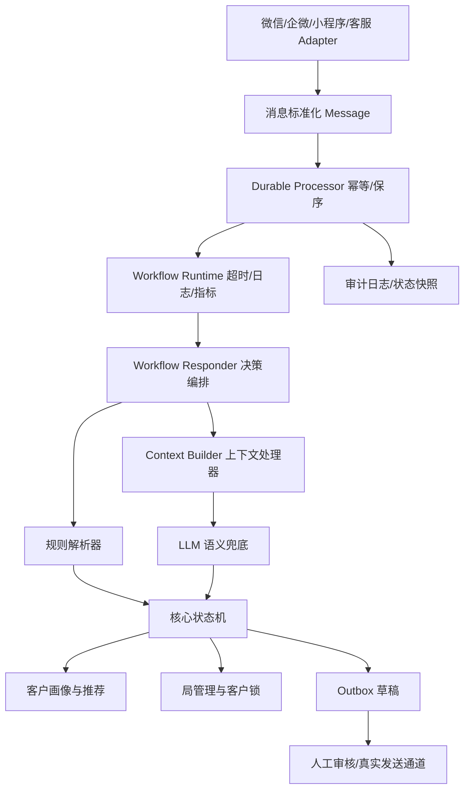

# Mahjong Ops Workflow

棋牌室自助运营助手。

面向自主棋牌室/麻将馆的可控运营 Workflow 核心引擎。

这个项目沉淀了一套可以接入真实微信、企业微信、小程序、客服系统和 CRM 的“麻将馆运营自动化中台”。它负责理解用户组局意图、维护客户画像、管理待组局队列、推荐合适客户、生成邀约草稿，并在高并发和分布式场景下保证消息不串、不乱序、可观测、可回溯。

更准确地说，当前项目是一个 **agentic workflow**：流程、状态推进、幂等、客户锁、outbox 和审计由确定性后端控制；LLM 只在语义理解、上下文依赖和新行话场景下作为受控能力参与。它不是一个可以绕过后端边界、自己随意调用工具和发送消息的完全自治 Agent。

代码里的 `mahjong_agent` 包名和 `AgentRuntime` 等类名暂时保留为历史实现名，后续可以做无破坏兼容迁移；对外产品名和仓库名建议使用 `mahjong-ops-workflow`。

## 解决的问题

线下麻将馆的运营本质上是一个高频、多线程、强上下文的人力调度问题：

- 群聊和私聊里有人用各种口语、缩写、图片、语音表达想打麻将。
- 同时存在多个局，时间、玩法、档位、人数、烟否、时长都不同。
- 老板需要判断哪些局可以合并，哪些人适合邀请，哪些人今天已经打过不能再打扰。
- 用户会报名、取消、说满了、临时改时间，所有状态都要同步。
- 单个客户不能被重复拉进多个有效局。
- 线上系统必须幂等、保序、可审计，不能因为节点重启丢消息。

本项目把这些经验沉淀为结构化状态机、规则解析、生产级上下文处理器、LLM 语义兜底、客户推荐和可靠运行时。

## 核心能力

- 组局意图识别：识别找人、报名、取消、满员、潜在咨询、无关消息。
- 玩法解析：支持杭麻/财敲、川麻、幺鸡、红中、捉鸡、湖南麻将等本地玩法体系。
- 口语缩写解析：例如 `cq371` = 杭麻财敲三缺一，`川麻216` = 川麻 2-16 档。
- 底注/封顶结构化：`216` 解析为底注 2、封顶 16。
- 待组局队列：信息明确但缺时间时，先入队列并继续追问，不乱发邀约。
- 房态约束：如果目标开局时间满房，会建议最快可用时间并暂停邀约，避免承诺不存在的房间。
- 客户画像：记录客户偏好玩法、档位、无烟偏好、常见同行人数、常打时段、疲劳度和打扰频率。
- 候选人推荐：结合玩法偏好、档位、烟否、活跃时段、疲劳度和客户锁推荐人选。
- 局隔离和客户锁：防止客户被重复拉入多个有效局。
- 生命周期管理：自动处理待确认、开放、邀约中、占位、已确认、已完成、已过期、已取消。
- 草稿生成：生成群发和私聊邀约草稿，默认进入人工确认 outbox。
- 碎片消息聚合：同一用户短时间连发“老板 / 今天下午 / 有没有打麻将的 / 0.5或者1都行”等碎片时，会合并理解后再追问；如果老客户画像里高置信记录为通常一个人来，会按 `173` 处理而不是重复问人数。
- 生产级上下文处理器：每次 LLM 调用前统一裁剪、脱敏、组装、预算控制和记录上下文 digest。
- LLM 语义兜底：规则解析失败但疑似麻将相关时，可调用 OpenAI-compatible LLM 解释用户意图。
- 可观测运行时：结构化日志、指标、审计事件、上下文快照、异常和超时 fail-closed。
- 可靠处理：平台消息幂等、短窗口语义去重、会话保序、SQLite 持久化、outbox 幂等键、状态快照。

完整功能矩阵见 [docs/product_capabilities.md](docs/product_capabilities.md)。
真实微信聊天记录复盘见 [docs/wechat_record_analysis.md](docs/wechat_record_analysis.md)。
模型评估、训练与持续改进方案见 [docs/agent_training_and_improvement.md](docs/agent_training_and_improvement.md)。

## 生产架构



生产级架构说明见 [docs/production_architecture.md](docs/production_architecture.md)。

## LLM 接入

系统默认优先使用确定性规则解析。配置 LLM 后，只有在规则无法理解但消息疑似和麻将运营相关时，才调用 LLM 做语义兜底。

最小配置：

```bash
export MAHJONG_LLM_API_KEY="your-api-key"
export MAHJONG_LLM_MODEL="your-model"
```

使用通义千问/阿里云百炼：

```bash
export DASHSCOPE_API_KEY="your-dashscope-api-key"
export MAHJONG_LLM_MODEL="qwen-plus"
export MAHJONG_LLM_TIMEOUT_SECONDS=60
```

设置 `DASHSCOPE_API_KEY` 时，系统会自动使用 `qwen` provider。你也可以显式设置 `MAHJONG_LLM_PROVIDER=qwen` 和 `MAHJONG_LLM_API_KEY`。

`MAHJONG_LLM_PROVIDER=qwen` 会默认使用 OpenAI-compatible endpoint：

```text
https://dashscope.aliyuncs.com/compatible-mode/v1
```

使用其他 OpenAI-compatible 服务：

```bash
export MAHJONG_LLM_BASE_URL="https://your-provider.example/v1"
```

测试 LLM 是否能真实调用：

```bash
PYTHONPATH=src python scripts/run_llm_smoke_test.py
```

`MAHJONG_LLM_TIMEOUT_SECONDS` 是单次模型请求超时。控制台、聊天室和 API 服务的外层 workflow 超时会默认读取它并额外增加 5 秒缓冲；也可以通过 `MAHJONG_AGENT_TIMEOUT_SECONDS` 单独覆盖。

LLM 只允许输出结构化 JSON 或规范化文本，不能直接改状态、不能直接发消息、不能直接占位。所有状态变更仍由核心状态机完成。

## API 入口

生产系统可以把任意上游消息通道转换为统一请求：

```bash
curl -X POST http://127.0.0.1:8787/respond \
  -H "Content-Type: application/json" \
  -d '{
    "text": "cq371 0.5 19.30 无烟",
    "sender_id": "u_123",
    "sender_name": "张哥",
    "channel_id": "group_main",
    "channel_type": "wechat_group",
    "source_message_id": "wechat-msg-001",
    "sequence": 1,
    "now": "2026-06-16T18:00:00+08:00"
  }'
```

返回值是结构化 `ReplyDecision`，包含：

- `action`：本轮动作，如追问、建局、生成邀约、接受报名、转人工、静默。
- `reply_text`：给当前用户的回复。
- `draft_group_post`：群发草稿。
- `invitation_drafts`：私聊邀约草稿。
- `needs_human_review`：是否需要人工确认。
- `notes`：决策证据、LLM 解释、风险提示。

## 控制台输入 + 微信测试输出

在不依赖个人微信实时读消息的情况下，可以先用控制台作为输入通道，用测试路由把所有输出改写到自己的微信号 `radon_1`：

```bash
PYTHONPATH=src python scripts/run_console_agent.py \
  --reset \
  --dispatch wechat-test \
  --output-channel wechat \
  --test-recipient radon_1
```

如果要让控制台输入真的走 LLM，把 LLM 环境变量放在同一个 shell 里再启动；千问等较慢模型建议设置 30-60 秒超时：

```bash
export DASHSCOPE_API_KEY="your-dashscope-api-key"
export MAHJONG_LLM_MODEL="qwen3.7-plus"
export MAHJONG_LLM_TIMEOUT_SECONDS=60

PYTHONPATH=src python scripts/run_console_agent.py \
  --reset \
  --dispatch wechat-test \
  --output-channel wechat \
  --test-recipient radon_1
```

运行后在终端输入真实群消息即可。Workflow 会按完整链路处理：

```text
控制台输入 -> IncomingEnvelope -> DurableProcessor -> AgentRuntime
-> AgentResponder -> outbox_events -> OutputRouter -> radon_1
```

默认是 dry-run，只会在终端打印将要发送到 `radon_1` 的内容。若要调用 Mac 微信 UI 自动化发送，需要显式开启：

```bash
PYTHONPATH=src python scripts/run_console_agent.py \
  --dispatch wechat-test \
  --output-channel wechat \
  --test-recipient radon_1 \
  --wechat-live-send
```

实际发送脚本是 [scripts/send_wechat_mac.py](scripts/send_wechat_mac.py)。它依赖 macOS Accessibility 权限和微信客户端 UI，适合测试执行器，不适合作为长期唯一生产通道。

当前输入和输出已经解耦：控制台、API、微信、企微、小红书、抖音都应被视为 adapter。核心引擎只处理标准 `Message` 和 `outbox_events`，不绑定具体平台。

## 运行方式

启动 API 服务：

```bash
PYTHONPATH=src python scripts/run_agent_server.py
```

开发和验收时可以启动本地对话验证工具：

```bash
PYTHONPATH=src python scripts/run_chatroom.py
```

本地对话验证工具仅用于开发和质量验收，不是生产架构本身。

## 测试

```bash
PYTHONPATH=src python scripts/run_tests.py
PYTHONPATH=src python scripts/run_scenario_eval.py
```

当前覆盖：

- 玩法解析和本地行话
- 模糊时间追问
- 待组局队列
- 满房时间协商
- 玩法偏好推荐
- 客户疲劳度
- 客户锁
- 邀约接受和废弃
- 局生命周期
- 多模态 metadata
- 敏感词转人工
- 运行时异常和超时
- 持久化幂等和会话保序
- LLM 兜底路径

## 当前实现状态

这是一个可运行的核心引擎版本，已经具备生产系统中最关键的领域建模和可靠性骨架。

已经完成：

- 规则解析和结构化状态机。
- 客户画像和推荐。
- 待组局队列。
- outbox 草稿。
- 输入/输出 adapter 边界。
- 控制台输入 runner。
- OutputRouter 和微信测试输出到 `radon_1`。
- ContextBuilder 上下文处理器。
- LLM 接入点。
- 运行时保护。
- SQLite 持久化、幂等、保序、审计。

尚未完成：

- 真实微信/企业微信/小红书/抖音生产级消息收发 adapter。
- 生产数据库迁移。
- 多租户权限和后台管理。
- 真实图片 OCR / 语音 ASR 管线。
- 网页搜索和外部工具注册中心。
- LLM token 成本统计。
- 商业化管理后台。

项目路线图见 [docs/roadmap.md](docs/roadmap.md)。

## 适合的商业化形态

- 单店麻将馆 AI 运营助理。
- 多店连锁棋牌室运营中台。
- SaaS 化客户画像和组局调度系统。
- 微信群/私域流量运营 Workflow。
- 面向地方玩法的垂直行业 agentic workflow 模板。

核心商业价值在于减少老板/店员反复拉人、确认、追问、记偏好的人工成本，同时提高组局成功率和客户触达质量。
