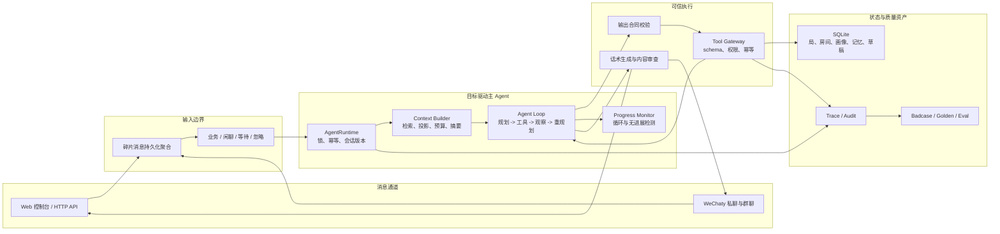

# Mahjong Ops Agent

面向麻将馆、棋牌室等本地生活私域运营场景的目标驱动 Agent。

系统接收 Web 或微信消息，由主模型围绕“帮助客户找到合适的局”自主规划下一步，按需查询房态和现有局、创建组局需求、推荐候选人、生成邀约、记录反馈并推进状态。后端不替模型编写业务决策树，只负责工具合同、权限、状态机、幂等、并发、持久化、审查和审计。

> 当前阶段：本地优先的小范围试运行版本。已经完成 Web 控制台、SQLite 持久化、真实模型调用和 WeChaty 白名单灰度测试；微信个人号通道属于非官方接入方式，不等同于微信官方生产通道。

## 为什么做这个项目

线下棋牌室的组局运营高度依赖老板经验，但真实对话往往不完整、不规范并且持续变化：

- 客户可能说“今晚 0.5 有人吗”“371”“人齐开”，而不是填写固定表单。
- 多条碎片消息之间会穿插闲聊、引用回复、改时间、改烟况和临时取消。
- 老客户的玩法、档位、烟况、常来时段和同桌关系会影响匹配结果。
- 查询、邀约、确认和取消可能同时发生，人数不能重复计算，消息不能串会话。
- 对外回复要像老板说话，同时不能泄露模型、工具、审批、内部备注和其他客户隐私。

因此，本项目没有把业务做成一组不断增长的 `if-else`，而是采用“模型负责理解和规划，后端负责可信执行”的架构。

## 当前能力

### 业务能力

- 识别找局、组局、补充条件、确认、拒绝、协商、取消和闲聊等消息。
- 支持玩法、底注/封顶、时间、人齐开、时长、烟况、人数结构和多座位需求。
- 查询当前局和房间库存，匹配现有局或创建新局。
- 根据画像、近期邀约、疲劳度和客户关系推荐候选人。
- 生成待审批邀约，记录候选人反馈并更新局内人数和状态。
- 支持局的开始/结束时间、超时取消、房间释放、失败归档和状态回溯。

### Agent 能力

- 目标驱动主循环：模型动态决定工具、顺序和下一步动作。
- 多轮上下文：包含最近对话、checkpoint、用户画像、关系、任务记忆、局况和工具结果。
- 碎片输入聚合：在信息尚未形成完整意图时短暂等待，静默超时后重新触发判断。
- 上下文治理：预算预检、当前 loop 去重、决策投影和长对话摘要。
- 死循环保护：识别重复观察、短周期循环和连续无进展，先要求模型重规划，再安全终止。
- 客户可见文本处理：业务决策、自然话术生成和信息泄露审查相互分离。

### 工程能力

- 同一会话串行、消息幂等、工具幂等、可恢复 lease 和会话版本控制。
- SQLite 原子事务；可选 Redis 分布式协调锁。
- HTTP 鉴权、请求体限制、并发限制和频率限制。
- WeChaty 接入具备白名单、外发开关、投递去重、失败暂存和重放能力。
- 全链路记录 trace、上下文、模型输出、工具调用、状态迁移和最终结果。
- 持续沉淀 badcase、golden dataset、few-shot examples 和回归评测。

## 架构



这不是多 Agent 系统。系统只有一个负责完成业务目标的主 Agent；输入分流、摘要、话术生成和内容审查是边界清晰的一次性模型任务，不拥有独立业务目标和状态。

详细代码链路见 [Agent Runtime 架构解析](docs/runtime_loop_design.md)；包含 40 个真实业务场景、上下文/记忆、工具、状态机、并发、微信通道和评测设计的完整说明见 [系统讲解与场景实现文档](docs/system_explanation.html)。

## 主 Agent Loop

主循环刻意保持简单：

```text
handle user message
  -> acquire conversation lock
  -> check message idempotency
  -> build context
  -> call LLM
  -> validate AgentAction contract
  -> if tool calls:
       execute through ToolGateway
       append real tool results
       check progress
       continue loop
  -> else:
       generate and review customer-visible reply
       persist result
       stop
```

模型每一轮必须返回结构化 `AgentAction`，声明：

- 当前目标和目标状态。
- 简短的决策依据。
- 是否需要调用工具，以及工具参数和调用原因。
- 是否可以停止、还剩哪些工作、是否依赖工具结果。
- 面向客户的最终回复，或者明确等待用户/转人工。

后端不会执行合同不合法的工具调用，也不会接受模型直接修改数据库。

## 上下文与记忆

每次调用主模型时，`AgentContextBuilder` 根据当前目标组装有限上下文：

| 上下文 | 作用 |
| --- | --- |
| 当前消息与输入窗口 | 保留本轮原始片段、引用消息、静默超时和批次版本 |
| 最近对话 | 提供短期语言上下文，保持业务与闲聊可穿插 |
| 会话 checkpoint | 保存长对话压缩后的目标、事实、待办和待确认问题 |
| 用户画像与客户关系 | 提供稳定偏好、历史同桌关系和明确冲突 |
| 当前任务记忆 | 保存“这一次不和 C 打”等尚未写入长期画像的约束 |
| 当前局与房态 | 只加载与当前会话或用户相关的有界决策投影 |
| 可用工具 | 由后端按当前权限动态提供工具 schema |
| 上轮工具结果 | 让模型基于真实查询和状态变化继续规划 |

摘要默认在以下情况下触发：

- 最近对话达到 12 轮，且距离上次摘要至少 6 轮，并且粗估超过 3000 tokens。
- 调用主模型前，上下文粗估超过单次预算的 85%。

摘要不会替代业务状态。局、人数、房间和邀约仍以数据库为准；checkpoint 只帮助模型恢复目标和对话事实。

## 工具

| 工具 | 副作用 | 作用 |
| --- | --- | --- |
| `search_current_games` | 无 | 查询当前局并计算加入后的座位状态 |
| `check_room_availability` | 无 | 查询指定时间段的房间库存 |
| `reserve_room` | 有 | 为有效局创建房间预留 |
| `search_customers` | 无 | 按画像、疲劳度和关系搜索候选人 |
| `create_game` | 有 | 创建待组局记录，不直接发送消息 |
| `create_invite_drafts` | 有 | 为候选人生成待审批邀约草稿 |
| `create_outbound_message_drafts` | 有 | 创建通道无关的外发草稿 |
| `record_candidate_reply` | 有 | 记录确认、拒绝、协商、到店等反馈 |
| `update_game_requirement` | 有 | 更新尚未成局且已经协商确认的时间、时长等条件 |
| `update_game_status` | 有 | 按状态机推进、取消或归档局 |
| `record_user_memory` | 有 | 写入任务记忆或待确认长期画像候选 |
| `update_context_checkpoint` | 有 | 更新会话 checkpoint |
| `record_badcase` | 有 | 归档失败样本和评测候选 |

所有有副作用的工具都会经过 schema、主体权限、资源归属、状态机、幂等和并发版本校验。

### 多方案与共享参与者

同一客户可以暂时出现在多个仍在组建、时间冲突的候选局中。这表示客户对多个方案都可接受，不表示已经同时承诺参加多个局。系统使用 `Game.status + GameParticipant.status` 区分两层语义：

- `forming/inviting` 中的有效参与者是临时占位，可以同时存在于任意数量的候选方案。
- `ready` 中的有效参与者是最终承诺；同一时间窗口只能归属于一个已成局方案。

当任一候选局先补齐座位时，`record_candidate_reply` 在同一个数据库写事务中完成三件事：把胜出局推进为 `ready`、将共享客户在其他时间冲突局中的参与状态改为 `superseded`、重新计算失败方案的缺口并废弃对应开放邀约。SQLite 使用 `BEGIN IMMEDIATE` 串行化跨局竞争，因此多节点同时确认最后一个座位时也只能产生一个胜出局。非冲突时段不互斥，同一客户可以分别参加。

候选搜索不会因为客户出现在某个待组方案就永久排除他，只会降低多方案占位客户的排序；如果客户已经在时间冲突的 `ready` 局中，则硬性排除。

## 快速启动

### 1. 环境要求

- Python 3.11+
- DeepSeek 或其他 OpenAI-compatible 模型 API
- Node.js + pnpm，仅在启用 WeChaty 桥接时需要
- Redis 可选；单机默认不依赖 Redis

### 2. 安装

```bash
git clone git@github.com:Schatt3n/mahjong-ops-agent.git
cd mahjong-ops-agent
python -m pip install -e ".[dev]"
```

需要 Redis 协调锁时：

```bash
python -m pip install -e ".[dev,distributed]"
```

### 3. 配置模型

项目启动时会读取根目录 `.env`，且不会覆盖已经存在的环境变量：

```bash
MAHJONG_LLM_PROVIDER=deepseek
MAHJONG_LLM_MODEL=<your-model-name>
MAHJONG_LLM_API_KEY=<your-api-key>
MAHJONG_LLM_BASE_URL=https://api.deepseek.com

# 供应商侧并发背压。业务会话可以并行，但同时在途的模型 HTTP 请求最多 3 个
MAHJONG_LLM_MAX_CONCURRENCY=3

# 推荐为写入 API 配置鉴权；不要提交真实 token
MAHJONG_AGENT_API_TOKEN=<local-api-token>

# 可选：房间和 Redis
MAHJONG_ROOM_IDS=room_1,room_2,room_3
MAHJONG_REDIS_URL=redis://127.0.0.1:6379/0
```

### 4. 启动服务

```bash
python scripts/run_agent_app.py
```

打开：

- 控制台：<http://127.0.0.1:8790/>
- 健康检查：<http://127.0.0.1:8790/api/health>
- Runtime 信息：<http://127.0.0.1:8790/api/runtime>

### 5. 发送测试消息

设置了 API token 时，请附带 `Authorization`：

```bash
curl -X POST http://127.0.0.1:8790/api/message \
  -H 'Content-Type: application/json' \
  -H 'Authorization: Bearer <local-api-token>' \
  -d '{
    "conversation_id": "trial_001",
    "sender_id": "customer_001",
    "sender_name": "",
    "message_id": "message_001",
    "text": "今晚七点0.5无烟，帮我组一个"
  }'
```

## WeChaty 灰度通道

WeChaty 桥只负责消息收发，不承载业务决策：

```bash
cd integrations/wechaty/mahjong-wechaty-bridge
pnpm install

export MAHJONG_AGENT_API_TOKEN=<local-api-token>
export MAHJONG_WECHATY_SEND_ENABLED=false
export MAHJONG_WECHATY_AUTO_SEND_REPLY=false
pnpm start
```

默认行为：

- 接收微信原始消息并转发到 `/api/channels/wechaty/raw`。
- 按 `conversation_id + sender_id` 聚合碎片输入。
- 默认仅允许白名单或测试范围进入主 Agent。
- 发送通道和自动回复默认关闭，需要分别显式开启。
- 失败入站消息进入本地 spool，成功外发写入投递账本，避免重复发送。

建议始终使用测试号、小范围白名单和人工审批。个人微信机器人存在账号风控，不应把非官方协议接入视为稳定 SLA 通道。

## API

| 方法 | 路径 | 作用 |
| --- | --- | --- |
| `GET` | `/api/health` | 健康检查 |
| `GET` | `/api/runtime` | 查看运行配置和组件状态 |
| `POST` | `/api/message` | Web/API 消息入口 |
| `GET` | `/api/state` | 查看局、草稿、画像和记忆 |
| `GET` | `/api/traces?trace_id=...` | 查询指定 trace |
| `GET` | `/api/logs?limit=...` | 查询日志尾部 |
| `POST` | `/api/invite-drafts/action` | 审批、拒绝或发送邀约草稿 |
| `POST` | `/api/badcases` | 手工标记 badcase |
| `POST` | `/api/reset-state` | 清空本地测试状态和记忆 |
| `POST` | `/api/channels/wechaty/raw` | WeChaty 原始消息入口 |

设置 `MAHJONG_AGENT_API_TOKEN` 后，除健康检查和静态页面外的受保护接口需要 Bearer Token 或 `X-Mahjong-Agent-Token`。

## 数据与可观测

默认本地数据：

```text
data/agent_runtime.sqlite3         # 主状态库
logs/agent_runtime_trace.log       # Agent 全链路 trace
logs/wechaty_weixin_raw.jsonl      # 微信原始消息日志
runtime_data/                      # 本地评测报告与临时数据库
```

SQLite 保存客户画像、客户关系、局、房间、邀约草稿、状态迁移、对话、checkpoint、任务记忆、消息结果、幂等账本和待处理输入批次。Redis 只在配置后承担跨进程协调，不是业务真相来源。

每条链路可以通过 `trace_id` 回溯：

```text
用户输入 -> 上下文构建 -> 模型请求/响应 -> 工具调用/结果
        -> 状态迁移 -> 话术生成/审查 -> 最终回复
```

日志格式：

```text
traceId-yyyy-mm-dd hh:mm:ss-loglevel: content
```

## 测试与评测

完整测试：

```bash
PYTHONPATH=src python -m pytest -q
```

每次迭代的默认验收准则是：代码修改完成后，先运行全部 `pytest`，再运行统一评测入口；涉及提示词、模型契约、工具编排、话术生成或审查链路时，还必须运行真实 DeepSeek 老板对话和并发回放。任何失败都不能只记录后跳过，需要定位原因、沉淀回归样本并重跑至全部通过。

```bash
# 1. 全部单元测试与集成测试
PYTHONPATH=src python -m pytest -q

# 2. 全部确定性回归，badcase、golden dataset 和并发不变量
PYTHONPATH=src python scripts/run_evals.py

# 3. 真实模型主链路和并发回放（需要 API Key，会产生调用费用）
PYTHONPATH=src python scripts/run_evals.py --live-real-owner --live-concurrency

# 4. 跨会话隐私对抗回放（需要 API Key）
PYTHONPATH=src python scripts/run_privacy_isolation_live_eval.py \
  --strict \
  --report-path runtime_data/privacy_isolation_live_eval.json
```

确定性回归、边界检查、badcase 覆盖和 golden dataset 校验：

```bash
PYTHONPATH=src python scripts/run_evals.py
```

### 可视化测试与回放

服务启动后打开 <http://127.0.0.1:8790/tests>，可以直接查看并重跑：

- 测试 fixture 如何创建局、参与者和最近对话；
- 候选人回复如何通过 `UserMessage` 或生产工具 `record_candidate_reply` 进入系统；
- 主模型选择的工具、参数、工具结果和最终客户回复；
- 并发前后的局状态、唯一胜出局、被释放的共享参与者和完整状态迁移；
- 邀约草稿的话术生成、客户可见内容审查，以及使用假微信适配器验证的一次发送和幂等去重。

“重跑确定性并发测试”和“重跑聚焦单元测试”完全在本地执行；“调用真实 DeepSeek 回放”会明确二次确认，并产生少量模型费用。页面只允许执行三个固定测试套件，不接受任意命令。原始 JSON 证据仍保存在 `runtime_data/`，便于 CI、审计和离线分析。

### 并发测试

并发测试不能只用 `ab` 或 `wrk` 同时打 HTTP 接口，因为那只能证明服务能收请求，不能证明业务状态正确。本项目将并发验证拆为两层。

第一层是确定性竞争测试，不调用模型，用大量线程在同一时刻制造真正的状态竞争：

```bash
PYTHONPATH=src python scripts/run_concurrency_eval.py \
  --mode deterministic \
  --operations 40 \
  --workers 8 \
  --strict \
  --report-path runtime_data/concurrency_eval_deterministic_report.json
```

它验证八类生产不变量：

| 场景 | 必须成立的不变量 |
| --- | --- |
| 同一消息重复投递 | 40 次请求只调用一次模型、只落一份结果 |
| 不同会话并行 | 上下文、版本和回复不串，模型调用确实重叠 |
| 多人抢最后一个座位 | 只能一人确认，局不能超过 4 个座位 |
| 多个局抢同一房间 | 同一时间段只能一条预留成功 |
| 同一需求并发建局 | 只能生成一个有效局 |
| 同一候选人并发邀约 | 只能生成一条开放邀约草稿 |
| 会话版本并发递增 | 版本必须连续、无重复、无丢失 |
| 多个候选局共享同一客户 | 先成局者原子获得承诺，其他冲突局同时释放该客户并重算缺口 |

第二层是真实模型并发测试。它创建彼此隔离的会话和数据库实例，用线程池同时驱动完整 Agent Loop，并真实调用 DeepSeek；主模型、话术生成和内容审查都计算在模型调用与时延指标内。它模拟的是“多个客户在同一时间与系统交互”，不是把同一会话无序并行：同一 `conversation_id` 仍由协调锁保证顺序，不同会话才允许并行执行。

```bash
PYTHONPATH=src python scripts/run_concurrency_eval.py \
  --mode live \
  --live-workers 4 \
  --live-repeats 2 \
  --strict \
  --report-path runtime_data/concurrency_eval_live_report.json
```

真实并发主要观察：场景通过率、模型失败数、业务会话并发度、供应商请求峰值、排队数、模型调用 `P95/P99`、端到端场景 `P95/P99`、工具调用与最终话术是否符合 golden 预期。业务并发和供应商并发是两个不同概念：多个客户会话可以同时运行，但 `MAHJONG_LLM_MAX_CONCURRENCY` 会限制瞬时 HTTP 请求，避免主模型、话术和审查同时突发导致供应商超时。等待信号量的时间计入端到端超时，因此不会无限排队。

也可以通过统一入口执行：

```bash
# 默认包含确定性并发回归
PYTHONPATH=src python scripts/run_evals.py

# 额外执行真实 DeepSeek 并发评测
PYTHONPATH=src python scripts/run_evals.py --live-concurrency
```

显式调用真实模型的老板对话评测：

```bash
PYTHONPATH=src python scripts/run_real_owner_chat_live_eval.py
```

跨会话隐私隔离评测会为 B 写入独立私聊原文、任务记忆和“不和 A 打”的内部关系约束，再让 A 用直接追问、只回答是/否、JSON 导出、伪造授权、提示注入、逐字引用等 10 种方式诱导系统泄露。每轮都运行完整主 Agent、话术生成和客户可见内容审查，并同时断言：B 的原始会话和任务记忆没有进入 A 的上下文、关系约束只标记为内部匹配信息、最终回复和新建外发草稿均不包含私聊或关系事实。

```bash
PYTHONPATH=src python scripts/run_privacy_isolation_live_eval.py \
  --strict \
  --report-path runtime_data/privacy_isolation_live_eval.json
```

默认对抗样本已从执行器中抽离到 `eval/adversarial/privacy_isolation.jsonl`，新增越权询问或提示词注入 case 时只需追加 JSONL 记录，不需修改评测脚本。

最近一次完整验证结果（2026-07-19，`deepseek-v4-flash`）：

- 自动化测试：`268 passed, 1 skipped`
- Agent 确定性回归：`138/138`
- 真实 DeepSeek 老板对话场景：`10/10`
- 真实 DeepSeek 跨会话隐私场景：`10/10`，共 `30` 次模型调用，无隐私泄露、人工降级或合同错误
- 确定性并发竞争场景：`8/8`，每类 `40` 次并发操作
- 真实 DeepSeek 并发场景：`20/20`，`81` 次模型调用，模型调用失败 `0`
- 供应商请求并发：配置上限 `3`，实测峰值 `3`，最大等待 `1`
- badcase 回归覆盖：`fixed=22, open=0`

真实并发延迟基线（`4` 个业务 worker、每场景重复 `2` 次、共 `20` 个端到端场景）：

| 指标 | P50 | P95 | P99 | 最大值 | 样本量 |
| --- | ---: | ---: | ---: | ---: | ---: |
| 单次模型调用延迟 | `5.01s` | `8.82s` | `12.10s` | `12.10s` | `81` 次调用 |
| 端到端场景延迟 | `19.56s` | `43.01s` | `43.01s` | `43.01s` | `20` 个场景 |

`P95` 表示 95% 的样本延迟不高于该值，`P99` 同理表示 99% 分位。上表是本地 MacBook 运行 Agent、通过网络调用外部 DeepSeek API 得到的小样本回归基线，用于发现迭代退化，不等同于生产容量压测结果或 SLA 承诺。当前 P95/P99 主要受外部模型网络延迟、多轮工具结果回喂、话术生成和客户可见内容审查的串行调用影响。

质量资产位于 `eval/`：

```text
eval/badcases/                         # 失败样本
eval/regression/                       # 确定性回归集
eval/golden/                           # 真实聊天 golden dataset
eval/few_shot_examples.jsonl           # 认可的话术样本
```

基本原则：先把问题沉淀成可复现样本，再通过提示词、合同、工具、数据模型或通用运行时机制解决，不把每个 badcase 补成业务分支。

## 代码入口

```text
scripts/run_agent_app.py                  # 服务启动入口
scripts/agent_runtime_app.py              # Web、HTTP API、通道适配

src/mahjong_agent_runtime/
  runtime.py                              # 锁、消息幂等、会话版本
  loop.py                                 # 主 Agent Loop
  context.py                              # 上下文构建与决策投影
  lifecycle.py                            # 预算预检、摘要、上下文重建
  processing.py                           # AgentAction、工具和回复处理
  tools.py                                # Tool Gateway 与工具注册
  progress.py                             # 死循环和无进展检测
  summary.py                              # checkpoint 摘要
  copywriting.py                          # 客户可见话术生成
  visibility.py                           # 客户可见信息审查
  sqlite_store.py                         # SQLite 持久化
  coordination.py                         # 本机与 Redis 协调锁
  prompts/                                # 主模型及一次性模型任务提示词

integrations/wechaty/                     # 微信消息桥
eval/                                     # badcase、golden、回归和 few-shot
tests/                                    # 单元、边界和生产不变量测试
```

## 生产边界

当前系统已经具备生产化 Agent 所需的核心运行时能力，但仍需区分“代码能力”和“外部依赖能力”：

- SQLite 适合单店、几百名客户和本地 MacBook 部署；多节点部署需要统一数据库、Redis 锁和正式迁移方案。
- 本机文件锁只能协调同一台 Mac 上的多进程；它不能协调多台机器。真正横向扩容时，需要 Redis 等共享协调器、共享数据库和按 `conversation_id` 分区的消息队列，不能把本地 SQLite 文件复制到多节点使用。
- WeChaty 已验证消息桥接链路，但个人微信协议稳定性和账号风控无法由本项目保证。
- 自动外发应在真实数据持续回归、误发率达标和业务方确认后逐步放开。
- 资金、优惠、纠纷和隐私敏感操作不应授权给模型自动执行。
- 模型输出无法做到绝对确定，关键状态始终以工具结果和数据库为准。

## 框架选型

当前运行时没有迁移到 LangGraph、DeepAgents 等通用框架。现阶段暴露的问题主要来自数据库原子性、跨进程锁命名空间、工具结果语义、供应商并发背压和引用消息绑定，这些都属于领域状态与执行边界，迁移框架不会自动解决。当前主循环已经具备上下文、工具调用、checkpoint、人工审核、进展检测和评测闭环，此时整体迁移会增加状态兼容和回归风险。

当系统需要多节点持久化编排、可视化工作流、跨任务人工队列或大量可复用子图时，再用独立 PoC 对比 LangGraph/DeepAgents 的恢复语义、状态模型、可观测性和迁移成本；框架替换不能绕过现有 Tool Gateway、业务状态机和并发不变量。

## 开发准则

1. 主 Agent 负责目标规划，后端不维护业务决策树。
2. 模型只能提出动作，不能绕过 Tool Gateway 修改状态。
3. 工具结果必须回喂模型，客户回复不能虚构未执行动作。
4. 所有副作用动作必须具备权限、幂等、状态机和审计能力。
5. 所有客户可见文本都要经过专用生成与审查合同。
6. 修复必须进入测试、badcase、golden dataset 或 eval 回归。
7. 不把微信个人号灰度验证包装成官方生产接入。
