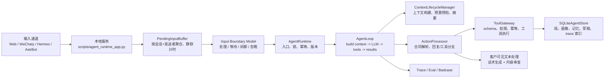

# Mahjong Agent Runtime

面向私域运营撮合场景的目标驱动 Agent Runtime。当前业务落点是麻将馆/棋牌室组局运营：接收客户消息，理解意图，查询现有局，创建组局需求，推荐候选人，生成待审批邀约，记录反馈，并把全链路沉淀为可审计、可回放、可评测的数据。

这个仓库当前只保留一条主链路：`mahjong_agent_runtime`。历史兼容实现和早期规则式实现已从主工程入口移除，不作为默认开发对象。

## 项目定位

这个系统不是固定流程表单，也不是让模型直接改数据库的裸 Agent。它采用目标驱动结构：

- 主模型负责理解上下文、规划任务、选择工具、根据工具结果动态调整下一步。
- 后端负责上下文构建、输出合同校验、工具权限、schema 校验、幂等、状态机、并发顺序、日志、审计和人工边界。
- 所有客户可见文本必须经过话术生成和内容审查，避免泄露系统实现、内部状态、候选人信息或未发生的动作。
- 每一轮输入、提示词、模型输出、工具调用、工具结果和状态变更都会写入 trace，方便回溯和沉淀 badcase。

## 当前能力

- 本地 Web 控制台：用于输入消息、查看结果、刷新状态、清空状态、标记 badcase。
- 微信灰度通道：通过 WeChaty 接收好友/群聊原始消息，支持白名单路由、闲聊分流、业务消息进入主 Agent、外发开关和人工审批。
- 碎片化输入聚合：按 `conversation_id + sender_id` 聚合连续消息，由模型结合画像、最近对话和静默状态判断立即处理、继续等待、闲聊或忽略；30 秒无新消息后由持久化调度器重新触发判断。
- 多轮上下文：保留当前消息、最近对话、会话 checkpoint、客户画像、关系画像、当前任务记忆、局池、草稿和工具结果。
- 上下文去重与投影：当前 loop 的工具结果只回馈一次，持久化原始结果保留给审计，模型只读取有体积上限的决策投影。
- 目标驱动主循环：模型每轮输出结构化 `AgentAction`，可以继续调用工具，也可以等待用户、完成回复或转人工。
- 进展与循环监测：基于稳定的动作/结果指纹识别重复观察、短周期循环和连续无进展；首次命中回喂模型重规划，再次停滞才终止并转人工。
- 受控工具网关：模型不能直接改数据库，只能通过工具合同请求动作。
- 组局与房态：支持当前局、候选邀约、房间库存/预留、外发草稿、候选反馈、状态迁移、过期归档和多座位模型。
- 生产保护：HTTP token 认证、请求体/并发/频率限制、可恢复 lease、SQLite 原子版本、邀约审批证明、通道投递去重与未投递队列。
- 画像与记忆：支持客户画像、客户关系、当前任务短期记忆、待确认长期画像候选。
- 质量资产：支持 badcase、golden dataset、few-shot examples 和 eval 回归。

## 快速启动

进入项目目录：

```bash
cd "/Users/wangjie/Desktop/03_项目与方案/麻将Agent/mahjong_agent_core"
```

配置 `.env`，至少需要：

```bash
MAHJONG_LLM_PROVIDER=deepseek
MAHJONG_LLM_MODEL=deepseek-v4-flash
MAHJONG_LLM_API_KEY=your-api-key
MAHJONG_LLM_BASE_URL=https://api.deepseek.com
```

启动本地服务：

```bash
python scripts/run_agent_app.py
```

默认访问：

```text
http://127.0.0.1:8790/
```

检查服务状态：

```bash
curl http://127.0.0.1:8790/api/runtime
```

## 运行测试

单元测试：

```bash
PYTHONPATH=src python -m pytest -q
```

默认评估：

```bash
PYTHONPATH=src python scripts/run_evals.py
```

主链路架构边界检查：

```bash
PYTHONPATH=src python scripts/verify_agent_runtime_boundary.py
```

客户可见文本合同检查：

```bash
PYTHONPATH=src python scripts/verify_customer_visible_contract.py
```

真实老板聊天 golden dataset 校验：

```bash
PYTHONPATH=src python scripts/validate_real_owner_chat_golden.py
```

## 系统架构



详细架构解析见 [docs/runtime_loop_design.md](docs/runtime_loop_design.md)。

## 主循环

通道消息进入主 Agent 前先经过输入边界层：

```text
message fragment
  -> persist pending batch
  -> model decides process / wait / casual / ignore
  -> wait: return no customer-visible reply and keep collecting
  -> quiet timeout: scheduler reloads the batch and asks the model again
  -> process: claim exact batch version and enter AgentRuntime
```

后端不按“老板”“帮我组局”等关键词写等待规则。是否已经表达完整由模型判断；后端只保证持久化、定时触发、消息幂等、版本 CAS 和旧执行结果失效。

主 Agent loop 保持简单：

```text
handle_user_message
  -> conversation lock
  -> message idempotency
  -> advance conversation version
  -> supersede previous pending outputs
  -> AgentLoop.run
       -> build context
       -> context budget precheck / summary if needed
       -> call LLM
       -> validate AgentAction contract
       -> execute tools or prepare reply
       -> append tool results and continue
       -> check material progress / request replan / abort repeated stall
       -> stop when waiting_user / completed / needs_human
  -> maybe summarize after turn
  -> remember message result
```

当前响应不是流式输出。一次用户消息会在主循环结束后返回最终 `AgentRuntimeResult`。微信通道的真实外发由通道层和外发开关控制，不等同于模型直接发送消息。

### 死循环与无进展检测

`ProgressMonitor` 不判断麻将业务语义，只比较当前 run 内的通用执行事实：

- 工具名、经过稳定化的参数和工具结果共同组成观察指纹。
- 新查询条件得到空结果仍算新信息；同一条件反复得到同一结果不算进展。
- 非幂等重放的状态迁移算状态进展，并开启新的检测 epoch。
- 连续重复观察、`A -> B -> A -> B` 这类短周期、连续无进展达到阈值时触发检测。
- 第一次命中会把虚拟工具结果 `agent_progress_guard` 放入下一轮 `previous_tool_results`，要求模型换计划；重规划后仍停滞才中止本轮。
- `max_steps` 仍作为最后一道硬上限，两种机制互不替代。

## 上下文包含什么

每次调用主模型时，`AgentContextBuilder` 会组装：

- `current_message`：当前用户消息，包含安全过滤后的通道元数据和引用消息。碎片聚合后还包含 `input_window`，其中有原始片段、是否已经静默超时、批次版本和触发原因。
- `recent_conversation`：预算内最近对话。
- `conversation_checkpoint`：长对话压缩后的关键摘要。
- `sender_profile`：当前发送者画像，隐藏私有备注等不可见字段。
- `sender_relationships`：当前用户和局内其他人的关系、是否打过、是否不愿同桌。
- `task_memories`：当前任务即时约束，例如“不和 C 打”“这次只能无烟”。
- `pending_memory_candidates`：待确认长期画像候选。
- `active_games` / `active_game_visible_summaries`：当前局池和给客户可见的局况摘要。
- `outbound_message_drafts`：待审批外发草稿。
- `available_tools`：本轮允许模型调用的工具 schema。
- `previous_tool_results`：上一轮工具结果，模型必须基于真实结果继续决策。
- `planning_contract` / `output_contract`：任务规划和输出结构合同。

## 上下文摘要

上下文摘要由 `ContextSummaryManager` 负责，默认开启。

触发条件有两类：

- 轮次后摘要：最近对话达到 `12` 轮、距离上次摘要至少 `6` 轮、最近对话粗估超过 `3000` tokens。
- 调用前摘要：主模型调用前发现上下文粗估超过单次预算的 `85%`，会先尝试生成 checkpoint，再重建上下文。

token 估算是工程保护用的保守粗估：CJK 字符按接近一字一 token 计数，ASCII 字符按约四字符一 token，标点单独计数。它不追求和厂商 tokenizer 完全一致，而是避免中文上下文被严重低估。

当前 loop 内已持久化的工具 turn 与 `previous_tool_results` 内容相同时，模型上下文只保留后者；完整工具结果仍在存储和 trace 中可回放。局、候选人和草稿会转换为有界的决策投影，避免把同一 seat/party 结构重复塞入模型。

checkpoint 会保存：

- 给未来模型看的短摘要。
- 关键结构化事实，例如当前目标、玩法、档位、烟况、时间、人齐开、人数结构、当前局 ID、待办。
- 仍待确认的问题。
- 来源 traceId 和更新时间。

## 可用工具

| 工具 | 类型 | 作用 |
| --- | --- | --- |
| `search_current_games` | 只读 | 查询当前局池，返回匹配局和加入后的座位推演 |
| `check_room_availability` | 只读 | 查询指定时间段房间库存，不产生占用 |
| `reserve_room` | 写状态 | 在权限和库存校验通过后创建房间预留 |
| `search_customers` | 只读 | 搜索候选客户，结合画像、疲劳度和关系约束排序 |
| `create_game` | 写状态 | 创建待组局记录，不发消息、不确认房间 |
| `create_invite_drafts` | 写草稿 | 创建候选人邀约草稿，默认待审批 |
| `create_outbound_message_drafts` | 写草稿 | 创建通道无关外发草稿 |
| `record_candidate_reply` | 写状态 | 记录候选人确认、拒绝、协商、到店等反馈 |
| `update_game_status` | 写状态 | 按状态机更新局状态 |
| `record_badcase` | 审计 | 记录 badcase/eval 候选样本 |
| `record_user_memory` | 写记忆 | 记录当前任务约束和待确认长期画像候选 |
| `update_context_checkpoint` | 写摘要 | 更新会话 checkpoint |

## 数据存储

默认主存储是 SQLite：

```text
data/agent_runtime.sqlite3
```

核心表：

- `runtime_customers`：客户画像。
- `runtime_customer_relationships`：客户关系。
- `runtime_games`：局。
- `runtime_rooms`：房间库存。
- `runtime_room_reservations`：房间预留及释放记录。
- `runtime_invite_drafts`：候选邀约草稿。
- `runtime_outbound_message_drafts`：通道外发草稿。
- `runtime_state_transitions`：状态迁移。
- `runtime_conversation_turns`：多轮对话。
- `runtime_conversation_checkpoints`：上下文摘要。
- `runtime_conversation_versions`：会话版本。
- `runtime_idempotency_ledger`：工具幂等账本。
- `runtime_message_results`：消息幂等结果。
- `runtime_message_references`：引用消息与业务对象关联。
- `runtime_task_memories`：当前任务短期记忆。
- `runtime_pending_memory_candidates`：待确认长期画像候选。
- `runtime_pending_input_batches`：尚未形成完整输入边界的消息片段、静默截止时间、模型决策和批次版本。
- `runtime_badcases`：badcase 归档。

Redis 当前不是主状态存储。系统默认以 SQLite 承担本地生产试运行的状态持久化，适合单店、几百客户规模的 MacBook 本地部署。

输入聚合相关配置：

```bash
# WeChaty 默认开启；Web API 可通过请求 aggregate_fragments=true 单次开启
MAHJONG_INPUT_AGGREGATION_WECHATY_ENABLED=true
MAHJONG_INPUT_AGGREGATION_API_ENABLED=false
MAHJONG_INPUT_QUIET_PERIOD_SECONDS=30
```

主 Agent 进展监测配置：

```bash
MAHJONG_AGENT_REPEATED_OBSERVATION_LIMIT=2
MAHJONG_AGENT_NO_PROGRESS_LIMIT=2
MAHJONG_AGENT_MAX_PROGRESS_REPLANS=1
MAHJONG_AGENT_MAX_CYCLE_PERIOD=3
MAHJONG_AGENT_MAX_STEPS=8
```

## 日志和可观测

默认 trace 文件：

```text
logs/agent_runtime_trace.log
```

默认通道原始日志：

```text
logs/wechaty_weixin_raw.jsonl
logs/hermes_weixin_raw.jsonl
logs/astrbot_weixin_raw.jsonl
```

日志格式遵循：

```text
traceId-time(yyyy-mm-dd hh:mm:ss)-loglevel: content
```

常用接口：

- `GET /api/runtime`：查看 runtime manifest。
- `GET /api/health`：健康检查。
- `POST /api/message`：本地控制台消息入口。
- `GET /api/state`：查看局、草稿、画像、记忆状态。
- `GET /api/traces?trace_id=...`：查看指定 trace。
- `GET /api/logs?limit=...`：查看日志尾部。
- `POST /api/badcases`：手工标记 badcase。
- `POST /api/reset-state`：清空本地状态和记忆。
- `POST /api/channels/wechaty/raw`：WeChaty 原始消息入口。
- `POST /api/invite-drafts/action`：邀约草稿审批/发送入口，发送前校验审查证明和当前局状态。

除健康检查和静态页外，写入型 API 在设置 `MAHJONG_AGENT_API_TOKEN` 或本地 token 文件后需提供 `Authorization: Bearer ...` 或 `X-Mahjong-Agent-Token`。通道桥会从同一环境变量/文件读取 token。

## 质量资产

质量资产在 `eval/`：

- `eval/badcases/badcases.jsonl`：失败样本和边界样本。
- `eval/regression/agent_runtime_regression.jsonl`：主链路回归集。
- `eval/golden/real_owner_chat_golden.jsonl`：真实老板聊天 golden dataset。
- `eval/golden/real_owner_chat_transcript_20260704.md`：真实聊天截图转写。
- `eval/few_shot_examples.jsonl`：老板认可的话术样例。

原则：问题先沉淀到 badcase，再转成 regression 或 golden，不在主流程里无限补业务 if-else。

## 关键目录

```text
src/mahjong_agent_runtime/
  runtime.py                 # AgentRuntime 入口，锁、幂等、版本、结果持久化
  loop.py                    # 目标驱动主循环
  progress.py                # 死循环、短周期和无进展检测
  lifecycle.py               # 上下文构建、预算预检、摘要重建
  processing.py              # 合同解析、工具分支、回复分支
  tools.py                   # ToolGateway 和工具定义
  coordination.py            # 进程内/本机文件/可选 Redis 协调锁
  token_estimation.py        # 中文友好的保守 token 估算
  context.py                 # ContextBuilder
  summary.py                 # checkpoint 摘要
  visibility.py              # 客户可见文本审查
  copywriting.py             # 客户可见话术生成
  sqlite_store.py            # SQLite 持久化
  prompts/                   # 主模型、摘要、审查、话术、微信分流提示词

scripts/
  run_agent_app.py           # 当前本地服务入口
  agent_runtime_app.py       # Web 控制台和通道 API
  run_evals.py               # 评测入口

integrations/
  wechaty/                   # WeChaty 通道桥接
```

## 开发准则

- 不把 badcase 修成一串业务 if-else。
- 主 loop 只做编排，不写麻将语义。
- 模型输出必须符合结构化合同。
- 后端只执行通过 schema、权限、状态机、幂等和客户可见文本审查的动作。
- 客户可见文本不能暴露工具、系统、模型、审批、草稿、traceId、候选人内部状态。
- 写工具必须可回放、可审计、可幂等。
- 所有修复都要沉淀测试、badcase、golden dataset 或 eval。
