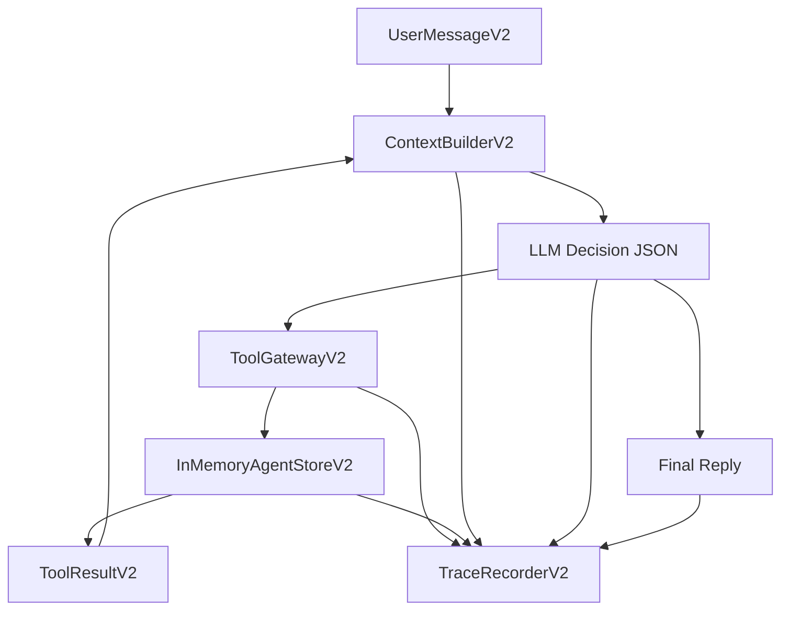

# Mahjong Agent Runtime V2

V2 是一条独立的新主链路，不再沿用旧的 parser、controlled workflow、reply guard。

目标：

- LLM 负责理解用户、判断目标、决定调用哪些工具。
- 后端负责工具 schema 校验、权限、幂等、状态机、并发、预算、日志审计。
- 不再用业务 if-else 修麻将语义。
- 每一次模型输入、模型输出、工具调用、工具结果、状态变化都可追溯。
- 回复不对时沉淀 eval/badcase，不直接硬编码修一句话。

## 主链路



## 代码入口

- Runtime: `src/mahjong_agent_v2/runtime.py`
- Context: `src/mahjong_agent_v2/context.py`
- Tool Gateway: `src/mahjong_agent_v2/tools.py`
- Store: `src/mahjong_agent_v2/store.py`
- LLM Client: `src/mahjong_agent_v2/llm.py`
- Prompt: `src/mahjong_agent_v2/prompts/agent_v2_system.md`
- Local Web/API: `scripts/run_agent_v2_app.py`

## 工具契约

V2 当前工具：

- `search_current_games`: 查询现有有效局。
- `search_customers`: 搜索候选客户。
- `create_game`: 创建待组局。
- `create_invite_drafts`: 创建待审批邀约草稿，不发送。
- `record_candidate_reply`: 记录候选人回复并推进状态。
- `record_badcase`: 记录 badcase/eval 候选。

LLM 决定是否调用这些工具。后端只做：

- 工具名是否存在。
- arguments 是否符合 schema。
- 工具是否允许当前执行模式。
- 幂等键是否重复。
- 状态机是否允许。
- 客户是否已在有效局或待审批邀约里。

## Trace

每轮会记录：

- `user_input`
- `context_built`
- `llm_prompt`
- `budget_checked`
- `llm_response`
- `action_proposed`
- `tool_called`
- `tool_result`
- `state_transition`
- `final_output`

本地 V2 服务 trace 默认写入：

```text
logs/agent_runtime_v2_trace.jsonl
```

## Eval / Badcase

V2 不再通过后端 if-else 修复单句 badcase。模型如果判断本轮或上一轮回复有问题，可以调用 `record_badcase` 工具。后端只负责校验参数并把样本写入 JSONL。

本地 V2 服务默认写入：

```text
eval/badcases/agent_runtime_v2_badcases.jsonl
```

每条记录包含：

- `badcase_id`
- `trace_id`
- `conversation_id`
- `reason`
- `input`
- `actual`
- `expected`
- `tags`
- `metadata`

本地查看：

```bash
curl -s http://127.0.0.1:8791/api/v2/badcases
```

## 本地启动

```bash
set -a
source .env
set +a
/Users/wangjie/Documents/Codex/tools/miniforge3/bin/python scripts/run_agent_v2_app.py
```

默认地址：

```text
http://127.0.0.1:8791/
```

接口：

```bash
curl -s http://127.0.0.1:8791/api/v2/message \
  -H 'Content-Type: application/json' \
  -d '{"conversation_id":"v2_test","sender_id":"zhang","sender_name":"张哥","text":"通宵有人吗"}'
```

## 当前边界

这是新系统的最小闭环版本，还没有替换旧老板试用台。

下一步应该做：

- 把 V2 store 从内存迁移到 SQLite/Redis。
- 把 V2 页面扩展为完整测试控制台。
- 把 eval/badcase 写入真实 JSONL 数据集。
- 给 V2 增加端到端回归集。
- 再考虑替换旧 `scripts/run_boss_trial_app.py` 的主入口。
