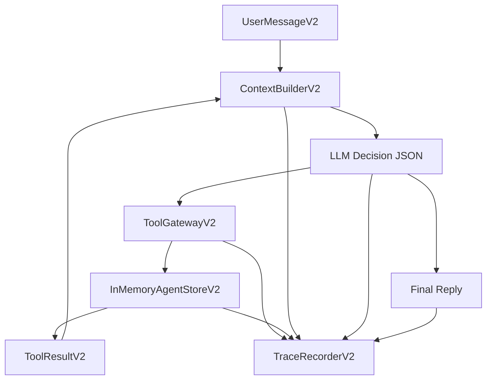

# Mahjong Agent Runtime V2

V2 是一条独立的新主链路，不再沿用旧的 parser、controlled workflow、reply guard。

目标：

- LLM 负责理解用户、判断目标、决定调用哪些工具。
- 后端负责工具 schema 校验、权限、幂等、状态机、并发、预算、日志审计。
- 不再用业务 if-else 修麻将语义。
- 每一次模型输入、模型输出、工具调用、工具结果、状态变化都可追溯。
- 回复不对时沉淀 eval/badcase，不直接硬编码修一句话。

## 主链路



## 代码入口

- Runtime: `src/mahjong_agent_v2/runtime.py`
- Context: `src/mahjong_agent_v2/context.py`
- Tool Gateway: `src/mahjong_agent_v2/tools.py`
- State Policy: `src/mahjong_agent_v2/state_policy.py`
- Store: `src/mahjong_agent_v2/store.py`
- SQLite Store: `src/mahjong_agent_v2/sqlite_store.py`
- LLM Client: `src/mahjong_agent_v2/llm.py`
- Prompt: `src/mahjong_agent_v2/prompts/agent_v2_system.md`
- Local Web/API: `scripts/run_agent_v2_app.py`

## Context Budget

V2 使用 `ContextPackingPolicyV2` 做确定性的上下文打包：

- 从最新对话 turn 往前装入 `recent_conversation`。
- 超过预算的旧 turn 会被裁掉，不会继续塞满上下文窗口。
- 当前消息、客户画像、有效局、可用工具和上一轮工具结果不会因为对话历史预算被静默删除。
- 每次构建上下文都会写入 `context_budget`，包含 `included_turn_count`、`omitted_turn_count`、`omitted_for_budget`、`estimated_recent_conversation_tokens` 等字段。
- Runtime 会单独记录 `context_packed` trace 事件，方便回放时判断模型当时看到了哪些历史、哪些历史被裁剪。

这部分只做上下文窗口管理，不做麻将语义判断。

## 工具契约

V2 当前工具：

- `search_current_games`: 查询现有有效局。
- `search_customers`: 搜索候选客户。
- `create_game`: 创建待组局。
- `create_invite_drafts`: 创建待审批邀约草稿，不发送。
- `record_candidate_reply`: 记录候选人回复并推进状态。
- `record_badcase`: 记录 badcase/eval 候选。

LLM 决定是否调用这些工具。后端只做：

- 工具名是否存在。
- arguments 是否符合 schema。
- 工具是否允许当前执行模式和风险等级；不允许时返回 `tool_result.error`，不会落库。
- 幂等键是否重复。
- 状态机是否允许。
- 客户是否已在有效局或待审批邀约里。

工具 schema 负责收敛工程边界，而不是替模型理解麻将语义：

- `requirement` 使用统一结构，模型可以填 `game_type`、`stake`、`start_time_kind`、`smoke_preference`、`current_players`、`missing_players`、`duration_hours`、`candidate_preferences` 等字段。
- 模型应同时给出 `user_visible_summary`，例如“杭麻 1档 人齐开 烟都可 通宵 缺3”。
- 工具结果会给模型返回 `requirement_public_summary`，用于后续自然语言回复和候选人邀约。
- `create_invite_drafts.message_text` 是客户可见文案，schema 会拒绝 snake_case、JSON 等内部表示。
- 如果工具参数不合法，Runtime 会把 `tool_result.error` 放回下一轮上下文，让模型修正工具调用；不在后端硬编码某一句回复。

## State Policy

V2 的状态机边界由 `StatePolicyV2` 负责，不由 LLM 决定。

当前规则：

- `game`: `null -> forming -> inviting -> ready -> finished/cancelled`，已结束或已取消的局不能继续写入邀约。
- `invite_draft`: `pending_approval/sent/negotiating/no_reply` 可以进入 `confirmed/declined/negotiating/no_reply` 等允许状态；`confirmed` 和 `declined` 是终态。
- `record_candidate_reply` 必须绑定已有 `invite_draft`，不能让模型凭空把一个客户加入某个局。
- 状态机拒绝时，工具返回 `called=false, allowed=false, error=...`，Runtime 把错误放进下一轮上下文交给模型处理或转人工。

## Trace

每轮会记录：

- `user_input`
- `context_packed`
- `context_built`
- `llm_prompt`
- `budget_checked`
- `llm_response`
- `action_proposed`
- `tool_called`
- `tool_result`
- `state_transition`
- `final_output`

本地 V2 服务 trace 默认写入：

```text
logs/agent_runtime_v2_trace.jsonl
```

## State Persistence

V2 本地服务默认使用独立 SQLite 状态库，不使用旧老板试用台的 SQLite 表。

默认路径：

```text
data/agent_runtime_v2.sqlite3
```

可通过环境变量覆盖：

```bash
export MAHJONG_AGENT_V2_DB_PATH="data/agent_runtime_v2.sqlite3"
```

SQLite 中持久化：

- 客户画像
- 有效局
- 待审批邀约草稿
- 多轮对话 turn
- 工具幂等账本
- 消息处理结果账本
- 状态迁移事件

本地查看当前 V2 状态：

```bash
curl -s http://127.0.0.1:8791/api/v2/state
```

## Concurrency / Idempotency

V2 Runtime 负责同会话串行处理：

- 同一个 `conversation_id` 的消息会进入同一把运行时锁，避免同会话并发请求同时调用模型和写状态。
- 不同 `conversation_id` 可以并行处理。
- 同一个 `message_id` 重复进入时，会直接返回消息结果账本里的旧结果，不再调用 LLM，也不重复执行工具。
- 工具级副作用继续使用工具幂等键，由 `ToolGatewayV2` 和 store 的工具幂等账本兜住。

这部分属于后端边界，不交给 LLM 判断。

## Eval / Badcase

V2 不再通过后端 if-else 修复单句 badcase。模型如果判断本轮或上一轮回复有问题，可以调用 `record_badcase` 工具。后端只负责校验参数并把样本写入 JSONL。

本地 V2 服务默认写入：

```text
eval/badcases/agent_runtime_v2_badcases.jsonl
```

每条记录包含：

- `badcase_id`
- `trace_id`
- `conversation_id`
- `reason`
- `input`
- `actual`
- `expected`
- `tags`
- `metadata`

本地查看：

```bash
curl -s http://127.0.0.1:8791/api/v2/badcases
```

## 本地启动

```bash
set -a
source .env
set +a
/Users/wangjie/Documents/Codex/tools/miniforge3/bin/python scripts/run_agent_v2_app.py
```

默认地址：

```text
http://127.0.0.1:8791/
```

接口：

```bash
curl -s http://127.0.0.1:8791/api/v2/message \
  -H 'Content-Type: application/json' \
  -d '{"conversation_id":"v2_test","sender_id":"zhang","sender_name":"张哥","text":"通宵有人吗"}'
```

## 当前边界

这是新系统的最小闭环版本，还没有替换旧老板试用台。

下一步应该做：

- 把 V2 页面扩展为完整测试控制台。
- 给 V2 增加端到端回归集。
- 再考虑替换旧 `scripts/run_boss_trial_app.py` 的主入口。
