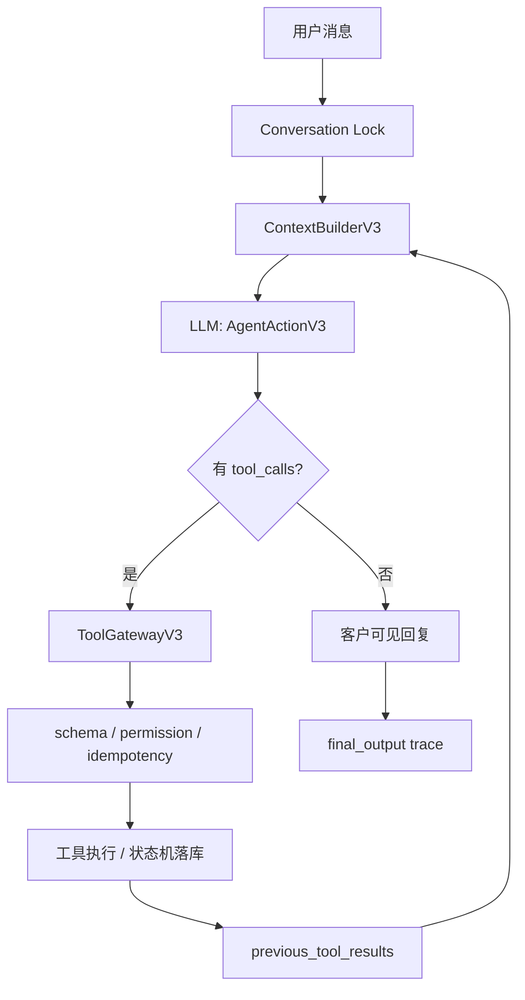

# Mahjong Agent Runtime

这是当前默认的独立主链路，不在 V2 或旧 trial/workflow 代码上继续缝补。

V2 和旧 trial/workflow 代码仅作为 legacy/reference 保留，不接入当前主服务、上下文构建、工具网关或默认评测入口。当前稳定 import 面和主实现包是 `mahjong_agent_runtime`；`mahjong_agent_v3` 只作为兼容壳保留，文档里的 V3 类名是内部兼容名，不代表对外还要维护多个主版本。

## 设计边界

- LLM 负责理解用户、判断目标、决定调用哪些工具和调用顺序。
- 后端负责工具 schema 校验、权限、幂等、状态机、并发、预算、日志和审计。
- 后端不解析麻将自然语言，不用 if-else 修具体 badcase。
- 旧 parser、旧 workflow、旧 guard 不参与当前主链路。
- 工具调用、模型输入、模型输出、状态变化都写入 trace。
- 回复不对时进入 `record_badcase` 或 eval，不把坏例子硬编码进主流程。

## 主链路



## 当前工具

- `search_current_games`：查询当前局池，只读。
- `search_customers`：按模型给出的结构化条件搜索候选客户，只读。
- `create_game`：创建待组局记录，不发送消息，不确认房间。
- `create_invite_drafts`：创建待审批邀约草稿，不代表已经发送。
- `create_outbound_message_drafts`：创建通道无关的待审批外发消息草稿，不代表已经发送。
- `record_candidate_reply`：记录候选人反馈并推进受控状态。
- `update_game_status`：按状态机更新局状态。
- `record_badcase`：记录 badcase/eval 候选样本。
- `update_context_checkpoint`：更新当前会话的长期上下文 checkpoint，由模型决定摘要内容，后端只校验并持久化。

## 工具合同

- ToolGateway 会校验必填字段、字段类型、数组元素、嵌套对象和枚举值。
- `create_game` 必须显式提供 `organizer_id` 和 `organizer_name`；后端不会从当前消息发送者自动补组织者身份。
- 关键 ID、展示名、邀约文案和状态变更原因必须是非空字符串；空字符串不会被后端替换成当前发送者或默认 reason。
- `record_candidate_reply.status` 只接受 `accepted / confirmed / arrived / declined / negotiating / no_reply`，非法值会被拒绝并回喂模型。
- `update_game_status.status` 只接受状态机定义的局状态；即使枚举合法，非法状态迁移也会被状态机拒绝，不会落库。
- `create_invite_drafts.invitations` 必须包含候选人 ID、展示名和客户可见草稿，避免创建空草稿。
- `create_outbound_message_drafts.drafts` 必须包含收件人 ID、展示名、通道、客户可见文案和用途；后端只保存草稿，不发送。
- 草稿类写入工具的数组参数必须至少包含一条记录；空数组会被 schema 拒绝并作为 `tool_result.error` 回喂模型。
- 候选人确认加入局时，会记录 `game_participant` 状态变化，并同时写入 trace 和持久化状态变化表。
- schema 错误、权限拒绝和状态机错误都会作为 `tool_result.error` 放进下一轮上下文，由模型决定修正参数、追问或转人工。
- 权限策略可以按 `execution_mode` 或 `risk_level` 禁止某类工具；被拒绝的工具不会执行副作用，也不会落库。

## 上下文和记忆

- `ContextBuilderV3` 每轮只负责打包上下文，不解释麻将语义，不决定下一步动作。
- 每轮上下文包含当前消息、近期对话、客户画像、当前局池、待审批草稿、可用工具、上一轮工具结果、输出合同和 `conversation_checkpoint`。
- `ContextPackingPolicyV3` 会按 token 预算裁剪近期对话，并把裁剪数量、是否带 checkpoint、checkpoint 来源 trace 写入 `context_packed` trace。
- `conversation_checkpoint` 是模型通过 `update_context_checkpoint` 工具写入的长期对话摘要，用来保留“用户已经说过的人数、档位、烟况、待确认问题”等跨窗口事实。
- 后端不会自动总结用户语义，也不会把短句硬编码进 checkpoint；如果模型没有显式调用工具，checkpoint 不会更新。
- 如果 checkpoint 和当前消息、工具结果或系统状态冲突，提示词要求模型以当前事实为准，并再次调用 `update_context_checkpoint` 修正。

## 模型输出合同

- 每轮上下文都会包含 `output_contract`，明确要求模型只输出 JSON object，并声明字段类型、合法 `objective_status` 和停止协议。
- `goal`、`objective_status`、`reasoning_summary`、`reply_to_user` 必须是字符串；`tool_calls` 必须是数组；`needs_human` 必须是布尔值；`badcase` 是废弃旁路字段，只能为 null。
- `stop_reason` 必须是对象，用来记录模型为什么此刻可以停、或者为什么不能停而必须继续调用工具。
- `stop_reason.can_stop` 是布尔值；`stop_reason.why` 是非空字符串；`stop_reason.pending_work` 是字符串数组；`stop_reason.depends_on_tool_results` 是布尔值。
- `needs_tool` 必须携带至少一个工具调用，并且 `reply_to_user` 必须为空，避免“调用工具”和“客户回复”混在同一步。
- `needs_tool` 必须声明 `stop_reason.can_stop=false`，并列出非空 `pending_work`，避免模型把没有工具副作用的模糊承诺当作完成。
- 每个工具调用必须包含非空 `name`、`arguments` 对象和非空 `reason`；`reason` 会进入 trace，用于审计模型为什么选择这个工具。
- `idempotency_key` 如果出现只能是字符串或 null；真正生效的工具幂等键仍由后端根据消息 ID、工具名和 canonical arguments 派生。
- `waiting_user`、`completed`、`needs_human`、`unknown` 不能同时携带工具调用。
- `waiting_user`、`completed`、`needs_human`、`unknown` 都必须给出非空 `reply_to_user`，否则视为合同错误，避免产生空回复。
- `waiting_user`、`completed`、`needs_human`、`unknown` 必须声明 `stop_reason.can_stop=true`，让每一次停止都有审计依据。
- `objective_status=needs_human` 时 `needs_human` 必须为 true，否则视为合同错误。
- `needs_human=true` 时 `objective_status` 也必须是 `needs_human`，避免模型状态和人工介入标志不一致。
- 合同错误会写入 `action_contract_error` trace，后端不会执行任何工具，也不会创建局、创建邀约或写业务状态。
- 记录 badcase/eval 样本必须显式调用 `record_badcase` 工具，不能通过 action 顶层 `badcase` 字段让 runtime 自动落库。
- 这些校验只约束模型输出结构和执行边界，不用来解释麻将业务语义；“通宵、人齐开、0。5”等理解仍由模型结合上下文和画像完成。

## 预算和幂等

- 每轮 LLM 调用前都会执行 `TokenBudgetV3.reserve`，预算拒绝时不会调用模型，也不会执行工具。
- 预算拒绝会写入 `budget_checked` 和 `final_output`，trace 完整性校验不会要求不存在的 `llm_response`。
- 同一 `message_id` 重复进入时直接返回消息结果账本，不再调用 LLM，也不重复执行建局、邀约草稿等副作用工具。
- 工具幂等键由后端根据 `source_message_id + tool name + canonical arguments` 生成，模型无法通过篡改 traceId 绕过工具幂等。
- ToolGateway 在执行通过 schema/权限校验的工具前，会先向 store claim 幂等键；SQLite 使用唯一键原子 claim，claim 失败时返回已有结果或进行中结果，不再执行副作用工具。
- `tool_idempotency_claimed` 会写入 trace，证明某次工具执行是否真正拿到了执行权。

## 并发边界

- Runtime 对同一 `conversation_id` 使用会话锁串行处理，避免同一对话的多轮上下文和状态写入乱序。
- 同一 `message_id` 并发进入时，第一条请求完成后写入消息结果账本，后续请求只返回缓存结果并记录 `message_deduplicated`。
- ToolGateway 对同一后端幂等键使用进程内锁，SQLite store 再用持久化 claim 做第二层保护；单机多线程下同一个副作用工具只执行一次，未来多进程部署也不会在 claim 前重复执行同一工具。

## 已验证

- `scripts/verify_agent_runtime_boundary.py`：验证当前主链路不 import V2/旧 parser/workflow/guard，也不把正则归一化、业务回复 guard、单句 badcase 补丁塞回主链路。
- `tests/test_agent_runtime_v3.py`：验证模型驱动工具顺序、工具错误回喂模型、后端不解释短确认语义、上下文 checkpoint、预算拒绝、消息幂等、并发去重、JSONL trace 可回放、SQLite 状态可恢复。
- `scripts/run_agent_runtime_eval.py`：当前主链路 regression eval，使用稳定 `mahjong_agent_runtime` import 面。
- `scripts/run_evals.py`：当前主链路默认评测，只运行当前 Agent Runtime 边界、runtime eval 和主链路 pytest。
- `scripts/run_legacy_evals.py`：旧 V2/trial/workflow 参考回归，保留用于对照，不代表当前主链路。

## 持久化

- 本地主服务默认使用 SQLite：`data/agent_runtime_v3.sqlite3`。
- SQLite 持久化客户、局、邀约草稿、通用外发消息草稿、对话 turn、上下文 checkpoint、工具幂等 claim/result、消息幂等结果、badcase、状态变化。
- Trace 使用 JSONL：`logs/agent_runtime_v3_trace.log`，可按 `traceId` 结构化回放模型输入、模型输出、工具调用、工具结果和状态变化。
- 本地页面保留短路径：`/api/logs` 查看日志尾部，`/api/state` 查看状态，`/api/message` 发送测试消息。
- `/api/runtime` 和 `/api/health` 返回当前 runtime manifest，包括主链路名、工具清单、端点清单和 legacy 入口状态，用于确认当前服务没有跑回旧系统。

## 本地启动

```bash
set -a
source .env
set +a
/Users/wangjie/Documents/Codex/tools/miniforge3/bin/python scripts/run_agent_app.py
```

默认地址：

```text
http://127.0.0.1:8790/
```

## Badcase 入口

- 模型可以在 action 中调用 `record_badcase` 工具主动归档坏例子。
- 顶层 `badcase` 字段不是写入通道；非 null 时会触发合同错误，后端不会替模型转换成工具调用。
- 人工测试时可以调用 `POST /api/badcases`，或在本地页面点击“标记 badcase”。
- 人工 badcase 不直接写库，会先构造 `record_badcase` 工具调用，再经过 `ToolGatewayV3` 的 schema、权限、幂等和 trace。

## 当前限制

- 当前主链路还没有真实微信/小红书/抖音通道，只保留通道无关的输入输出模型。
- 当前主链路还没有独立 golden dataset；当前先用单元测试证明主链路边界。
- 当前主链路还没有多进程 SQLite 工具执行租约；当前进程内有幂等锁，单机单进程可用。
