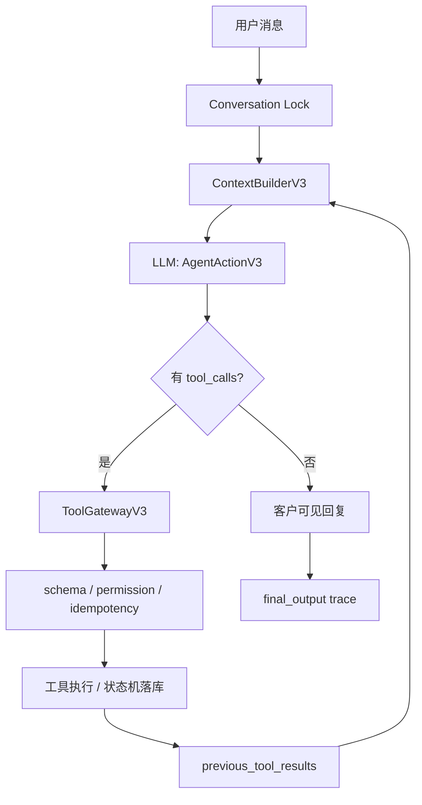

# Mahjong Agent Runtime V3

V3 是一条独立主链路，不在 V2 或旧 trial/workflow 代码上继续缝补。

## 设计边界

- LLM 负责理解用户、判断目标、决定调用哪些工具和调用顺序。
- 后端负责工具 schema 校验、权限、幂等、状态机、并发、预算、日志和审计。
- 后端不解析麻将自然语言，不用 if-else 修具体 badcase。
- 旧 parser、旧 workflow、旧 guard 不参与 V3 主链路。
- 工具调用、模型输入、模型输出、状态变化都写入 trace。
- 回复不对时进入 `record_badcase` 或 eval，不把坏例子硬编码进主流程。

## 主链路

## 当前工具

- `search_current_games`：查询当前局池，只读。
- `search_customers`：按模型给出的结构化条件搜索候选客户，只读。
- `create_game`：创建待组局记录，不发送消息，不确认房间。
- `create_invite_drafts`：创建待审批邀约草稿，不代表已经发送。
- `record_candidate_reply`：记录候选人反馈并推进受控状态。
- `update_game_status`：按状态机更新局状态。
- `record_badcase`：记录 badcase/eval 候选样本。

## 已验证

- `scripts/verify_agent_runtime_v3_boundary.py`：验证 V3 不 import V2/旧 parser/workflow/guard。
- `tests/test_agent_runtime_v3.py`：验证模型驱动工具顺序、工具错误回喂模型、后端不解释短确认语义。
- `scripts/run_evals.py`：已纳入 V3 边界和 V3 runtime 测试。

## 当前限制

- V3 入口当前使用内存状态，重启后状态会丢失；后续需要补 SQLite/Redis 持久化。
- V3 还没有真实微信/小红书/抖音通道，只保留通道无关的输入输出模型。
- V3 还没有独立 golden dataset；当前先用单元测试证明主链路边界。
