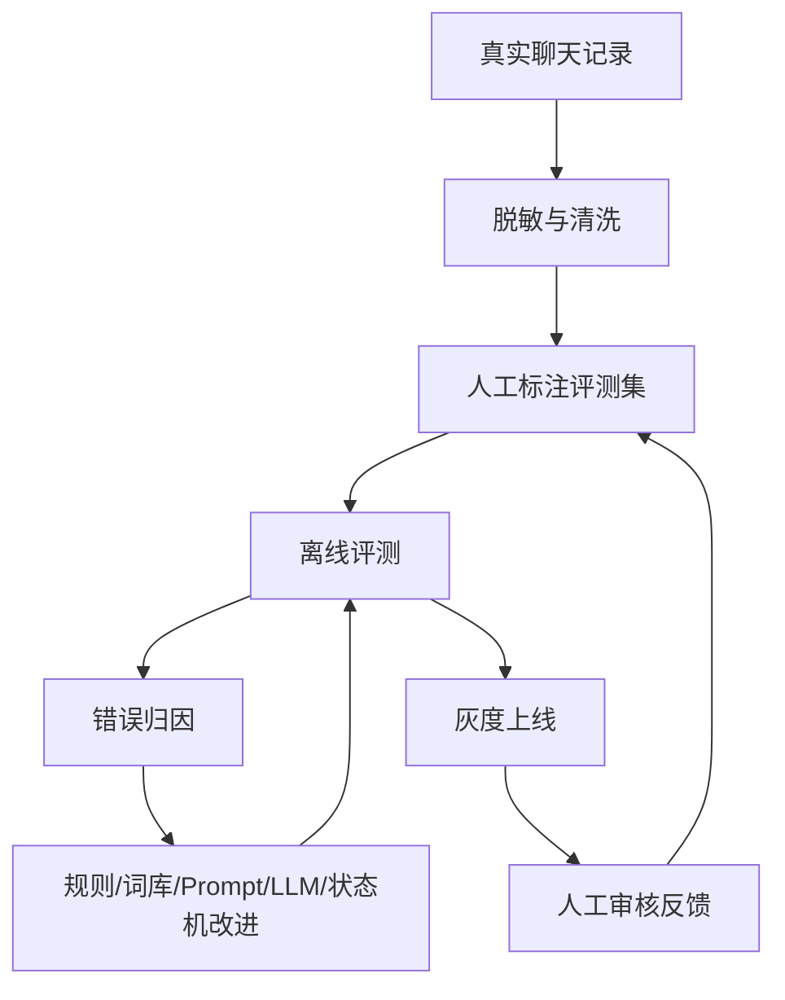

# 模型评估与 Workflow 持续改进方案

这个项目不应该先训练一个“会聊天的麻将馆大模型”，而应该训练和完善一个可控的运营 workflow。核心思路是：

1. 用规则、词库和状态机承接确定性业务。
2. 用 LLM 处理模糊语言、图片/语音转写后的语义归一、未知玩法解释。
3. 用真实数据评测集持续衡量 workflow 是否变好。
4. 当某类任务稳定、高频、规则难覆盖时，再考虑微调模型。

## 总体路线



这里的“训练”不是单指 LLM fine-tuning，而是整个 workflow 的评测、错误归因和持续改进闭环。

## 第一阶段：建立评测集

先从真实 CSV 中抽样 500-1000 条消息，做脱敏标注。不要直接拿原始微信记录进模型训练，也不要提交到 GitHub。

建议分层抽样：

- 高频财敲模板：100 条
- 一条消息多桌：100 条
- 私聊自然语言咨询：100 条
- 红中/川麻/捉鸡/幺鸡特殊玩法：100 条
- 订房/房态/满房：100 条
- 报名/取消/满员/改时间：100 条
- 无关闲聊和噪声消息：100 条
- 图片 OCR / 语音 ASR 转写样本：按实际接入后补充

每条样本标注结构建议：

```json
{
  "id": "sample_000001",
  "text": "红中368鲨鱼，371，无烟",
  "channel_type": "wechat_group",
  "expected": {
    "intent": "find_players",
    "game_count": 1,
    "games": [
      {
        "game_type": "hongzhong_mahjong",
        "variant": "shayu",
        "level": "368",
        "current_player_count": 3,
        "missing_count": 1,
        "start_time": null,
        "rules": ["无烟"],
        "play_options": ["鲨鱼"],
        "status": "need_clarification",
        "follow_up": ["希望几点开局？"]
      }
    ],
    "should_reply": true,
    "expected_action": "create_pending_game"
  },
  "labels": {
    "needs_llm": false,
    "needs_human_review": false,
    "contains_private_data": false
  }
}
```

## 第二阶段：错误归因

每次离线评测失败，不要只记录“错了”，要归因到可行动类型：

- `intent_miss`：没有识别出组局/报名/取消/订房。
- `false_positive`：无关消息误识别成组局。
- `game_split_error`：一条消息多桌拆分错。
- `game_type_error`：玩法错，如把财敲误判成重庆麻将。
- `stake_error`：档位/底注/封顶错。
- `time_error`：时间错或上午下午歧义处理错。
- `missing_count_error`：371/272/173 等人数错。
- `rule_error`：烟况、女玩家、情侣、通宵等规则错。
- `state_error`：局状态、客户锁、候补、满员处理错。
- `reply_error`：回复话术不合适。
- `llm_error`：LLM 输出不稳定、不合规或不能被规则接住。

错误归因决定怎么改：

- 高频固定格式错：改规则解析器。
- 本地行话错：改玩法词库。
- 状态流转错：改状态机。
- 模糊自然语言错：改 prompt 或引入 LLM。
- 规则难覆盖但输出稳定：再考虑微调。

## 第三阶段：先训练词库和规则

麻将馆运营里很多“智能”其实来自本地词库，而不是大模型本身。

建议新增可配置的 `MahjongOntology`：

```yaml
aliases:
  cq:
    canonical: 财敲
    game_type: hangzhou_mahjong
    variant: caiqiao
  371:
    current_player_count: 3
    missing_count: 1
  272:
    current_player_count: 2
    missing_count: 2
  173:
    current_player_count: 1
    missing_count: 3
  216:
    base_score: 2
    cap_score: 16

local_rules:
  少烟:
    rule: 少烟
  烟都可:
    rule: 烟况都可
  568/3:
    game_type: hongzhong_mahjong
    play_option: 爆炸
```

词库应该支持门店级覆盖。比如 A 店的 `cq` 是财敲，另一个城市可能不是。

## 第四阶段：训练客户画像

客户画像不是一次性填表，而是从行为中持续学习。

建议把画像拆成“事实”和“推断”：

- 事实：某人在 2026-06-17 报名了 `杭麻 财敲 0.5 无烟`。
- 推断：此人偏好 `杭麻/财敲/0.5/无烟`。
- 推断：此人通常一个人来，常见同行人数 `1`，置信度 `0.9`。

画像更新规则：

- 同类行为出现多次才提高置信度。
- 最近行为权重大于很久以前。
- 用户明确说“不打这个/不喜欢有烟”优先级高于历史推断。
- 成功到店比随口问一句权重高。
- 被邀请但未回复不能等同于不喜欢。

客户画像字段建议：

```json
{
  "customer_id": "u_123",
  "preferences": [
    {
      "game_type": "hangzhou_mahjong",
      "variant": "caiqiao",
      "levels": [{"value": "0.5", "confidence": 0.86}],
      "rules": [{"value": "无烟", "confidence": 0.72}],
      "usual_hours": [{"hour": 19, "confidence": 0.61}],
      "usual_party_size": {"value": 1, "confidence": 0.9},
      "evidence_count": 8,
      "last_seen_at": "2026-06-17T19:30:00+08:00"
    }
  ],
  "fatigue": {
    "max_games_per_day": 1,
    "min_hours_between_games": 6,
    "invite_cooldown_hours": 6
  }
}
```

## 第五阶段：LLM 应该怎么用

LLM 最适合做这些事：

- 把“今天下班有人打麻将吗”识别为潜在组局咨询。
- 把语音 ASR/OCR 中的脏文本归一成可解析文本。
- 对未知缩写给出候选解释。
- 多桌消息拆分失败时，给出候选切分。
- 生成更自然的追问和人工审核说明。

LLM 不应该直接做这些事：

- 直接占位。
- 直接取消局。
- 直接发私聊。
- 直接改客户画像。
- 直接决定敏感经营/资金相关内容。

推荐 LLM 输出结构：

```json
{
  "is_mahjong_related": true,
  "intent": "find_players",
  "confidence": 0.82,
  "normalized_text": "今晚7点 杭麻财敲 0.5 三缺一 无烟",
  "games": [
    {
      "raw_span": "cq371 0.5 19.30 无烟",
      "normalized_text": "19:30 杭麻财敲 0.5 三缺一 无烟",
      "confidence": 0.88
    }
  ],
  "unknown_terms": [],
  "needs_human_review": false,
  "reason": "cq 在本店词库中表示杭麻财敲，371 表示三缺一。"
}
```

然后系统仍然把 `normalized_text` 交给规则解析器和状态机处理。

## 第六阶段：什么时候微调 LLM

不要太早微调。满足以下条件再考虑：

- 已经有至少 1000-3000 条高质量脱敏标注样本。
- 规则、词库、prompt 已经覆盖大部分固定格式。
- 仍有一类稳定、高频、规则难覆盖的问题。
- 有离线评测集可以证明微调前后提升。
- 可以接受模型更新、回滚、成本和数据合规管理。

适合微调的任务：

- 本地麻将行话归一。
- 多桌消息切分。
- 模糊自然语言意图分类。
- OCR/ASR 脏文本纠错。
- 运营话术风格统一。

不适合微调的任务：

- 客户锁和状态一致性。
- 幂等、保序、异常中断。
- 敏感内容拦截。
- 精确时间计算。
- 需要审计和可回滚的业务状态变更。

## 第七阶段：线上反馈闭环

真实上线后，每次人工介入都应该变成训练数据。

需要记录：

- agent 原始判断。
- agent 置信度。
- 生成的草稿。
- 人工是否修改。
- 人工最终发送了什么。
- 用户是否回复/报名/取消。
- 最终是否成局。
- 是否产生投诉或误打扰。

这些反馈可以计算核心指标：

- 组局识别准确率。
- 多桌拆分准确率。
- 待组局追问成功率。
- 候选人推荐命中率。
- 私聊邀约接受率。
- 人工修改率。
- 静默误杀率。
- 无关误触发率。
- LLM 调用成本/单。
- 自动处理率。

## 推荐优先级

短期最该做：

1. 建立脱敏评测集和 `eval` 脚本。
2. 实现一条消息多桌拆分。
3. 把玩法词库从代码抽成配置。
4. 完善订房/房态 intent，包括纯订房、满房候补、改房间时间和房间释放通知。
5. 增加人工审核反馈记录。

中期再做：

1. 客户画像自动沉淀。
2. LLM 多桌切分兜底。
3. 未知词队列和老板确认后台。
4. LLM 成本、置信度、转人工率看板。

后期才做：

1. 微调本地行话理解模型。
2. 半自动私聊邀约。
3. 多门店词库和客户画像隔离。
4. SaaS 化运营后台。

## 最重要的判断

这个 agent 的护城河不是“用了哪个大模型”，而是：

- 真实麻将馆数据。
- 本地玩法词库。
- 可解释状态机。
- 客户画像和疲劳度。
- 人工审核反馈闭环。
- 一套能持续评测、持续改进的工程系统。

LLM 是这个系统的语义增强层，不是业务大脑本身。
