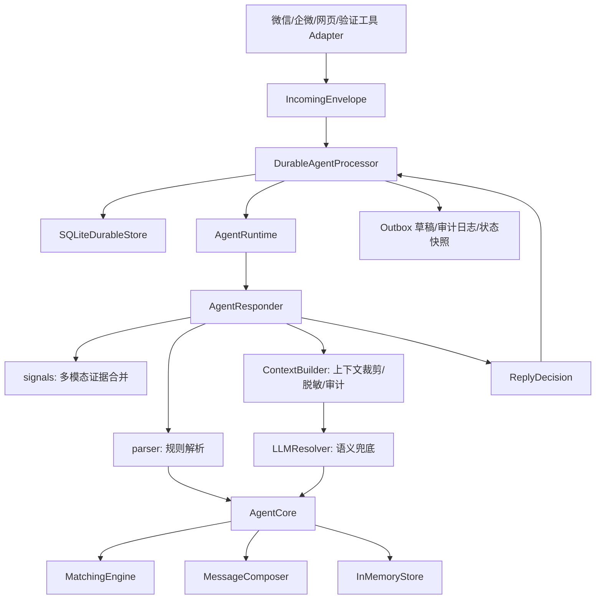
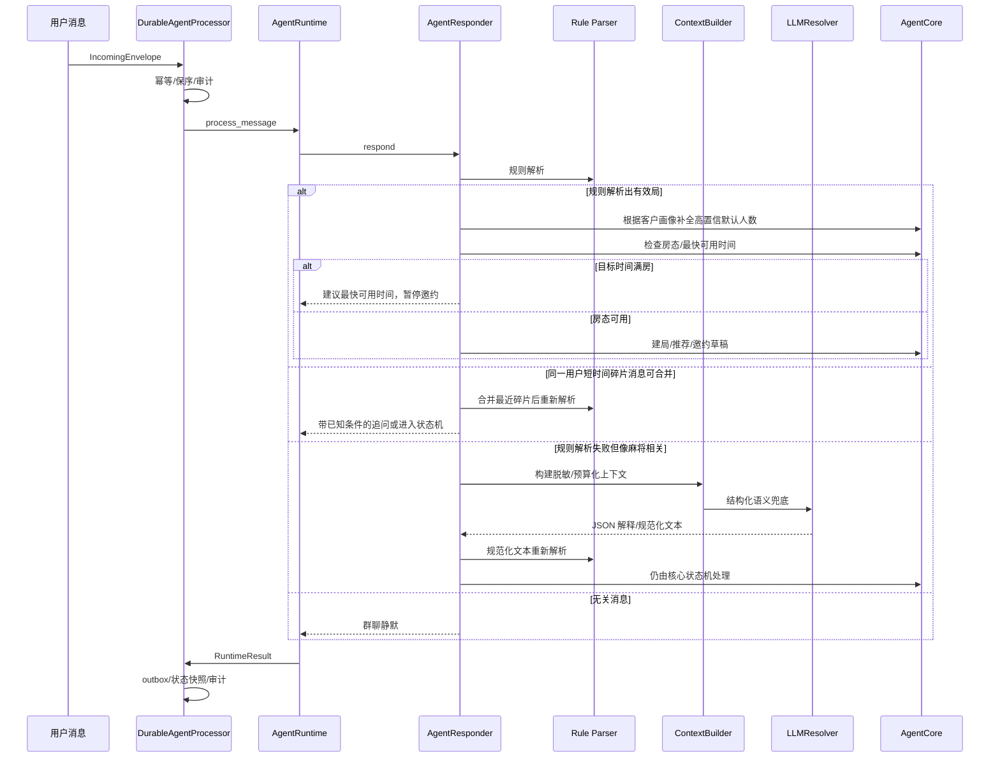

# 自主棋牌室运营 Workflow 架构设计

本文档描述当前 Mahjong Ops Workflow 的代码架构、数据模型、决策流程、可靠性设计、生产级上下文处理器，以及 LLM 接入点。

当前项目的准确定位是 **agentic workflow**：业务流程、状态迁移、幂等、客户锁、outbox、审计由确定性后端控制；LLM 只在语义解析、上下文依赖、新行话和弱表达场景下提供受控判断。它不是完全自治 Agent。

## 目标边界

当前系统先解决“消息进入系统之后怎么正确运营”的核心问题，不直接绑定微信 hook：

- 识别组局、报名、取消、组好、潜在客户咨询等消息。
- 抽取玩法、档位、底注/封顶、时间、几缺几、时长、无烟/有烟等规则。
- 维护客户画像、玩法偏好、疲劳度和打扰频率。
- 推荐候选人并生成群发/私聊草稿。
- 保证同一个客户不会被重复拉入多个有效局。
- 保证同一会话消息幂等、保序、可观测、可回溯。
- 为 LLM 语义兜底预留标准接入点。

当前仍然不做真实微信收发、不自动点击第三方客户端、不直接发送未审核私聊。

## 总体架构



### 关键分层

- `models.py`：核心领域模型，包括 `Message`、`GameRequest`、`CustomerProfile`、`PlayPreference`、`Invitation`。
- `signals.py`：合并文字、语音转写、图片 OCR、表情描述等多模态证据，计算潜在意向分。
- `context.py`：生产级上下文处理器，负责每轮 LLM 调用前的上下文裁剪、脱敏、预算控制、证据来源、digest 和工具策略。
- `parser.py`：规则优先解析器，负责本地玩法、时间、档位、几缺几、规则抽取。
- `llm.py`：LLM 语义解析兜底层，规则不够时才调用。
- `core.py`：业务状态机，负责建局、候选人、邀约、锁、生命周期。
- `matcher.py`：客户推荐引擎，结合玩法偏好、档位、无烟偏好、疲劳度评分。
- `messages.py`：回复、群发草稿、私聊草稿模板。
- `responder.py`：单条消息的运营决策入口，返回结构化 `ReplyDecision`。
- `runtime.py`：运行时保护层，负责上下文、日志、指标、异常、超时。
- `durable.py`：持久化处理器，负责幂等、保序、审计、outbox、状态快照。
- `scripts/run_chatroom.py`：本地对话验证工具，端口 `8788`。
- `scripts/run_agent_server.py`：本地 API 服务，端口 `8787`。

## 核心数据模型

### GameRequest

一桌局的结构化状态：

- `game_type`：大类，如 `hangzhou_mahjong`、`sichuan_mahjong`、`hongzhong_mahjong`。
- `ruleset`：规则体系，如 `hangzhou_mahjong`、`yaoji_mahjong`。
- `variant`：细分玩法，如 `caiqiao`、`yaoji_47`、`suji`。
- `level`：展示档位，如 `0.5`、`2-16`、`1-32`。
- `base_score` / `cap_score`：底注和封顶。比如 `川麻216` 解析为底注 `2`、封顶 `16`。
- `play_options`：玩法选项，如 `财敲`、`换三张`、`定缺`。
- `current_player_count` / `missing_count`：已有几人、还缺几人。
- `start_at` / `duration_hours`：开局时间和预计时长。
- `status`：`need_clarification`、`open`、`negotiating`、`holding`、`confirmed`、`completed`、`cancelled`、`expired`。

### CustomerProfile

客户画像：

- `preferred_levels`：兼容旧逻辑的通用档位偏好。
- `play_preferences`：按玩法细分的偏好。
- `tags`：无烟、熟人局、杭麻、川麻等标签。
- `smoke_free_preference`：是否偏好无烟。
- `usual_party_size` / `usual_party_size_confidence`：常见同行人数及置信度。比如张哥长期一个人来，可高置信记录为 `1`，系统在他没有明说人数时可自动推断为 `1缺3`；新客或低置信客户仍要追问人数。
- `usual_start_hours` / `usual_weekdays`：常打时段。
- `max_games_per_day`、`min_hours_between_games`、`invite_cooldown_hours`、`daily_invite_limit`、`fatigue_sensitivity`：疲劳度和打扰频率。

### RoomHold

房态占用：

- `room_capacity`：门店可用房间总数，保存在运行状态里。
- `RoomHold.start_at` / `RoomHold.end_at`：某个房间被占用的时间段。
- `RoomHold.room_id`：可选房间编号；没有编号时按匿名占用计数。
- `RoomAvailability`：检查指定开局时间和预计时长是否有房，并给出最快可用时间。

如果客户 16:00 来问 17:00 开局，但 17:00 满房且最快 18:00 有房，系统会进入时间协商，不会生成群发或私聊邀约。

示例：

```python
PlayPreference(
    game_type="hangzhou_mahjong",
    preferred_levels=["0.5"],
    preferred_rulesets=["hangzhou_mahjong"],
    preferred_variants=["caiqiao"],
    preferred_play_options=["财敲"],
)

PlayPreference(
    game_type="sichuan_mahjong",
    preferred_levels=["1-32"],
    preferred_rulesets=["sichuan_mahjong"],
    preferred_play_options=["换三张"],
)
```

## 决策流程



### 为什么 LLM 不直接改状态

LLM 只做语义解释，不能直接：

- 创建或取消局。
- 给客户占位。
- 发送私聊。
- 修改客户锁。
- 处理敏感经营或资金相关内容。

LLM 如果输出 `normalized_text`，系统会把它重新交给规则解析器和 `AgentCore`，由确定性代码完成状态变更。这样可测试、可回滚，也便于审计。

## ContextBuilder 上下文处理器

代码位置：`src/mahjong_agent/context.py`

`ContextBuilder` 是 LLM 调用前的统一上下文处理器。它负责决定模型本轮能看见什么，不能看见什么。

当前实现包含：

- `schema_version` / `builder_version`：上下文结构版本，便于回放和灰度。
- `runtime.trace_id`：后端生成或透传的只读链路 ID。
- `current_message`：当前消息的脱敏视图，包含文本、模态、证据和来源。
- `conversation_summary`：同一会话内最近消息摘要，不跨群、不跨用户串线。
- `customer_profile_summary`：客户画像摘要，只放本轮判断需要的偏好和疲劳策略。
- `game_state_snapshot`：最近开放局快照，使用稳定引用，不暴露原始内部 ID。
- `room_state_snapshot`：房态容量和占用快照。
- `tool_policy` / `allowed_tools`：当前 LLMResolver 不开放工具调用；生产 tool call 必须由后端 ToolRouter 注入并由 ToolGateway 校验。
- `rag_snippets`：内置玩法别名和业务词典片段。
- `context_budget`：最大字符预算、估算字符数、被裁剪的上下文段。
- `privacy`：脱敏策略和脱敏计数。
- `audit.context_digest`：本次上下文快照指纹，用于日志检索和事故复盘。

上下文处理原则：

- 模型只看稳定引用，不直接看原始 `sender_id`、`game_id`、`room_id`。
- 手机号、微信号、长数字和资金相关字段会脱敏。
- 上下文按预算裁剪，优先保留当前消息，裁剪历史消息、旧局和房态占用。
- 每个 LLM 参与的 `ReplyDecision` 会记录 `llm_context_digest` 和脱敏后的 `llm_context_snapshot`。
- LLM 返回值不能覆盖后端真实状态；状态推进仍由 `AgentCore` 和 durable 层提交。

## LLM 接入点

代码位置：`src/mahjong_agent/llm.py`

默认实现：`OpenAICompatibleLLMResolver`

启用方式只需要提供 API key 和模型：

```bash
export MAHJONG_LLM_API_KEY="你的 API Key"
export MAHJONG_LLM_MODEL="你的模型名"
PYTHONPATH=src python scripts/run_chatroom.py
```

默认请求地址是：

```text
https://api.openai.com/v1/chat/completions
```

如果使用通义千问/阿里云百炼：

```bash
export DASHSCOPE_API_KEY="你的 DashScope API Key"
export MAHJONG_LLM_MODEL="qwen-plus"
export MAHJONG_LLM_TIMEOUT_SECONDS=60
PYTHONPATH=src python scripts/run_llm_smoke_test.py
```

设置 `DASHSCOPE_API_KEY` 时系统会自动选择 `qwen` provider；如果想统一使用 `MAHJONG_LLM_API_KEY`，也可以额外设置 `MAHJONG_LLM_PROVIDER=qwen`。

`qwen` provider 默认使用：

```text
https://dashscope.aliyuncs.com/compatible-mode/v1/chat/completions
```

如果使用其他 OpenAI-compatible 服务，再额外设置：

```bash
export MAHJONG_LLM_BASE_URL="https://你的服务地址/v1"
```

可选配置：

```bash
export MAHJONG_LLM_TIMEOUT_SECONDS=60
export MAHJONG_LLM_TEMPERATURE=0.1
```

`MAHJONG_LLM_TIMEOUT_SECONDS` 控制模型 HTTP 请求超时。外层 workflow runtime 会默认读取该值并额外增加 5 秒缓冲，避免模型请求还没结束就被 runtime 中断；如需单独覆盖可设置：

```bash
export MAHJONG_AGENT_TIMEOUT_SECONDS=65
```

### LLM 调用时机

`AgentResponder` 会优先走规则解析。只有在以下情况才尝试 LLM：

- 规则解析没有得到可操作的局。
- 消息看起来可能和麻将/组局/本地行话相关，例如“搭子”“雀”“cq”“财敲”等。
- 或者消息来自私聊/手动入口，需要更积极地理解用户意图。

敏感词命中时不会调用 LLM，直接转人工。

### LLM 输出契约

LLM 必须返回 JSON：

```json
{
  "is_mahjong_related": true,
  "intent": "find_players",
  "confidence": 0.86,
  "normalized_text": "今晚7点 0.5 三缺一 无烟",
  "reply_text": "你想几点开、几个人、打多大的？",
  "needs_human_review": false,
  "facts": {
    "reason": "用户说老地方搭子，可能是在问组局"
  }
}
```

系统处理方式：

- 有 `normalized_text` 且置信度足够：重新进入规则解析和核心状态机。
- 相关但信息不足：追问用户。
- 涉及敏感经营、资金、结算：转人工。
- 无关或低置信度：群聊静默。

### 当前没有实现的工具

目前已经有 LLM 接入点，但还没有接网页搜索、地图、排班、CRM 或微信真实发送工具。后续可以在 LLM 层旁边增加 `ToolRegistry`，把可调用工具限制为只读或草稿生成，例如：

- 查询本店玩法词典。
- 查询客户历史偏好。
- 查询当前待组局队列。
- 查询活动/营销素材库。
- 网页搜索某个新玩法名称。

工具结果仍然要回到结构化决策，不能让工具直接发送消息或修改状态。

## 可靠性和可观测

### 幂等

`source_message_id` 作为外部消息唯一键，重复投递不会重复处理。

如果用户或客户端真的发送了两条不同平台 ID、但短时间内语义相同的消息，`durable.py` 会按 `tenant_id + conversation_id + sender_id + channel_type + normalized_text + intent_kind` 生成语义指纹。默认 20 秒窗口内命中同一指纹时，第二条消息会被标记为语义重复并推进 sequence，但不会进入状态机，也不会再次生成 outbox。

### 保序

同一个 `conversation_id` 内用 `sequence` 保证顺序。后序消息先到会进入等待状态，等前序处理完再继续。

### 审计

`durable.py` 会记录：

- `message_received`
- `message_claimed`
- `decision_made`
- `outbox_created`
- `message_processed`

### Outbox

群发和私聊都先进入 outbox 草稿，当前默认待人工确认。这样即使 LLM 参与理解，也不会直接对客户造成不可回滚影响。

### 超时和异常

`AgentRuntime` 对单轮处理设置超时。异常或超时会 fail-closed，返回转人工。

## 上线推荐路径

1. 保持当前规则解析作为主路径。
2. 用 LLM 处理低置信度和新行话，不让 LLM 直接改状态。
3. 收集真实聊天误判，沉淀到玩法词典和测试场景。
4. 接入真实微信/企微时只实现 adapter 和 outbox，不改核心状态机。
5. 从“人工确认草稿”逐步过渡到“低风险自动发送”。
6. 分布式部署时把客户锁和会话顺序从 SQLite 升级到生产数据库或队列。
