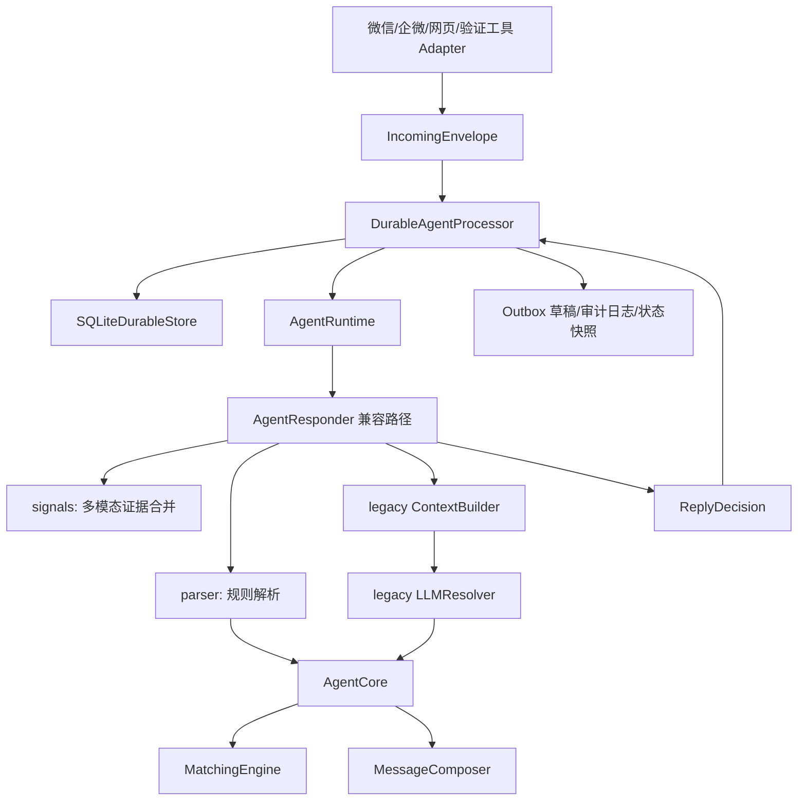
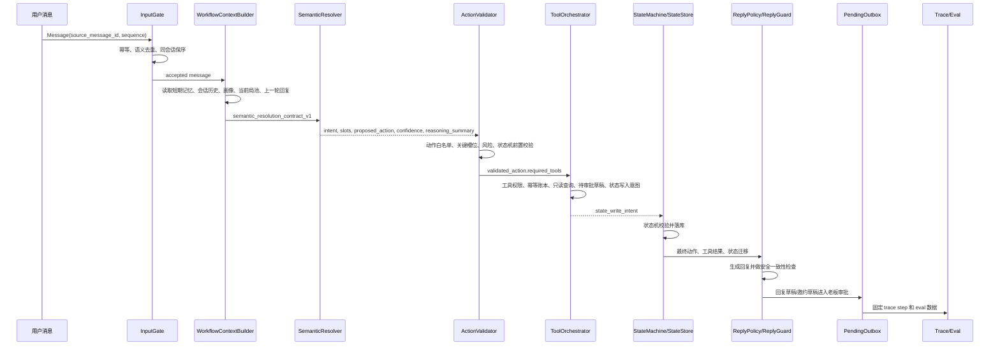

# 自主棋牌室运营 Workflow 架构设计

本文档描述当前 Mahjong Ops Workflow 的代码架构、数据模型、决策流程、可靠性设计、生产级上下文处理器，以及 LLM 接入点。

当前项目的准确定位是 **agentic workflow**：业务流程、状态迁移、幂等、客户锁、outbox、审计由确定性后端控制；LLM 只在语义解析、上下文依赖、新行话和弱表达场景下提供受控判断。它不是完全自治 Agent。

当前默认老板试用台 `/api/analyze` 已优先走受控工作流。`AgentResponder` 仍保留在早期 API、控制台验证工具和兼容测试里，但不再代表目标主链路。

## 目标边界

当前系统先解决“消息进入系统之后怎么正确运营”的核心问题，不直接绑定微信 hook：

- 识别组局、报名、取消、组好、潜在客户咨询等消息。
- 抽取玩法、档位、底注/封顶、时间、几缺几、时长、无烟/有烟等规则。
- 维护客户画像、玩法偏好、疲劳度和打扰频率。
- 推荐候选人并生成群发/私聊草稿。
- 保证同一个客户不会被重复拉入多个有效局。
- 保证同一会话消息幂等、保序、可观测、可回溯。
- 为 LLM 语义兜底预留标准接入点。

当前仍然不做真实微信收发、不自动点击第三方客户端、不直接发送未审核私聊。

## 总体架构

默认受控链路：

```mermaid
flowchart LR
    A["用户消息"] --> B["InputGate 幂等/去重/保序"]
    B --> C["WorkflowContextBuilder"]
    C --> D["SemanticResolver LLM语义contract"]
    D --> E["ProposedAction"]
    E --> F["ActionValidator"]
    F --> G["ToolOrchestrator"]
    G --> H["StateMachine + WorkflowStateStore"]
    H --> I["ReplyPolicy"]
    I --> J["ReplyGuard"]
    J --> K["ReplyApprovalQueue / PendingOutbox"]
    K --> L["Trace / Eval / Audit"]
```



早期兼容链路仍存在，主要用于控制台、老 API 和回归对照：



### 关键分层

- `models.py`：核心领域模型，包括 `Message`、`GameRequest`、`CustomerProfile`、`PlayPreference`、`Invitation`。
- `signals.py`：合并文字、语音转写、图片 OCR、表情描述等多模态证据，计算潜在意向分。
- `context_builder.py` / `memory.py`：受控工作流上下文构建器，负责读取短期记忆、会话历史、用户画像、当前局池、上一轮系统回复，并显式告诉 LLM 当前消息是否可能在回答上一轮。
- `context.py`：早期生产级上下文处理器，仍服务 legacy LLMResolver 和兼容路径。
- `workflow_models.py`：受控工作流 contract，包括 `ConversationContext`、`UserMessage`、`SlotValue`、`GameRequirement`、`SemanticResolution`、`ProposedAction`、`ValidatedAction`、`ToolResult`、`ReplyDraft`。
- `semantic_resolver.py`：LLM 语义解析 contract，模型只输出结构化 JSON，不调用工具、不改状态。
- `action_validator.py` / `state_machine.py`：后端动作校验、状态机合法性、状态迁移账本。
- `tool_orchestrator.py` / `tools/`：工具权限、幂等、只读搜索、待审批 outbox 和状态写入意图。
- `reply_policy.py` / `reply_guard.py`：基于最终动作结果生成回复，guard 只做安全一致性检查。
- `parser.py`：规则优先解析器，负责本地玩法、时间、档位、几缺几、规则抽取。
- `llm.py`：早期 LLM 语义解析兜底层，规则不够时才调用；目标主链路使用 `semantic_resolver.py`。
- `core.py`：业务状态机，负责建局、候选人、邀约、锁、生命周期。
- `matcher.py`：客户推荐引擎，结合玩法偏好、档位、无烟偏好、疲劳度评分。
- `messages.py`：回复、群发草稿、私聊草稿模板。
- `responder.py`：单条消息的运营决策入口，返回结构化 `ReplyDecision`。
- `runtime.py`：运行时保护层，负责上下文、日志、指标、异常、超时。
- `durable.py`：持久化处理器，负责幂等、保序、审计、outbox、状态快照。
- `scripts/run_chatroom.py`：本地对话验证工具，端口 `8788`。
- `scripts/run_agent_server.py`：本地 API 服务，端口 `8787`。

## 核心数据模型

### GameRequest

一桌局的结构化状态：

- `game_type`：大类，如 `hangzhou_mahjong`、`sichuan_mahjong`、`hongzhong_mahjong`。
- `ruleset`：规则体系，如 `hangzhou_mahjong`、`yaoji_mahjong`。
- `variant`：细分玩法，如 `caiqiao`、`yaoji_47`、`suji`。
- `level`：展示档位，如 `0.5`、`2-16`、`1-32`。
- `base_score` / `cap_score`：底注和封顶。比如 `川麻216` 解析为底注 `2`、封顶 `16`。
- `play_options`：玩法选项，如 `财敲`、`换三张`、`定缺`。
- `current_player_count` / `missing_count`：已有几人、还缺几人。
- `start_at` / `duration_hours`：开局时间和预计时长。
- `status`：`need_clarification`、`open`、`negotiating`、`holding`、`confirmed`、`completed`、`cancelled`、`expired`。

### CustomerProfile

客户画像：

- `preferred_levels`：兼容旧逻辑的通用档位偏好。
- `play_preferences`：按玩法细分的偏好。
- `tags`：无烟、熟人局、杭麻、川麻等标签。
- `smoke_free_preference`：是否偏好无烟。
- `usual_party_size` / `usual_party_size_confidence`：常见同行人数及置信度。比如张哥长期一个人来，可高置信记录为 `1`，系统在他没有明说人数时可自动推断为 `1缺3`；新客或低置信客户仍要追问人数。
- `usual_start_hours` / `usual_weekdays`：常打时段。
- `max_games_per_day`、`min_hours_between_games`、`invite_cooldown_hours`、`daily_invite_limit`、`fatigue_sensitivity`：疲劳度和打扰频率。

### RoomHold

房态占用：

- `room_capacity`：门店可用房间总数，保存在运行状态里。
- `RoomHold.start_at` / `RoomHold.end_at`：某个房间被占用的时间段。
- `RoomHold.room_id`：可选房间编号；没有编号时按匿名占用计数。
- `RoomAvailability`：检查指定开局时间和预计时长是否有房，并给出最快可用时间。

如果客户 16:00 来问 17:00 开局，但 17:00 满房且最快 18:00 有房，系统会进入时间协商，不会生成群发或私聊邀约。

示例：

```python
PlayPreference(
    game_type="hangzhou_mahjong",
    preferred_levels=["0.5"],
    preferred_rulesets=["hangzhou_mahjong"],
    preferred_variants=["caiqiao"],
    preferred_play_options=["财敲"],
)

PlayPreference(
    game_type="sichuan_mahjong",
    preferred_levels=["1-32"],
    preferred_rulesets=["sichuan_mahjong"],
    preferred_play_options=["换三张"],
)
```

## 决策流程



### 为什么 LLM 不直接改状态

LLM 只做语义理解、槽位填充、动作提案和回复草稿，不能直接：

- 创建或取消局。
- 给客户占位。
- 发送私聊。
- 修改客户锁。
- 处理敏感经营或资金相关内容。

模型输出必须先变成 `SemanticResolution` / `ProposedAction` contract。后端 `ActionValidator` 再决定动作是否合法，`ToolOrchestrator` 只能执行后端批准的工具，真正状态变更必须通过 `StateMachine` 和 `WorkflowStateStore`。这样可测试、可回滚，也便于审计。

## ContextBuilder 上下文处理器

受控链路代码位置：`src/mahjong_agent/context_builder.py`、`src/mahjong_agent/memory.py`

`WorkflowContextBuilder` 是 LLM 调用前的统一上下文处理器。它负责决定模型本轮能看见什么、不能看见什么，以及当前消息是不是在回答上一轮老板建议。

当前实现包含：

- `current_message`：当前标准化消息。
- `customer_profile`：客户画像摘要、偏好槽位、疲劳策略和低风险画像观察。
- `recent_turns`：最近会话轮次，包含用户输入、系统回复、上一轮结构化局需求和工具结果。
- `previous_system_reply`：上一轮老板建议回复，明确给模型判断“当前消息是不是在回答上一轮”。
- `previous_game_requirement`：上一轮已形成的结构化 `GameRequirement`。
- `active_game` / `open_games`：当前局池快照，包含受控状态账本还原出来的局。
- `followup_context`：上一轮未解决问题、预期回答类型、当前消息响应类型等信号。
- `trace_notes`：说明上下文构建器只提供事实和候选信号，不决定业务动作。

上下文处理原则：

- 上下文只提供事实、画像和候选信号，不直接推进状态。
- 上一轮系统回复必须进入上下文，否则“可以/组/六点”这类短回复无法正确理解。
- 画像可以作为 `source=profile` 的低风险默认值，但不能覆盖用户本轮显式表达。
- 状态账本中的局会还原为 `open_games`，避免服务重启后局池丢失。
- LLM 返回值不能覆盖后端真实状态；状态推进仍由 `StateMachine` 和状态账本提交。

## LLM 接入点

受控链路代码位置：

- `src/mahjong_agent/semantic_resolver.py`
- `src/mahjong_agent/prompts/semantic_resolution.md`
- `src/mahjong_agent/reply_policy.py`
- `src/mahjong_agent/prompts/reply_draft.md`
- `src/mahjong_agent/llm_client.py`

启用方式只需要提供 API key 和模型：

```bash
export MAHJONG_LLM_API_KEY="你的 API Key"
export MAHJONG_LLM_MODEL="你的模型名"
PYTHONPATH=src python scripts/run_boss_trial_app.py
```

默认请求地址是：

```text
https://api.openai.com/v1/chat/completions
```

如果使用通义千问/阿里云百炼：

```bash
export DASHSCOPE_API_KEY="你的 DashScope API Key"
export MAHJONG_LLM_MODEL="qwen-plus"
export MAHJONG_LLM_TIMEOUT_SECONDS=60
PYTHONPATH=src python scripts/run_llm_smoke_test.py
```

设置 `DASHSCOPE_API_KEY` 时系统会自动选择 `qwen` provider；如果想统一使用 `MAHJONG_LLM_API_KEY`，也可以额外设置 `MAHJONG_LLM_PROVIDER=qwen`。

`qwen` provider 默认使用：

```text
https://dashscope.aliyuncs.com/compatible-mode/v1/chat/completions
```

如果使用其他 OpenAI-compatible 服务，再额外设置：

```bash
export MAHJONG_LLM_BASE_URL="https://你的服务地址/v1"
```

可选配置：

```bash
export MAHJONG_LLM_TIMEOUT_SECONDS=60
export MAHJONG_LLM_TEMPERATURE=0.1
```

`MAHJONG_LLM_TIMEOUT_SECONDS` 控制模型 HTTP 请求超时。外层 workflow runtime 会默认读取该值并额外增加 5 秒缓冲，避免模型请求还没结束就被 runtime 中断；如需单独覆盖可设置：

```bash
export MAHJONG_AGENT_TIMEOUT_SECONDS=65
```

### LLM 调用时机

默认老板试用台会把每轮 `/api/analyze` 交给 `ControlledWorkflowService`。语义理解阶段由 `SemanticResolver` 调 LLM；回复阶段如果配置了回复模型，也会由 `ReplyPolicy` 调 LLM 生成草稿。

模型调用失败、超时、预算不足或 JSON contract 不合法时，系统 fail-closed：转人工或使用基于最终动作结果的安全规则兜底，不继续编造副作用动作。

敏感、高风险、资金、纠纷类动作即使模型提出，也会被后端校验器或 guard 拦截，进入人工审核。

### LLM 输出契约

语义解析模型必须返回 `semantic_resolution_contract_v1` JSON：

```json
{
  "intent": "find_players",
  "proposed_action": "create_game",
  "confidence": 0.86,
  "reasoning_summary": "用户明确要老板帮忙组局，已给出时间、档位和烟况。",
  "needs_human_review": false,
  "slots": {
    "stake": {
      "value": ["0.5", "1"],
      "source": "explicit",
      "confidence": 0.92,
      "confirmed": true,
      "needs_confirmation": false
    }
  }
}
```

系统处理方式：

- contract 不合法：拒绝执行，写 trace，转人工。
- proposed_action 不合法或置信度不足：后端降级为追问/转人工。
- 关键槽位不足：`ActionValidator` 生成 `missing_slots`，`ReplyPolicy` 再生成追问。
- 副作用动作：必须经工具权限、幂等账本、状态机和老板审批。

### 工具边界

受控链路已经有工具编排边界：

- `search_current_open_games`：只读查询当前局池。
- `search_candidate_customers`：只读候选人搜索。
- `create_pending_outbox`：只创建待审批草稿，不直接发送。
- `create_game` / `close_game` / `record_seat_acceptance`：只生成状态写入意图，再交给状态机落库。
- `profile_update`：只写低风险画像观察事实，不直接覆盖强画像字段。

真实微信、企业微信、小红书、抖音发送仍应作为外部 adapter 或发送网关接入，并且必须经过审批和幂等发送账本。

## 可靠性和可观测

### 幂等

受控链路由 `InputGate` 先处理 `source_message_id`、`conversation_id` 和 `sequence`。同一平台消息重复投递时，会复用首次处理结果，不会再次调用 LLM、创建局或生成 outbox。

legacy durable 路径仍保留语义指纹去重：如果用户或客户端真的发送了两条不同平台 ID、但短时间内语义相同的消息，`durable.py` 会按 `tenant_id + conversation_id + sender_id + channel_type + normalized_text + intent_kind` 生成语义指纹。默认 20 秒窗口内命中同一指纹时，第二条消息会被标记为语义重复并推进 sequence，但不会进入状态机，也不会再次生成 outbox。

### 保序

同一个 `conversation_id` 内用 `sequence` 保证顺序。后序消息先到会进入等待状态，等前序处理完再继续。

### 审计

受控链路会固定记录：

- `user_input`
- `context_built`
- `llm_prompt`
- `llm_response`
- `action_proposed`
- `action_validated`
- `tool_called`
- `state_transition`
- `reply_drafted`
- `reply_guarded`
- `reply_approval`
- `memory_written`
- `final_output`

legacy durable 路径会记录：

- `message_received`
- `message_claimed`
- `decision_made`
- `outbox_created`
- `message_processed`

### Outbox

群发和私聊都先进入 outbox 草稿，当前默认待人工确认。这样即使 LLM 参与理解，也不会直接对客户造成不可回滚影响。

### 超时和异常

受控链路的 LLM、工具和外层 workflow 都需要超时边界。异常或超时会 fail-closed：不执行副作用工具、不直接发送消息，转人工或返回待审批安全草稿。

## 上线推荐路径

1. 老板试用台默认走受控工作流，所有外发只进待审批草稿。
2. 用真实老板反馈沉淀 golden、badcase 和 regression，不把 badcase 继续写成业务 if-else。
3. 接入真实微信/企微时只新增 adapter 和发送网关，不让渠道层绕过状态机、outbox 和审批。
4. 运行 1-2 个月影子模式：LLM 提动作，老板确认，系统记录成功率、转人工率、误判和成本。
5. 只对低风险、高置信、连续通过 eval 的动作逐步放权，例如只读查局、候选推荐、草稿生成。
6. 分布式部署时把 InputGate、短期记忆、状态账本、工具幂等账本、outbox 和预算计数迁移到 Redis/PostgreSQL 等可共享存储。
