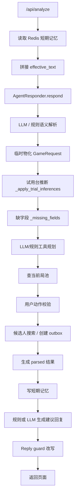

# 麻将馆受控 Agent 工作流架构收敛计划

本文档用于冻结“补丁式修复”，把当前试用台大脚本收敛成可维护、可审计、可上线演进的受控 Agent 工作流。

## 目标边界

系统目标不是让 LLM 自由改状态，而是让 LLM 在后端边界内完成语义理解和动作提案：

- LLM 负责理解用户语义、结合上下文补全低风险信息、提出下一步动作和回复草稿。
- 后端负责状态机、权限、幂等、去重、顺序、并发、风险控制、落库和审计。
- 工具调用必须经过后端工具网关，LLM 不能直接写数据库。
- 回复生成必须发生在动作校验、工具执行和状态更新之后。
- guard 只做安全兜底，不能承担主业务流程。
- badcase 进入 eval 回归，不再变成散落在业务里的 if-else。

## 目标链路


入口 Gate 是技术边界，不理解麻将业务语义。它只根据 `tenant_id + source_message_id` 做幂等去重，根据 `tenant_id + conversation_id + sequence` 做同会话保序；通过后才允许消息进入 `ContextBuilder` 和 LLM contract。重复消息会复用首次处理结果，乱序消息会短路并写入 trace，不会重复创建局、重复生成邀约或重复写短期记忆。内存版适合单进程测试，SQLite 版适合本地生产式部署，可通过 `MAHJONG_INPUT_GATE_SQLITE_PATH` 跨重启保留入口处理进度。

## 当前链路

当前 Web 试用台核心入口在 `scripts/run_boss_trial_app.py` 的 `BossTrialService.analyze()`。实际链路大致如下：



这条链路的问题不是单点 bug，而是多个职责混在一个脚本内：

- 上下文构建、短期记忆、用户画像、工具结果都在 `analyze()` 周围临时拼接。
- `GameRequest` 同时承载事实、推断、状态、展示文案和局部槽位。
- `rules` 字符串承担了结构化槽位职责，例如烟况、时长、人齐开。
- `search_existing_games` 和 `create_game` 的优先级没有统一的决策表。
- 回复生成同时看中间态、工具态和 guard 态，容易前后矛盾。
- guard 多次承担“业务修正”，导致问题被遮住，不容易定位根因。

## 最近失败类型归类

| 类型 | 表现 | 根因 | 目标修复方式 |
| --- | --- | --- | --- |
| 多轮上下文丢失 | 用户回复“组/可以”后没有继承上一轮条件 | 上下文是 dict + 字符串，缺少结构化会话状态 | `ConversationContext` 统一承载上一轮系统问题、上一轮局需求、工具结果 |
| 槽位覆盖/继承混乱 | 上一轮“烟况都可”下一轮又缺烟况 | 槽位散落在 `rules`、`play_options`、LLM slots 和画像里 | `SlotValue` 明确 source、confidence、confirmed、needs_confirmation |
| 查局和建局抢优先级 | 已确认组局后还回复“现在没有，要组一个吗” | `search_current_open_games` 无结果话术压过 `create_game` 缺字段状态 | `ActionValidator` 用决策表先确定最终动作，再生成回复 |
| 缺字段回复错误 | reasoning 说追问，文案却问是否组局 | 回复 prompt 和 guard 优先级不一致 | `ReplyPolicy` 基于最终动作结果生成回复 |
| guard 业务化 | guard 把“帮你问问”改成“留意下” | 上游没有创建 outbox，guard 被迫遮挡错误 | guard 只检查禁止承诺、状态矛盾和高风险文案 |

## 目标目录结构

```text
src/mahjong_agent/
  workflow_models.py        # 受控工作流核心数据模型
  input_gate.py             # 入口幂等、去重和同会话顺序控制
  context_builder.py        # 新版上下文构建器，逐步替换 context.py 中的试验逻辑
  semantic_resolver.py      # LLM 语义解析与 prompt 组装
  action_validator.py       # 动作提案校验、风险和状态机前置判断
  tool_orchestrator.py      # 工具规划、权限、幂等、执行与结果规范化
  reply_policy.py           # 基于最终动作结果生成回复
  reply_guard.py            # 安全兜底，不承载业务主流程
  memory.py                 # 短期记忆、会话摘要、压缩策略
  state_machine.py          # 局、邀约、候选人反馈状态转换
  tools/
    current_games.py
    candidates.py
    outbox.py
  prompts/
    semantic_resolution.md
    reply_draft.md
```

保留但逐步迁移：

- `scripts/run_boss_trial_app.py`：保留为 Web 试用台入口和 HTTP 层，逐步剥离业务逻辑。
- `src/mahjong_agent/context.py`：已有 ContextBuilder，可复用隐私脱敏、预算、快照等能力，但要对齐新的 `ConversationContext`。
- `src/mahjong_agent/models.py`：保留现有运行模型，新增的 `workflow_models.py` 先作为工作流 contract，不立刻破坏旧逻辑。

当前落地状态：

- `workflow_models.py` 已新增，作为受控工作流 contract。
- `input_gate.py` 已新增 `InputGateDecision`、`InputGate` 协议、`InMemoryInputGate` 和 `SQLiteInputGate`：受控 workflow 入口先校验平台消息唯一键和可选 sequence，重复消息不会再次调用 LLM 或触发副作用工具，超前 sequence 不进入上下文构建，等待前序消息处理完成后可重试；本地生产可通过 `MAHJONG_INPUT_GATE_SQLITE_PATH` 启用 SQLite 入口账本，服务重启后仍能识别已完成消息和同会话 sequence 进度。
- `context_builder.py` 已新增，负责把旧运行数据转换为 `ConversationContext`，但尚未接管 Web 试用台主链路。
- `context_builder.py` 已新增 `TrialWorkflowFollowupContextBuilder`，把 Web 试用台旧短期记忆里的“上一轮老板建议回复/上一轮局需求/上一轮工具结果”打包成稳定的 `trial_workflow_followup_context.v1`；当前作为迁移桥接供 `run_boss_trial_app.py` 调用，后续应并入统一 `ConversationContext.followup_context`。
- `context_builder.py` 已新增 `TrialShortMemoryTextMerger`，把 Web 试用台旧 `effective_text` 合并逻辑移出脚本：负责近期碎片消息合并、pending goal 跨窗口继承、重复片段去重和最大长度截断；是否“查现有局/明确组局”仍通过注入函数由迁移期服务判断，后续应收敛到统一 `ConversationContext.recent_turns` 和 `SlotValue`。
- `memory.py` 已新增 `ShortTermMemoryStore` 协议、`InMemoryShortTermMemoryStore` 和 `SQLiteShortTermMemoryStore`；`ContextBuilder` 只依赖协议读取上一轮用户输入、系统回复、结构化 `GameRequirement` 和工具结果摘要。内存版适合测试，SQLite 版适合本地生产式部署，可通过 `MAHJONG_SHORT_MEMORY_SQLITE_PATH` 跨重启保留多轮上下文，避免“上一轮问了什么/答了什么”在服务重启后丢失。后续 Redis 实现也应替换这个接口，而不是改 ContextBuilder。
- `semantic_resolver.py` 和 `prompts/semantic_resolution.md` 已新增，负责把 `ConversationContext` 转换为 `SemanticResolution`，但尚未接管 Web 试用台主链路。
- `action_validator.py` 和 `state_machine.py` 已新增，负责把 LLM 的动作提案校验为 `ValidatedAction`，但尚未接管 Web 试用台主链路。
- `tool_orchestrator.py` 和 `tools/` 已新增，负责按 `ValidatedAction.required_tools` 执行受控工具；副作用工具当前只创建待审批结果，不直接外发。
- `tool_orchestrator.py` 已新增 `ToolExecutionLedger` 协议、`InMemoryToolExecutionLedger` 和 `SQLiteToolExecutionLedger`，只读工具可重复执行，`create_pending_outbox`、`create_game`、`close_game` 等副作用工具按后端生成的 idempotency key 复用结果；本地生产可通过 `MAHJONG_TOOL_LEDGER_SQLITE_PATH` 启用 SQLite 工具执行账本，防止服务重启或重试后重复创建草稿或状态写入意图。
- `create_game` 和 `close_game` 已纳入受控工具链：工具只生成“状态写入意图”，不直接改数据库；真正状态变更仍由 `StateMachine` 校验并由 `WorkflowStateStore` 落库，避免 LLM 或工具绕过状态机。`create_game` 的状态迁移会携带结构化 `GameRequirement` 快照，`ContextBuilder` 会从活跃状态账本还原当前局池，因此受控链路创建的局在下一轮 `search_existing_games` 中可被命中，SQLite 状态账本重启后也能恢复。
- `accept_seat` 已纳入受控工具链：LLM 只能提出候选人确认入局的 contract，`ActionValidator` 会要求调用 `record_seat_acceptance`，工具只生成包含候选人、座位变化和最新 `GameRequirement` 的状态写入意图；`ControlledWorkflow` 再通过 `StateMachine` 校验并由 `WorkflowStateStore` 落库。候选人确认后，`current_player_count/missing_count/party_size` 会作为后端工具状态快照更新，下一轮 `ContextBuilder` 能从状态账本恢复“已确认几人、还缺几人”，避免页面层或 reply guard 用 if-else 猜缺口。
- `profile_update` 已纳入受控工具链：LLM 只能输出 `profile_observations` 观察事实，后端按字段白名单、置信度、风险等级和证据过滤后写入 `CustomerProfile.metadata.controlled_profile_observations`；`ContextBuilder` 会把这些低风险观察作为 `recent_facts` 带入后续上下文，但不会直接覆盖强画像字段。
- `customer_repository.py` 已新增 `CustomerProfileRepository` 协议和 `SQLiteCustomerProfileRepository`；本地生产可通过 `MAHJONG_CUSTOMER_PROFILE_SQLITE_PATH` 持久化客户画像。`ControlledRuntime` 启动时会把 SQLite 中的客户画像加载进 `AgentCore`，也会把启动时已有的常客资料同步到 SQLite；`profile_update` 工具在后端校验并应用低风险观察后会写回仓库，保证重启后候选人推荐和画像观察仍可用。
- `tools/outbox.py` 已新增 `PendingOutboxStore`、`InMemoryPendingOutboxStore` 和 `SQLitePendingOutboxStore`；受控 runtime 可通过 `MAHJONG_OUTBOX_SQLITE_PATH` 持久化待老板审批草稿，服务重启后仍可查询待审批 outbox。
- `create_pending_outbox` 已使用后端工具 idempotency key 派生稳定 outbox 草稿 ID：同一动作、同一候选人会得到同一个 `outbox_...`，即使工具执行账本未命中或重建，pending outbox store 也不会重复膨胀；工具账本负责重试复用结果，草稿稳定 ID 负责持久化侧二次去重。
- `PendingOutboxStore` 已支持审批决策状态更新：`pending_approval -> approved/rejected`，并记录审批人、审批原因、决策 trace 和决策时间；审批通过只表示老板认可草稿，仍不代表已发送，真实发送必须继续走独立发送网关和幂等审计。
- `approval.py` 已新增 `PendingOutboxApprovalService`，作为老板人工审批的受控入口：使用 `ToolExecutionLedger` 记录 `record_approval_decision`，支持审批禁用策略、幂等重试、终态冲突拦截和老板改写最终文案；它不调用 LLM，也不触发真实发送。
- `trial_approval.py` 已新增 `TrialApprovalDecisionAdapter`，把试用台 `/api/approval-decision` 的 payload 解析、受控 action 记录、执行委托和响应投影移出 `scripts/run_boss_trial_app.py`；当前仍写 legacy `approval_requests/outbox` 表，作为迁移期持久化桥接，后续可切换为 runtime 暴露的 `PendingOutboxApprovalService`。
- `trial_delivery.py` 已新增 `TrialOutboxDeliveryAdapter`，把试用台 `/api/send-outbox` 的发送前校验、delivery 幂等键、受控 action 记录、执行委托和响应投影移出脚本；当前仍写 legacy `message_delivery_attempts/outbox/feedback` 表，后续应切到独立发送网关。
- `trial_manual_game.py` 已新增 `TrialManualGameAdapter`，把老板电话/线下手动建局入口的 payload 解析、局 parsed 物化、受控 `create_game` action、幂等执行委托和响应投影移出脚本；当前仍通过脚本注入 legacy SQLite 写入回调，后续可接入统一 `StateMachine`/`WorkflowStateStore`。
- `trial_tool_planning.py` 已新增 `TrialToolPlanPromptBuilder`、`TrialToolPlanPromptInput`、`TrialToolCallNormalizer`、`TrialToolActionProposalFactory` 和 `TrialToolActionValidator`，把 Web 试用台旧 LLM 工具规划 prompt/payload contract、tool_calls 归一化、受控 action proposal 生成和迁移期后端动作校验从脚本移出；它们只构造发给模型的结构化上下文、过滤未知/重复工具、强制 `send_message` 进入待审批模式、生成稳定 `action_id/idempotency_key`，并校验阶段可用工具、局上下文、关键槽位、参数白名单、runtime policy、副作用工具可信提案和待审批 outbox 模式；不调用模型、不执行工具、不做预算、不写状态，后续应并入统一 `ActionValidator`/`ToolOrchestrator` contract。
- `trial_tool_gateway.py` 已新增 `TrialToolGateway`，把 Web 试用台旧链路的工具执行网关从脚本移出：只允许已通过后端校验的 action 调用受控执行账本，并把 `action_id/idempotency_key` 回填到工具结果；如果工具没有 validated action，则直接拒绝且不运行底层 operation。它不决定工具选择、不做业务搜索、不写状态，是迁移到统一 `ToolOrchestrator` 前的 legacy adapter。
- `trial_tool_requests.py` 已新增 `TrialToolRequestFactory`，把 Web 试用台旧链路中 `search_current_open_games`、`search_candidate_customers` 和 `send_message/create_pending_outbox` 的工具 request contract 从脚本移出；它只标准化工具入参、审计字段和硬边界说明，不决定是否调用工具，也不执行工具。
- `trial_tool_orchestration.py` 已新增 `TrialToolOrchestrationService`、`TrialToolOrchestrationInput` 和 `TrialToolOrchestrationResult`，把 Web 试用台旧链路中的工具顺序控制从 `analyze()` 移出：先让 LLM 规划当前局池查询，再根据语义动作、现有局命中和关键槽位决定是否物化局，之后按 `search_candidate_customers -> send_message/create_pending_outbox` 继续二/三段工具规划。当前具体 LLM 调用、后端校验、工具执行和状态写入仍通过回调注入，后续应逐步替换为统一 `ToolOrchestrator` 和 `StateMachine`。
- `ToolOrchestrator` 已新增“最终动作 -> 可用工具”白名单：即使上游 `ValidatedAction.required_tools` 被污染，工具层也会拒绝不属于当前 `effective_action` 的工具。例如最终动作只是 `ask_create_confirmation` 时，`create_game/create_pending_outbox/search_candidate_customers` 都不能执行；这层只做权限校验，不重新判断用户语义。
- `slot_matching.py` 已新增通用槽位匹配 contract：`SlotValue.value` 可以是单值、可接受值列表或 `any` 类不限值，`ActionValidator` 和 `CurrentGameSearchTool` 共用同一套匹配逻辑。这样“0.5 或 1 都行”“有烟无烟都可”会被当成结构化可接受范围，而不是在某个接口里临时写正则或 if-else。
- `ActionValidator` 已要求 `queue_invites/create_game` 在搜索候选人和创建待审批邀约前先执行 `search_current_open_games` 只读工具。这样“新组局”路径也会留下当前局池查询审计，避免只依赖 `ContextBuilder.open_games` 快照就直接进入候选人邀约。
- `ControlledWorkflowService` 的 `QUEUE_INVITES/CLOSE_GAME/ACCEPT_SEAT` 状态迁移已统一通过 `state_write_intent` helper 消费工具返回的 `target_status/requirement/entity_id`；主流程不再根据 outbox 是否创建成功自行重算 `open -> negotiating`，也不再把关闭局硬编码为 `cancelled`。工具层提出状态写入意图，状态机校验合法性，状态账本负责落库；工具缺少合法 `state_write_intent` 时不落库、不 fallback。
- `state_write_intent` 已收敛为 `state_write_intent.v1` contract：工具返回的状态写入意图必须包含合法 `kind/entity_type/entity_id/target_status/reason/requirement`，`create_game` 只能进入 `open/negotiating`，`close_game` 只能进入 `cancelled/expired/completed`，`record_seat_acceptance` 必须携带 `participant/seat_delta` 且只能进入 `negotiating/confirmed`。`ControlledWorkflowService` 先解析为 `StateWriteIntent`，再交给 `StateMachine` 校验迁移；非法工具 payload 不落库、不 fallback，并在 `state_transition` trace 中记录 `rejected_state_write_intents`，方便审计为什么没有推进状态。
- `trial_game_state.py` 已新增 `TrialGameStateCreationAdapter`，把 Web 试用台旧链路中 `create_game` 状态写入的受控 action 构造、幂等执行、SQLite legacy 写入回调、成功后内存缓存和 action plan 投影从 `analyze()` 移出；它仍通过回调接入旧 store，后续应由统一 `StateMachine`/`WorkflowStateStore` 承接。
- `trial_reply.py` 已新增 `TrialReplyDraftAdapter` 和 `TrialReplyRulePolicy`，把 Web 试用台旧链路中“工具和状态上下文就绪后生成建议回复，并把回复写回短期记忆”的回复阶段从 `analyze()` 移出，同时把规则兜底回复、现有局无匹配时是否跳过 LLM 的判断从 `_suggested_reply` 中移出；当前 LLM prompt、预算和 guard 仍在脚本回调里，后续应继续拆到统一 `ReplyPolicy`/`ReplyGuard`。
- `trial_candidate.py` 已新增 `TrialCandidateMessageAdapter`，把试用台 `/api/candidate-message` 的请求解析、候选人语义提案调用、状态写入委托、followup 合并和响应投影移出脚本。
- `candidate_semantics.py` 已新增 `CandidateSemanticProposalAdapter`、`CandidateSemanticProposalResult` 和 `CandidateSemanticResolverService`，把候选人回复的 LLM/fallback 语义提案收敛成单一 contract：模型只提出 `semantic_type/proposed_action/reply_text/confidence/reasoning_summary`，后端 validator 再决定是否允许写状态；候选人 `semantic_type/proposed_action/feedback_type` 的白名单、别名映射、LLM prompt、候选人上下文 payload 和提案归一化都已从脚本移入 contract 层。
- `candidate_reply_facts.py` 已新增 `CandidateReplyFactService`，把候选人回复的安全降级分类、改时间/改时长本地探测、自然时间标签和 LLM `extracted_facts` 合并从脚本移出；它不调用 LLM、不写库、不发消息，只为 semantic fallback 和 validator 提供事实解析。
- `candidate_validation.py` 已新增 `CandidateActionProposalValidator`，把候选人回复后的后端动作校验从脚本移出：它只检查 proposed_action 白名单、状态提交置信度、协商覆盖、局已归档和局已满等边界，不调用 LLM、不写库、不发消息；候选人事实解析通过 `CandidateReplyFactService` 注入。
- `candidate_feedback_action.py` 已新增 `CandidateFeedbackActionService`，把候选人反馈写状态前的 `record_candidate_feedback` 受控 action contract、幂等键、风险等级、runtime policy、state-write policy 和 tool audit 从脚本移出；它只生成和审计 action，不执行 action、不写库、不发消息。
- `trial_followup.py` 已新增 `TrialOrganizerFollowupAdapter`，把候选人协商后给发起人的 followup 编排从脚本移出：它只负责 `send_message/create_pending_followup` 的后端工具校验、待审批 followup 创建、tool audit 和 action plan 投影；不会直接外发，也不改变局状态。
- `organizer_followup_draft.py` 已新增 `OrganizerFollowupDraftService`，把协商 followup 的兜底话术、LLM 草稿 prompt、模型调用、预算/audit 和文案 guard 从脚本移出；它只生成待审批草稿 contract，不写库、不发消息。当前 SQLite followup/approval 写入函数仍由脚本回调提供，后续可继续迁移到发送网关或统一持久化 adapter。
- `candidate_reply_draft.py` 已新增 `CandidateReplyDraftService`，把候选人私聊回复的兜底话术、局面进度标签和安全 guard 从脚本移出；它不调用 LLM、不写库、不发消息，只根据后端已校验的候选人反馈生成安全草稿。当前候选人 LLM 语义提案中的 `reply_text` 仍由 `candidate_semantics` contract 产出，后续应迁移到统一 `ReplyPolicy`，并调整到状态/工具执行之后生成。
- `reply_policy.py`、`reply_guard.py` 和 `prompts/reply_draft.md` 已新增，负责基于最终动作和工具结果生成回复草稿并做安全一致性检查；`ReplyPolicy` 已支持可选 `reply_draft_contract_v1` 模型调用，模型只生成结构化回复草稿，后端仍负责工具、状态和 guard。
- `ReplyPolicy` 已开始读取状态机落库后的 `StateTransition.metadata`：例如候选人 `accept_seat` 后，回复文案从 `record_seat_acceptance` 产生的 `seat_delta` 得到“加你272/371/人齐了”，而不是从用户原文、旧 outbox 或 guard 中猜局面。`reply_draft_contract_v1` 的 LLM 输入也包含状态转移 metadata，保证模型生成回复时看到的是最终动作结果。
- `ReplyPolicy` 已开始执行回复草稿 contract 验收：`text/reasoning_summary/risk_level` 是必需字段，`text` 必须是字符串且允许为空，`risk_level` 必须是 `low/medium/high`。模型缺字段、输出非法风险等级或把 `text` 输出成非字符串时，不再视为成功草稿，而是记录 `llm_contract.accepted=false`、写入 `contract_errors`，再使用基于最终动作结果的规则兜底。
- `ReplyGuard` 已移除缺字段追问生成逻辑：缺字段该怎么问由 `ReplyPolicy` 基于 `ValidatedAction.missing_slots` 生成，guard 不再把“要组一个吗”改写成业务追问；它只保留安全一致性检查，例如高风险转人工、无 outbox 时禁止承诺问人、无房态时禁止留座/确认房间。
- `reply_approval.py` 已新增 `ReplyApprovalQueue`：最终 `GuardedReply` 不直接代表已发送，而是可作为 `source=controlled_reply` 的 pending outbox 草稿进入同一个 `PendingOutboxStore`，等待老板审批；没有配置 outbox store 时，受控 trace 会记录 `reply_approval.queued=false` 和跳过原因。这样目标链路中的 `ReplyGuard -> 待老板审批 -> 日志/trace/eval` 有明确落点，回复审批和候选邀约审批共享同一个审批服务与持久化边界。
- `reply_approval` 已纳入 `CONTROLLED_WORKFLOW_REQUIRED_TRACE_STEPS`：正常路径必须记录回复是否进入老板审批队列；input gate 短路路径也会记录 LLM prompt/response 被跳过、状态迁移为空、回复审批未入队，避免重复消息或乱序消息在 trace 中看起来像“漏日志”。
- `SemanticResolver` 和 `ReplyPolicy` 的 LLM 输出默认按“纯 contract”处理：模型必须返回单个 JSON object，不能夹带 Markdown、代码块或解释文字；如果需要兼容旧模型输出，必须显式开启 `allow_json_fragment_extraction=True`。生产默认拒绝从自由文本里抠 JSON，避免模型用自然语言绕过结构化校验。
- `SemanticResolver` 已开始执行语义 contract 验收：`intent/proposed_action/confidence/reasoning_summary/slots` 是必需字段，`slots/action_arguments/profile_observations` 必须是约定类型，`intent/proposed_action` 必须在白名单内；每个 slot 也必须是 `SlotValue` contract，包含 `value/source/confidence/confirmed/needs_confirmation`，且 source、confidence、布尔字段类型都要合法，`value` 不能为空或 `unknown`，`confirmed` 与 `needs_confirmation` 不能互相矛盾。模型缺少 `proposed_action` 或输出半结构化 slot 时不再由后端根据 intent/默认值猜动作和槽位，而是记录 `llm_contract.accepted=false`、写入 `contract_errors` 并转人工，防止不完整模型输出继续进入状态机和工具链。
- `action_arguments` 已收敛为动作级 contract：`create_game/queue_invites/search_existing_games/ask_*` 等动作不允许模型携带参数，新局 ID 必须由后端幂等键生成；`join_game/accept_seat/match_existing_game` 只能携带已有 `game_id/outbox_id` 字符串引用；`cancel_game/close_game` 只能携带已有 `game_id` 和标准 `reason_code`，不能指定 `target_status/state_write_intent` 等写状态参数。`SemanticResolver` 先验收，`ActionValidator` 再复验，绕过语义层的非法参数也不会进入工具编排。
- `profile_observations` 已收敛为共享 contract：语义层要求每条画像观察必须是对象，并包含合法 `field/value/confidence/source/evidence/risk`，字段白名单、来源、风险等级和 0.65 置信度阈值在 `profile_observation_contract.py` 统一定义；工具层复用同一 contract 做落库归一化和拒绝原因，不再各自维护一套松散规则。
- `SemanticResolver` 已记录语义模型 contract 审计：成功解析时 `raw_response.llm_contract.accepted=true`；解析失败、超时或模型错误时保留 `parse_error/error/raw_output/prompt_messages`，并在受控 trace 的 `llm_response` 阶段以 `WARN` 记录，确保“为什么转人工/为什么没有继续走工具”可回放。
- `ActionValidator` 已停止从“组/可以/好/要”等短确认词和 `followup_context.signals` 中自行脑补新建局；多轮确认必须由 `SemanticResolver` 在 contract 中明确提出 `create_game/queue_invites`，后端只校验动作、关键槽位、局池优先级和工具权限。若模型仍提 `search_existing_games`，validator 只会执行查局/询问是否新组，不会私自升级为候选人搜索或创建局。
- `ReplyPolicy` 已记录回复模型 contract 审计：如果 LLM 回复草稿 contract 被拒绝，规则兜底生成的 `ReplyDraft.metadata.llm_contract` 会保留 `parse_error/raw_output/prompt_messages`，`reply_drafted` trace 以 `WARN` 记录，避免“模型失败但页面只看到规则回复”的不可回溯问题。
- `state_machine.py` 已新增 `WorkflowStateStore` 协议、`InMemoryWorkflowStateStore` 和 `SQLiteWorkflowStateStore`；受控链路会把允许的状态迁移应用到账本，本地生产可通过 `MAHJONG_STATE_SQLITE_PATH` 启用 SQLite 状态落库，后续 Redis/PostgreSQL 也应实现同一接口。
- `observability.py` 已新增 `controlled_trace.v1` contract、受控链路必需 trace step 列表和完整性校验函数；`final_output` 会携带 `trace_completeness`，回归评估可直接断言每轮链路是否可回放。
- `user_input` trace 已记录生产通道审计字段：内部 `message_id`、外部 `source_message_id/platform_message_id`、`tenant_id`、`conversation_id`、`channel_id/channel_type`、`sequence` 和 `input_refs`。这样重复消息、乱序消息和跨通道接入问题可以从第一条 trace 事件开始回放，而不是只在 input gate 阶段才看到。
- `scripts/run_evals.py` 已新增，统一运行当前场景评估和 boss trial golden 回归。
- `scripts/check_badcase_regression_coverage.py` 已新增并接入 `scripts/run_evals.py`：所有 `triage_status=fixed` 的 badcase 必须声明 `regression_refs`，并指向存在的 golden、controlled regression 或 pytest 用例；`triage_status=new` 的 badcase 保留为待处理队列，不作为发布阻塞。
- `scripts/run_boss_trial_app.py` 仍是旧试用台入口，后续只应作为 HTTP/UI 壳逐步调用新模块。
- 受控工作流接入试用台已拆成 `TrialControlledEntryAdapter`、`trial_projection.py`、`TrialControlledPersistenceAdapter`、`TrialControlledResponseAdapter` 几层迁移桥接，用于证明 `HTTP 输入 -> Message -> LLM contract -> ActionValidator -> ToolOrchestrator -> StateMachine -> 待审批 outbox` 可以闭环；后续应继续把试用台脚本收缩为 HTTP/UI 壳。
- 试用台 `/api/analyze` 默认走受控工作流，并且默认不能被请求体静默切回 legacy。只有显式设置 `MAHJONG_TRIAL_ALLOW_LEGACY_WORKFLOW=1` 后，才允许通过 `use_controlled_workflow=false` 或 `MAHJONG_TRIAL_USE_CONTROLLED_WORKFLOW=0` 做旧链路对照。这样保证日常老板试用和回归测试优先验证目标架构，而不是继续落到 legacy `BossTrialService.analyze()`。
- `trial_routing.py` 已新增，负责试用台 `controlled workflow` 与 legacy workflow 的路由策略。`scripts/run_boss_trial_app.py` 只导入并调用该策略，不再自己解释 `MAHJONG_TRIAL_USE_CONTROLLED_WORKFLOW`、`MAHJONG_TRIAL_ALLOW_LEGACY_WORKFLOW` 和请求体开关，继续把大脚本收缩为 HTTP/UI 壳。
- 试用台受控入口已开始透传生产通道元数据：`tenant_id/store_id`、`source_message_id/message_id/platform_message_id`、`sequence/message_sequence`、`channel_id/channel_type` 会进入 `Message.metadata`，供 `InputGate` 做幂等、去重和同会话保序。入口层只标准化外部消息引用，不判断麻将语义。

## 核心数据模型

第一批需要稳定的 contract：

- `WorkflowRun`
- `UserMessage`
- `ConversationContext`
- `WorkflowTurn`
- `SlotValue`
- `GameRequirement`
- `SemanticResolution`
- `ProposedAction`
- `ValidatedAction`
- `ToolCallRequest`
- `ToolResult`
- `StateTransition`
- `ReplyDraft`
- `GuardedReply`

`SlotValue` 必须替代散落的字符串槽位：

```python
{
    "name": "stake",
    "value": "0.5",
    "source": "explicit",
    "confidence": 0.92,
    "confirmed": True,
    "needs_confirmation": False,
}
```

`value` 可以是单值，也可以是可接受范围列表，例如 `["0.5", "1"]`；“不限/都可”应表达为明确的 `any` 类值，而不是把多个文案散落到各层规则里。后端使用统一的 `slot_matching` contract 判断查询条件和现有局是否兼容。

字段含义：

- `source=explicit`：用户原话明确说出，最高优先级。
- `source=context`：上一轮上下文已确认，允许继承。
- `source=profile`：用户画像偏好，只能作为默认建议或低风险补全。
- `source=region_default`：地区默认，例如杭州默认杭麻。
- `source=inferred`：模型或规则推断，必须看置信度和是否需要确认。

`ConversationContext.followup_context` 使用 `followup_context.v1`，用于解决多轮短消息理解问题。它只提供上下文信号，不直接推进业务状态：

- `previous_turn`：上一轮用户消息、老板建议回复和时间。
- `previous_game_requirement`：上一轮已形成的结构化槽位，LLM 可按 `source=context` 继承。
- `unresolved_questions`：上一轮还在等用户回答的问题，例如 `create_confirmation/start_time/party_size/stake/smoke/duration`。
- `expected_answer_type`：本轮预期是确认、补槽位，还是两者都有可能。
- `current_message_response_type`：当前消息像 `short_ack/slot_fill/correction/negative/unknown` 哪一类。
- `should_treat_current_message_as_followup`：提示 LLM 优先按“回答上一轮”理解，但最终动作仍由 LLM contract 和后端校验共同决定。

## 动作决策表

`ActionValidator` 需要显式决策，而不是散落判断：

| LLM proposed_action | 条件 | 后端 effective_action |
| --- | --- | --- |
| `search_existing_games` | 只是问有没有局 | `search_existing_games` |
| `search_existing_games` | 已有匹配局 | `match_existing_game` |
| `search_existing_games` | 无匹配局，用户未确认新组 | `ask_create_confirmation` |
| `create_game` | 缺关键字段 | `ask_clarification` |
| `create_game` | 关键字段齐全，当前无匹配局 | `queue_invites` |
| `create_game` | 已有可承接局 | `match_existing_game` |
| `join_game` | 候选邀约存在且名额未满 | `accept_seat` |
| `cancel_game` | 用户是发起人或老板确认 | `close_game` |
| 任意 | 涉及资金、纠纷、高风险 | `human_review` |

关键字段暂定：

- 玩法或可解释的默认玩法
- 档位
- 开局时间策略：固定时间或人齐开
- 人数/缺口
- 烟况
- 时长策略：固定时长或通宵

## 工具边界

工具分风险等级：

| 工具 | 风险 | 执行策略 |
| --- | --- | --- |
| `search_current_open_games` | low | 可自动执行，只读 |
| `search_candidate_customers` | low | 可自动执行，只读 |
| `create_pending_outbox` | medium | 只创建待审批草稿，不直接发送；可通过 SQLite pending outbox store 持久化待审批队列 |
| `record_approval_decision` | medium | 老板人工动作；只更新 outbox 审批状态、最终文案和审计 metadata；不触发真实发送；通过 `ToolExecutionLedger` 幂等 |
| `send_message` | high | 必须人工审批 + 幂等发送网关 |
| `create_game` | medium | 后端校验后由工具生成状态写入意图，再交给状态机落库 |
| `close_game` | medium/high | 后端校验后由工具生成关闭意图，需要身份、状态和原因校验，再交给状态机落库 |
| `profile_update` | low/medium | 只写低风险画像观察事实；要求字段白名单、置信度 >= 0.65、可回溯证据；敏感或冲突信息需人工确认 |

## 回复策略

回复只能基于最终动作结果：

```text
final_action + game_requirement + tool_results + state_transition -> reply_policy -> reply_guard
```

基本优先级：

1. 高风险或纠纷：转人工。
2. 缺关键字段：自然追问，最多问 3 个问题。
3. 已匹配现有局：给出可选局，问是否确认。
4. 已创建待审批邀约：简短确认“好的，我帮你问问。”
5. 无现有局且用户只是咨询：问是否新组。
6. 候选人反馈：按局进度回复，例如“好的，加你272了”“好的，人齐了”。

guard 只检查：

- 是否承诺已发送但没有 outbox/delivery。
- 是否承诺已确认房间但没有房态/人工确认。
- 是否在缺字段时说已经问人。
- 是否回复和状态机矛盾。
- 是否出现资金、纠纷、优惠承诺等高风险内容。

## 可观测要求

每轮 trace 必须有固定阶段：

```text
input_received
context_built
semantic_request
semantic_response
action_proposed
action_validated
tool_plan_created
tool_called
tool_result
state_transition
reply_request
reply_response
reply_guarded
output_returned
eval_case_recorded(optional)
```

每个阶段至少包含：

- `trace_id`
- `conversation_id`
- `sender_id`
- `stage`
- `input_hash`
- `reasoning_summary`
- `allowed/rejected`
- `state_before/state_after`，如适用
- `tool_name` 和 `idempotency_key`，如适用

## Eval 收敛

目标目录：

```text
eval/
  golden/
  badcases/
  regression/
```

现有 JSONL 已按职责归档：

- `eval/golden/scenario_golden.jsonl`：底层 workflow 稳定回归集。
- `eval/golden/boss_trial_golden.jsonl`：老板试用台核心样例。
- `eval/badcases/badcases.jsonl`：用户试用反馈的真实坏例。
- `eval/regression/`：badcase 修复后的专项回归集。
- `eval/few_shot_examples.jsonl`：可进入 prompt 的少量示例。

每次重构必须跑：

```bash
PYTHONPATH=src pytest -q
python scripts/run_evals.py
```

## 迁移顺序

### 第 1 步：建立 contract

- 新增 `workflow_models.py`。
- 定义核心 dataclass / enum。
- 不改变现有业务行为。
- 为 `SlotValue`、`GameRequirement`、`SemanticResolution` 增加基础单测。

### 第 2 步：抽 ContextBuilder 适配层

- 新增 `context_builder.py` 或在现有 `context.py` 上做新版接口。
- 输入 `UserMessage`。
- 输出 `ConversationContext`。
- Web 试用台先双写：仍用旧上下文，但 trace 里记录新版上下文。

### 第 3 步：抽 SemanticResolver

- 将 `semantic_resolution` prompt 从 `run_boss_trial_app.py` 移到 `prompts/semantic_resolution.md`。
- 新增 `semantic_resolver.py`，输入 `ConversationContext`，输出 `SemanticResolution`。
- 旧逻辑通过 adapter 转换。

### 第 4 步：抽 ActionValidator

- 新增 `action_validator.py` 和轻量 `state_machine.py`。
- 把 `create_game/search_existing_games/ask_clarification` 决策表迁出大脚本。
- 先只覆盖老板试用台最近高频路径。
- 保留 trace 对比旧结果和新结果。

### 第 5 步：抽 ToolOrchestrator

- 新增 `tool_orchestrator.py` 和 `tools/current_games.py`、`tools/candidates.py`、`tools/outbox.py`。
- 统一工具请求、权限、幂等键、执行结果。
- 所有工具结果返回 `ToolResult`。
- 副作用工具只写 outbox 或状态机，不直接执行外部发送。

### 第 6 步：抽 ReplyPolicy 和 ReplyGuard

- 新增 `reply_policy.py`、`reply_guard.py`，prompt 移到 `prompts/reply_draft.md`。
- 回复策略只吃最终动作结果。
- guard 只拦安全矛盾，不做主流程决策。

### 第 7 步：收束脚本

`scripts/run_boss_trial_app.py` 最终只保留：

- HTTP 路由
- 页面静态资源
- 服务组装
- DB/cache 初始化
- 临时调试 API

业务链路由 `ControlledWorkflowService` 承载。

当前已经新增受控运行时入口：

- `controlled_workflow.py`：串联上下文构建、语义解析、动作校验、工具编排、状态机、回复策略、回复安全闸和短期记忆。
- `controlled_runtime.py`：从环境变量组装 `ControlledWorkflowService`，默认写入 `logs/controlled_workflow_trace.jsonl`；可通过 `MAHJONG_STATE_SQLITE_PATH`、`MAHJONG_TOOL_LEDGER_SQLITE_PATH` 和 `MAHJONG_OUTBOX_SQLITE_PATH` 启用状态机落库、工具幂等账本和待审批 outbox 持久化；当启用 outbox store 时，runtime 会同时暴露共享同一 store 和 tool ledger 的 `PendingOutboxApprovalService`，`MAHJONG_APPROVAL_ENABLED=false` 可临时关闭审批状态写入。
- `llm_client.py`：OpenAI-compatible 语义解析客户端，实现 `SemanticLLMClient.complete()` contract，带预算、审计、超时和 fail-closed。
- `observability.py`：内存 trace 和 JSONL trace recorder。

下一步迁移试用台时，`/api/analyze` 应只负责装配 `TrialControlledEntryAdapter`，由 adapter 把 HTTP 输入转成 `Message`，调用 `build_controlled_runtime().service.handle_message()`，再把 `WorkflowRun`、`ToolResult`、`GuardedReply`、持久化结果和 trace 投影成页面需要的 JSON。

## 验收标准

架构收敛完成前，每一步必须满足：

- 页面可打开。
- `/api/analyze` 可用。
- 现有全量测试通过。
- 新增的模块测试通过。
- 新增或修复 badcase 必须进入 eval。
- trace 能解释本轮为什么这么回复。

阶段性完成标准：

- `run_boss_trial_app.py` 中 `BossTrialService.analyze()` 不再直接包含 LLM prompt、工具执行细节、回复策略细节。
- `SlotValue` 成为槽位继承和冲突解决的唯一结构。
- `ReplyGuard` 没有业务主流程分支，只做安全一致性检查。
- 对“通宵有人吗 -> 组/可以”“早麻有人吗 -> 可以”“下午两点 0.5 无烟杭麻，帮我组一桌”等核心 badcase 有稳定回归。
