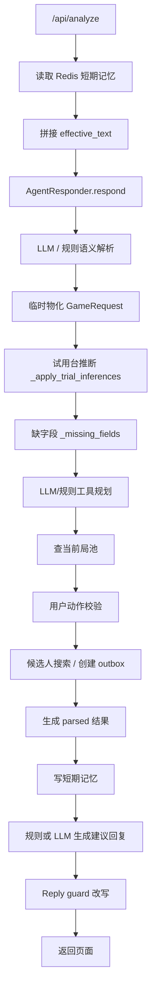

# 麻将馆受控 Agent 工作流架构收敛计划

本文档用于冻结“补丁式修复”，把当前试用台大脚本收敛成可维护、可审计、可上线演进的受控 Agent 工作流。

## 目标边界

系统目标不是让 LLM 自由改状态，而是让 LLM 在后端边界内完成语义理解和动作提案：

- LLM 负责理解用户语义、结合上下文补全低风险信息、提出下一步动作和回复草稿。
- 后端负责状态机、权限、幂等、去重、顺序、并发、风险控制、落库和审计。
- 工具调用必须经过后端工具网关，LLM 不能直接写数据库。
- 回复生成必须发生在动作校验、工具执行和状态更新之后。
- guard 只做安全兜底，不能承担主业务流程。
- badcase 进入 eval 回归，不再变成散落在业务里的 if-else。

## 目标链路

```mermaid
flowchart LR
  A["用户消息"] --> B["上下文构建器 ContextBuilder"]
  B --> C["LLM 语义解析 SemanticResolver"]
  C --> D["动作提案 ProposedAction"]
  D --> E["后端校验器 ActionValidator"]
  E --> F["工具编排器 ToolOrchestrator"]
  F --> G["状态机落库 StateMachine"]
  G --> H["回复生成 ReplyPolicy"]
  H --> I["回复安全闸 ReplyGuard"]
  I --> J["待老板审批 Outbox"]
  J --> K["日志 / Trace / Eval"]
```



## 当前链路

当前 Web 试用台核心入口在 `scripts/run_boss_trial_app.py` 的 `BossTrialService.analyze()`。实际链路大致如下：



这条链路的问题不是单点 bug，而是多个职责混在一个脚本内：

- 上下文构建、短期记忆、用户画像、工具结果都在 `analyze()` 周围临时拼接。
- `GameRequest` 同时承载事实、推断、状态、展示文案和局部槽位。
- `rules` 字符串承担了结构化槽位职责，例如烟况、时长、人齐开。
- `search_existing_games` 和 `create_game` 的优先级没有统一的决策表。
- 回复生成同时看中间态、工具态和 guard 态，容易前后矛盾。
- guard 多次承担“业务修正”，导致问题被遮住，不容易定位根因。

## 最近失败类型归类

| 类型 | 表现 | 根因 | 目标修复方式 |
| --- | --- | --- | --- |
| 多轮上下文丢失 | 用户回复“组/可以”后没有继承上一轮条件 | 上下文是 dict + 字符串，缺少结构化会话状态 | `ConversationContext` 统一承载上一轮系统问题、上一轮局需求、工具结果 |
| 槽位覆盖/继承混乱 | 上一轮“烟况都可”下一轮又缺烟况 | 槽位散落在 `rules`、`play_options`、LLM slots 和画像里 | `SlotValue` 明确 source、confidence、confirmed、needs_confirmation |
| 查局和建局抢优先级 | 已确认组局后还回复“现在没有，要组一个吗” | `search_current_open_games` 无结果话术压过 `create_game` 缺字段状态 | `ActionValidator` 用决策表先确定最终动作，再生成回复 |
| 缺字段回复错误 | reasoning 说追问，文案却问是否组局 | 回复 prompt 和 guard 优先级不一致 | `ReplyPolicy` 基于最终动作结果生成回复 |
| guard 业务化 | guard 把“帮你问问”改成“留意下” | 上游没有创建 outbox，guard 被迫遮挡错误 | guard 只检查禁止承诺、状态矛盾和高风险文案 |

## 目标目录结构

```text
src/mahjong_agent/
  workflow_models.py        # 受控工作流核心数据模型
  context_builder.py        # 新版上下文构建器，逐步替换 context.py 中的试验逻辑
  semantic_resolver.py      # LLM 语义解析与 prompt 组装
  action_validator.py       # 动作提案校验、风险和状态机前置判断
  tool_orchestrator.py      # 工具规划、权限、幂等、执行与结果规范化
  reply_policy.py           # 基于最终动作结果生成回复
  reply_guard.py            # 安全兜底，不承载业务主流程
  memory.py                 # 短期记忆、会话摘要、压缩策略
  state_machine.py          # 局、邀约、候选人反馈状态转换
  tools/
    current_games.py
    candidates.py
    outbox.py
  prompts/
    semantic_resolution.md
    reply_draft.md
```

保留但逐步迁移：

- `scripts/run_boss_trial_app.py`：保留为 Web 试用台入口和 HTTP 层，逐步剥离业务逻辑。
- `src/mahjong_agent/context.py`：已有 ContextBuilder，可复用隐私脱敏、预算、快照等能力，但要对齐新的 `ConversationContext`。
- `src/mahjong_agent/models.py`：保留现有运行模型，新增的 `workflow_models.py` 先作为工作流 contract，不立刻破坏旧逻辑。

当前落地状态：

- `workflow_models.py` 已新增，作为受控工作流 contract。
- `context_builder.py` 已新增，负责把旧运行数据转换为 `ConversationContext`，但尚未接管 Web 试用台主链路。
- `memory.py` 已新增，定义短期记忆接口和内存实现；后续 Redis 实现应替换这个接口，而不是改 ContextBuilder。
- `semantic_resolver.py` 和 `prompts/semantic_resolution.md` 已新增，负责把 `ConversationContext` 转换为 `SemanticResolution`，但尚未接管 Web 试用台主链路。
- `action_validator.py` 和 `state_machine.py` 已新增，负责把 LLM 的动作提案校验为 `ValidatedAction`，但尚未接管 Web 试用台主链路。
- `tool_orchestrator.py` 和 `tools/` 已新增，负责按 `ValidatedAction.required_tools` 执行受控工具；副作用工具当前只创建待审批结果，不直接外发。
- `tool_orchestrator.py` 已新增 `ToolExecutionLedger` 协议、`InMemoryToolExecutionLedger` 和 `SQLiteToolExecutionLedger`，只读工具可重复执行，`create_pending_outbox`、`create_game`、`close_game` 等副作用工具按后端生成的 idempotency key 复用结果；本地生产可通过 `MAHJONG_TOOL_LEDGER_SQLITE_PATH` 启用 SQLite 工具执行账本，防止服务重启或重试后重复创建草稿或状态写入意图。
- `create_game` 和 `close_game` 已纳入受控工具链：工具只生成“状态写入意图”，不直接改数据库；真正状态变更仍由 `StateMachine` 校验并由 `WorkflowStateStore` 落库，避免 LLM 或工具绕过状态机。
- `profile_update` 已纳入受控工具链：LLM 只能输出 `profile_observations` 观察事实，后端按字段白名单、置信度、风险等级和证据过滤后写入 `CustomerProfile.metadata.controlled_profile_observations`；`ContextBuilder` 会把这些低风险观察作为 `recent_facts` 带入后续上下文，但不会直接覆盖强画像字段。
- `tools/outbox.py` 已新增 `PendingOutboxStore`、`InMemoryPendingOutboxStore` 和 `SQLitePendingOutboxStore`；受控 runtime 可通过 `MAHJONG_OUTBOX_SQLITE_PATH` 持久化待老板审批草稿，服务重启后仍可查询待审批 outbox。
- `PendingOutboxStore` 已支持审批决策状态更新：`pending_approval -> approved/rejected`，并记录审批人、审批原因、决策 trace 和决策时间；审批通过只表示老板认可草稿，仍不代表已发送，真实发送必须继续走独立发送网关和幂等审计。
- `approval.py` 已新增 `PendingOutboxApprovalService`，作为老板人工审批的受控入口：使用 `ToolExecutionLedger` 记录 `record_approval_decision`，支持审批禁用策略、幂等重试、终态冲突拦截和老板改写最终文案；它不调用 LLM，也不触发真实发送。
- `trial_approval.py` 已新增 `TrialApprovalDecisionAdapter`，把试用台 `/api/approval-decision` 的 payload 解析、受控 action 记录、执行委托和响应投影移出 `scripts/run_boss_trial_app.py`；当前仍写 legacy `approval_requests/outbox` 表，作为迁移期持久化桥接，后续可切换为 runtime 暴露的 `PendingOutboxApprovalService`。
- `trial_delivery.py` 已新增 `TrialOutboxDeliveryAdapter`，把试用台 `/api/send-outbox` 的发送前校验、delivery 幂等键、受控 action 记录、执行委托和响应投影移出脚本；当前仍写 legacy `message_delivery_attempts/outbox/feedback` 表，后续应切到独立发送网关。
- `trial_candidate.py` 已新增 `TrialCandidateMessageAdapter`，把试用台 `/api/candidate-message` 的请求解析、候选人语义提案调用、状态写入委托、followup 合并和响应投影移出脚本。
- `candidate_semantics.py` 已新增 `CandidateSemanticProposalAdapter`、`CandidateSemanticProposalResult` 和 `CandidateSemanticResolverService`，把候选人回复的 LLM/fallback 语义提案收敛成单一 contract：模型只提出 `semantic_type/proposed_action/reply_text/confidence/reasoning_summary`，后端 validator 再决定是否允许写状态；候选人 `semantic_type/proposed_action/feedback_type` 的白名单、别名映射、LLM prompt、候选人上下文 payload 和提案归一化都已从脚本移入 contract 层。
- `candidate_reply_facts.py` 已新增 `CandidateReplyFactService`，把候选人回复的安全降级分类、改时间/改时长本地探测、自然时间标签和 LLM `extracted_facts` 合并从脚本移出；它不调用 LLM、不写库、不发消息，只为 semantic fallback 和 validator 提供事实解析。
- `candidate_validation.py` 已新增 `CandidateActionProposalValidator`，把候选人回复后的后端动作校验从脚本移出：它只检查 proposed_action 白名单、状态提交置信度、协商覆盖、局已归档和局已满等边界，不调用 LLM、不写库、不发消息；候选人事实解析通过 `CandidateReplyFactService` 注入。
- `candidate_feedback_action.py` 已新增 `CandidateFeedbackActionService`，把候选人反馈写状态前的 `record_candidate_feedback` 受控 action contract、幂等键、风险等级、runtime policy、state-write policy 和 tool audit 从脚本移出；它只生成和审计 action，不执行 action、不写库、不发消息。
- `trial_followup.py` 已新增 `TrialOrganizerFollowupAdapter`，把候选人协商后给发起人的 followup 编排从脚本移出：它只负责 `send_message/create_pending_followup` 的后端工具校验、待审批 followup 创建、tool audit 和 action plan 投影；不会直接外发，也不改变局状态。
- `organizer_followup_draft.py` 已新增 `OrganizerFollowupDraftService`，把协商 followup 的兜底话术、LLM 草稿 prompt、模型调用、预算/audit 和文案 guard 从脚本移出；它只生成待审批草稿 contract，不写库、不发消息。当前 SQLite followup/approval 写入函数仍由脚本回调提供，后续可继续迁移到发送网关或统一持久化 adapter。
- `candidate_reply_draft.py` 已新增 `CandidateReplyDraftService`，把候选人私聊回复的兜底话术、局面进度标签和安全 guard 从脚本移出；它不调用 LLM、不写库、不发消息，只根据后端已校验的候选人反馈生成安全草稿。当前候选人 LLM 语义提案中的 `reply_text` 仍由 `candidate_semantics` contract 产出，后续应迁移到统一 `ReplyPolicy`，并调整到状态/工具执行之后生成。
- `reply_policy.py`、`reply_guard.py` 和 `prompts/reply_draft.md` 已新增，负责基于最终动作和工具结果生成回复草稿并做安全一致性检查；`ReplyPolicy` 已支持可选 `reply_draft_contract_v1` 模型调用，模型只生成结构化回复草稿，后端仍负责工具、状态和 guard。
- `state_machine.py` 已新增 `WorkflowStateStore` 协议、`InMemoryWorkflowStateStore` 和 `SQLiteWorkflowStateStore`；受控链路会把允许的状态迁移应用到账本，本地生产可通过 `MAHJONG_STATE_SQLITE_PATH` 启用 SQLite 状态落库，后续 Redis/PostgreSQL 也应实现同一接口。
- `observability.py` 已新增 `controlled_trace.v1` contract、受控链路必需 trace step 列表和完整性校验函数；`final_output` 会携带 `trace_completeness`，回归评估可直接断言每轮链路是否可回放。
- `scripts/run_evals.py` 已新增，统一运行当前场景评估和 boss trial golden 回归。
- `scripts/run_boss_trial_app.py` 仍是旧试用台入口，后续只应作为 HTTP/UI 壳逐步调用新模块。
- 受控工作流接入试用台已拆成 `TrialControlledEntryAdapter`、`trial_projection.py`、`TrialControlledPersistenceAdapter`、`TrialControlledResponseAdapter` 几层迁移桥接，用于证明 `HTTP 输入 -> Message -> LLM contract -> ActionValidator -> ToolOrchestrator -> StateMachine -> 待审批 outbox` 可以闭环；后续应继续把试用台脚本收缩为 HTTP/UI 壳。

## 核心数据模型

第一批需要稳定的 contract：

- `WorkflowRun`
- `UserMessage`
- `ConversationContext`
- `WorkflowTurn`
- `SlotValue`
- `GameRequirement`
- `SemanticResolution`
- `ProposedAction`
- `ValidatedAction`
- `ToolCallRequest`
- `ToolResult`
- `StateTransition`
- `ReplyDraft`
- `GuardedReply`

`SlotValue` 必须替代散落的字符串槽位：

```python
{
    "name": "stake",
    "value": "0.5",
    "source": "explicit",
    "confidence": 0.92,
    "confirmed": True,
    "needs_confirmation": False,
}
```

字段含义：

- `source=explicit`：用户原话明确说出，最高优先级。
- `source=context`：上一轮上下文已确认，允许继承。
- `source=profile`：用户画像偏好，只能作为默认建议或低风险补全。
- `source=region_default`：地区默认，例如杭州默认杭麻。
- `source=inferred`：模型或规则推断，必须看置信度和是否需要确认。

`ConversationContext.followup_context` 使用 `followup_context.v1`，用于解决多轮短消息理解问题。它只提供上下文信号，不直接推进业务状态：

- `previous_turn`：上一轮用户消息、老板建议回复和时间。
- `previous_game_requirement`：上一轮已形成的结构化槽位，LLM 可按 `source=context` 继承。
- `unresolved_questions`：上一轮还在等用户回答的问题，例如 `create_confirmation/start_time/party_size/stake/smoke/duration`。
- `expected_answer_type`：本轮预期是确认、补槽位，还是两者都有可能。
- `current_message_response_type`：当前消息像 `short_ack/slot_fill/correction/negative/unknown` 哪一类。
- `should_treat_current_message_as_followup`：提示 LLM 优先按“回答上一轮”理解，但最终动作仍由 LLM contract 和后端校验共同决定。

## 动作决策表

`ActionValidator` 需要显式决策，而不是散落判断：

| LLM proposed_action | 条件 | 后端 effective_action |
| --- | --- | --- |
| `search_existing_games` | 只是问有没有局 | `search_existing_games` |
| `search_existing_games` | 已有匹配局 | `match_existing_game` |
| `search_existing_games` | 无匹配局，用户未确认新组 | `ask_create_confirmation` |
| `create_game` | 缺关键字段 | `ask_clarification` |
| `create_game` | 关键字段齐全，当前无匹配局 | `queue_invites` |
| `create_game` | 已有可承接局 | `match_existing_game` |
| `join_game` | 候选邀约存在且名额未满 | `accept_seat` |
| `cancel_game` | 用户是发起人或老板确认 | `close_game` |
| 任意 | 涉及资金、纠纷、高风险 | `human_review` |

关键字段暂定：

- 玩法或可解释的默认玩法
- 档位
- 开局时间策略：固定时间或人齐开
- 人数/缺口
- 烟况
- 时长策略：固定时长或通宵

## 工具边界

工具分风险等级：

| 工具 | 风险 | 执行策略 |
| --- | --- | --- |
| `search_current_open_games` | low | 可自动执行，只读 |
| `search_candidate_customers` | low | 可自动执行，只读 |
| `create_pending_outbox` | medium | 只创建待审批草稿，不直接发送；可通过 SQLite pending outbox store 持久化待审批队列 |
| `record_approval_decision` | medium | 老板人工动作；只更新 outbox 审批状态、最终文案和审计 metadata；不触发真实发送；通过 `ToolExecutionLedger` 幂等 |
| `send_message` | high | 必须人工审批 + 幂等发送网关 |
| `create_game` | medium | 后端校验后由工具生成状态写入意图，再交给状态机落库 |
| `close_game` | medium/high | 后端校验后由工具生成关闭意图，需要身份、状态和原因校验，再交给状态机落库 |
| `profile_update` | low/medium | 只写低风险画像观察事实；要求字段白名单、置信度 >= 0.65、可回溯证据；敏感或冲突信息需人工确认 |

## 回复策略

回复只能基于最终动作结果：

```text
final_action + game_requirement + tool_results + state_transition -> reply_policy -> reply_guard
```

基本优先级：

1. 高风险或纠纷：转人工。
2. 缺关键字段：自然追问，最多问 3 个问题。
3. 已匹配现有局：给出可选局，问是否确认。
4. 已创建待审批邀约：简短确认“好的，我帮你问问。”
5. 无现有局且用户只是咨询：问是否新组。
6. 候选人反馈：按局进度回复，例如“好的，加你272了”“好的，人齐了”。

guard 只检查：

- 是否承诺已发送但没有 outbox/delivery。
- 是否承诺已确认房间但没有房态/人工确认。
- 是否在缺字段时说已经问人。
- 是否回复和状态机矛盾。
- 是否出现资金、纠纷、优惠承诺等高风险内容。

## 可观测要求

每轮 trace 必须有固定阶段：

```text
input_received
context_built
semantic_request
semantic_response
action_proposed
action_validated
tool_plan_created
tool_called
tool_result
state_transition
reply_request
reply_response
reply_guarded
output_returned
eval_case_recorded(optional)
```

每个阶段至少包含：

- `trace_id`
- `conversation_id`
- `sender_id`
- `stage`
- `input_hash`
- `reasoning_summary`
- `allowed/rejected`
- `state_before/state_after`，如适用
- `tool_name` 和 `idempotency_key`，如适用

## Eval 收敛

目标目录：

```text
eval/
  golden/
  badcases/
  regression/
```

现有 JSONL 已按职责归档：

- `eval/golden/scenario_golden.jsonl`：底层 workflow 稳定回归集。
- `eval/golden/boss_trial_golden.jsonl`：老板试用台核心样例。
- `eval/badcases/badcases.jsonl`：用户试用反馈的真实坏例。
- `eval/regression/`：badcase 修复后的专项回归集。
- `eval/few_shot_examples.jsonl`：可进入 prompt 的少量示例。

每次重构必须跑：

```bash
PYTHONPATH=src pytest -q
python scripts/run_evals.py
```

## 迁移顺序

### 第 1 步：建立 contract

- 新增 `workflow_models.py`。
- 定义核心 dataclass / enum。
- 不改变现有业务行为。
- 为 `SlotValue`、`GameRequirement`、`SemanticResolution` 增加基础单测。

### 第 2 步：抽 ContextBuilder 适配层

- 新增 `context_builder.py` 或在现有 `context.py` 上做新版接口。
- 输入 `UserMessage`。
- 输出 `ConversationContext`。
- Web 试用台先双写：仍用旧上下文，但 trace 里记录新版上下文。

### 第 3 步：抽 SemanticResolver

- 将 `semantic_resolution` prompt 从 `run_boss_trial_app.py` 移到 `prompts/semantic_resolution.md`。
- 新增 `semantic_resolver.py`，输入 `ConversationContext`，输出 `SemanticResolution`。
- 旧逻辑通过 adapter 转换。

### 第 4 步：抽 ActionValidator

- 新增 `action_validator.py` 和轻量 `state_machine.py`。
- 把 `create_game/search_existing_games/ask_clarification` 决策表迁出大脚本。
- 先只覆盖老板试用台最近高频路径。
- 保留 trace 对比旧结果和新结果。

### 第 5 步：抽 ToolOrchestrator

- 新增 `tool_orchestrator.py` 和 `tools/current_games.py`、`tools/candidates.py`、`tools/outbox.py`。
- 统一工具请求、权限、幂等键、执行结果。
- 所有工具结果返回 `ToolResult`。
- 副作用工具只写 outbox 或状态机，不直接执行外部发送。

### 第 6 步：抽 ReplyPolicy 和 ReplyGuard

- 新增 `reply_policy.py`、`reply_guard.py`，prompt 移到 `prompts/reply_draft.md`。
- 回复策略只吃最终动作结果。
- guard 只拦安全矛盾，不做主流程决策。

### 第 7 步：收束脚本

`scripts/run_boss_trial_app.py` 最终只保留：

- HTTP 路由
- 页面静态资源
- 服务组装
- DB/cache 初始化
- 临时调试 API

业务链路由 `ControlledWorkflowService` 承载。

当前已经新增受控运行时入口：

- `controlled_workflow.py`：串联上下文构建、语义解析、动作校验、工具编排、状态机、回复策略、回复安全闸和短期记忆。
- `controlled_runtime.py`：从环境变量组装 `ControlledWorkflowService`，默认写入 `logs/controlled_workflow_trace.jsonl`；可通过 `MAHJONG_STATE_SQLITE_PATH`、`MAHJONG_TOOL_LEDGER_SQLITE_PATH` 和 `MAHJONG_OUTBOX_SQLITE_PATH` 启用状态机落库、工具幂等账本和待审批 outbox 持久化；当启用 outbox store 时，runtime 会同时暴露共享同一 store 和 tool ledger 的 `PendingOutboxApprovalService`，`MAHJONG_APPROVAL_ENABLED=false` 可临时关闭审批状态写入。
- `llm_client.py`：OpenAI-compatible 语义解析客户端，实现 `SemanticLLMClient.complete()` contract，带预算、审计、超时和 fail-closed。
- `observability.py`：内存 trace 和 JSONL trace recorder。

下一步迁移试用台时，`/api/analyze` 应只负责装配 `TrialControlledEntryAdapter`，由 adapter 把 HTTP 输入转成 `Message`，调用 `build_controlled_runtime().service.handle_message()`，再把 `WorkflowRun`、`ToolResult`、`GuardedReply`、持久化结果和 trace 投影成页面需要的 JSON。

## 验收标准

架构收敛完成前，每一步必须满足：

- 页面可打开。
- `/api/analyze` 可用。
- 现有全量测试通过。
- 新增的模块测试通过。
- 新增或修复 badcase 必须进入 eval。
- trace 能解释本轮为什么这么回复。

阶段性完成标准：

- `run_boss_trial_app.py` 中 `BossTrialService.analyze()` 不再直接包含 LLM prompt、工具执行细节、回复策略细节。
- `SlotValue` 成为槽位继承和冲突解决的唯一结构。
- `ReplyGuard` 没有业务主流程分支，只做安全一致性检查。
- 对“通宵有人吗 -> 组/可以”“早麻有人吗 -> 可以”“下午两点 0.5 无烟杭麻，帮我组一桌”等核心 badcase 有稳定回归。
