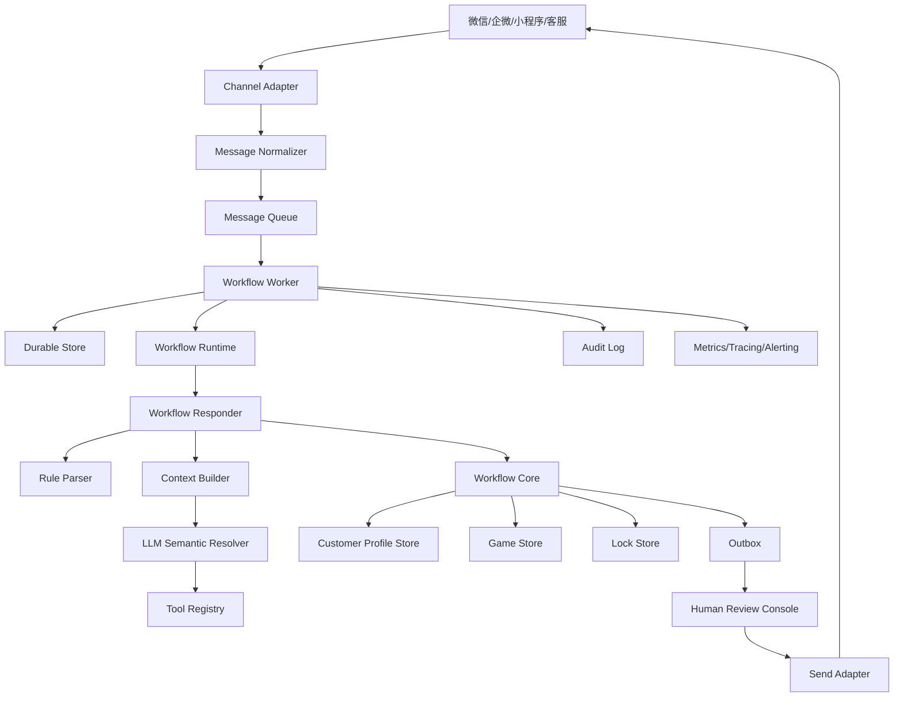

# 生产上线架构

本文档描述 Mahjong Ops Workflow 面向真实商业化部署时的推荐架构。

当前系统定位为 **agentic workflow**，不是完全自治 Agent。模型可以参与理解和建议，但业务状态推进、客户锁、outbox、发送审核、幂等和审计必须由后端控制。

## 设计原则

### 1. 业务状态确定性

LLM 可以参与理解，但不能直接修改业务状态。

所有关键动作必须由确定性代码执行：

- 建局
- 改局
- 取消局
- 生成邀约
- 客户占位
- 客户锁
- 状态流转

### 2. 消息处理可靠

真实微信、企微、小程序、客服系统都会出现重复投递、乱序、延迟、节点重启等情况。

系统必须支持：

- 幂等
- 保序
- 重试
- 死信
- 审计
- 状态恢复

### 3. 默认人工审核

商业化早期不建议直接自动发送所有私聊。

推荐策略：

- 低风险群发草稿可半自动。
- 私聊邀约先进入人工审核。
- 高置信、低风险、历史验证稳定后逐步开放自动发送。

### 4. 分层可替换

微信通道、数据库、LLM、工具、发送通道都应该可替换，核心业务状态机保持稳定。

## 生产拓扑



## 主要模块

### Channel Adapter

负责对接真实消息来源：

- 微信群
- 微信私聊
- 企业微信群
- 企业微信私聊
- 小程序客服
- 网页客服
- 人工导入

职责：

- 拉取或接收原始消息。
- 标准化 sender、channel、message id、时间。
- 获取语音转写、图片 OCR、表情描述。
- 生成统一 `Message`。

不负责：

- 业务决策。
- 客户推荐。
- 状态修改。

### Message Queue

生产环境建议使用队列：

- Kafka
- RabbitMQ
- Redis Stream
- SQS
- 云厂商消息队列

队列消息必须包含：

- `tenant_id`
- `source_message_id`
- `conversation_id`
- `sequence`
- `message`
- `received_at`

### Durable Processor

职责：

- 写入 inbound message。
- 根据 `source_message_id` 幂等。
- 根据 `conversation_id + sequence` 保序。
- claim 当前可处理消息。
- 写入结果。
- 写入审计。
- 创建 outbox。

当前代码用 SQLite 实现本地版本。生产建议替换为 PostgreSQL 或 MySQL。

### Workflow Runtime

职责：

- 输入校验。
- 单轮超时。
- 异常 fail-closed。
- 上下文快照。
- 指标采集。
- 结构化日志。

失败策略：

- 业务异常：转人工。
- LLM 超时：转人工或使用规则结果。
- 工具失败：转人工或降级。
- 无可判断内容：群聊静默。

### Workflow Responder

单条消息的决策编排层。

它协调：

- 多模态证据合并。
- 敏感词检测。
- 报名/拒绝/满员/取消处理。
- 规则解析。
- LLM 语义兜底。
- 核心状态机。
- 草稿生成。

返回统一 `ReplyDecision`。

### Rule Parser

规则解析是主路径。

优点：

- 快。
- 稳。
- 可测试。
- 成本低。
- 对本地行话可控。

适合解析：

- `cq371`
- `川麻216三等一`
- `今晚7点 0.5 三缺一 无烟`
- `0.5 5点开 371`

### LLM Semantic Resolver

LLM 是兜底层，不是主状态机。

调用时机：

- 规则解析失败。
- 消息疑似麻将相关。
- 存在新行话或上下文依赖。
- 私聊中用户表达不完整。

LLM 输出：

- 是否麻将相关。
- 意图。
- 置信度。
- 规范化文本。
- 追问话术。
- 是否转人工。
- 简短解释。

LLM 不允许：

- 直接建局。
- 直接发送消息。
- 直接给客户占位。
- 直接修改客户画像。

### Context Builder

`ContextBuilder` 是 LLM 调用前的生产级上下文处理器。

职责：

- 按 `conversation_id`、`customer_id`、`game_id` 隔离上下文。
- 组装当前消息、短期会话摘要、客户画像摘要、开放局快照、房态快照和玩法词典。
- 对手机号、微信号、长数字和资金相关内容脱敏。
- 使用稳定引用替代原始用户 ID、局 ID、房间 ID。
- 根据预算裁剪旧消息、旧局和低优先级 RAG 片段。
- 记录 `context_digest`、上下文 schema 版本、builder 版本、脱敏计数和来源信息。
- 给 LLM 明确本轮 `tool_policy` 和 `allowed_tools`。

生产要求：

- 每次 LLM 调用的上下文都要能按 `trace_id + context_digest` 回放。
- 上下文快照必须是脱敏后的，不把无关隐私传给模型。
- 工具列表由后端 ToolRouter 按当前状态注入，不允许把所有工具一次性暴露给模型。
- 模型返回的 trace、idempotency key、引用 ID 只能作为回显，不作为后端写入依据。

### Tool Registry

当前代码尚未实现工具注册中心，但生产架构应该预留。

推荐工具类型：

- 本店玩法词典查询。
- 客户画像查询。
- 当前待组局队列查询。
- 历史聊天摘要查询。
- 外部网页搜索。
- 营销素材库查询。
- 优惠活动查询。

工具权限建议：

- 默认只读。
- 写操作必须通过核心状态机。
- 发送类动作必须走 outbox。

### Workflow Core

核心业务状态机。

职责：

- 保存局。
- 推荐客户。
- 生成邀约。
- 接受邀约。
- 拒绝邀约。
- 设置局状态。
- 推进生命周期。
- 维护客户锁。
- 计算疲劳度。

### Lock Store

生产环境必须有客户锁。

推荐表：

```sql
CREATE TABLE customer_game_locks (
  tenant_id TEXT NOT NULL,
  customer_id TEXT NOT NULL,
  game_id TEXT NOT NULL,
  lock_status TEXT NOT NULL,
  expires_at TIMESTAMP,
  created_at TIMESTAMP NOT NULL,
  updated_at TIMESTAMP NOT NULL,
  PRIMARY KEY (tenant_id, customer_id)
);
```

同一个 `tenant_id + customer_id` 同时只能有一个 active lock。

### Outbox

所有对外发送先进入 outbox。

包括：

- 群发组局草稿。
- 私聊邀约草稿。
- 满员通知。
- 候补通知。
- 改时间通知。

outbox 需要：

- 幂等键。
- 目标类型。
- 目标 id。
- 消息正文。
- 审核状态。
- 发送状态。
- 错误信息。

### Human Review Console

商业化产品需要一个审核台。

审核台展示：

- 当前消息。
- Agent 判断。
- 结构化局信息。
- 推荐候选人。
- 群发草稿。
- 私聊草稿。
- 风险提示。
- LLM 解释。
- 审计链路。

操作：

- 批准发送。
- 修改草稿。
- 拒绝发送。
- 转人工处理。
- 更新客户画像。
- 更新玩法词典。

## 数据存储建议

### PostgreSQL / MySQL

用于：

- 租户
- 客户画像
- 局
- 邀约
- 客户锁
- 消息
- outbox
- 审计
- 玩法词典

### Redis

用于：

- 短期缓存
- 限流
- 分布式锁辅助
- 热点上下文

### 对象存储

用于：

- 图片
- 语音
- OCR 原文
- ASR 原文
- 长审计附件

### 向量库

可选，用于：

- 历史聊天语义检索
- 客户偏好摘要
- 玩法文档检索
- 营销素材检索

## 多租户设计

商业化 SaaS 必须把 `tenant_id` 作为一等字段。

所有核心数据都应包含：

- `tenant_id`
- `created_at`
- `updated_at`

包括：

- customer
- game
- invitation
- lock
- message
- outbox
- audit
- rule dictionary

## 可观测性

生产指标：

- 消息总数
- 处理成功率
- 平均耗时
- P95/P99 耗时
- 超时率
- 异常率
- 转人工率
- 静默率
- 建局数
- 成功组局数
- 邀约接受率
- LLM 调用数
- LLM 成本
- LLM 失败率
- outbox 待审核数
- outbox 发送失败数

审计必须能回答：

- 这条回复为什么这么说？
- 这个客户为什么被推荐？
- 为什么没有推荐某个客户？
- 这个客户为什么被锁定？
- 哪次 LLM 参与了判断？
- 哪个用户批准了发送？

## 安全和合规

系统应默认拦截或转人工：

- 资金结算
- 抽水
- 赌资
- 上分下分
- 借码
- 放贷
- 代收代付
- 其他高风险内容

LLM 提示词和工具层也必须包含同样约束。

## 部署阶段

### 阶段 1：人工审核增强

- 接入真实消息。
- Agent 生成草稿。
- 人工确认发送。
- 收集真实样本。

### 阶段 2：低风险自动化

- 高置信组局自动入队。
- 低风险群发可自动发送。
- 私聊仍需审核。
- 建立玩法词典后台。

### 阶段 3：半自动运营

- 常见组局自动邀约。
- 客户报名自动占位。
- 冲突和敏感场景转人工。
- 引入 LLM 工具调用。

### 阶段 4：多店 SaaS

- 多租户。
- 权限系统。
- 运营看板。
- 客户分层。
- 营销自动化。
- 成本和效果分析。

## 当前代码和生产架构的关系

当前仓库已经实现：

- 核心领域模型。
- 规则解析。
- 客户推荐。
- 客户锁。
- 生命周期。
- outbox 草稿。
- 本地持久化。
- LLM 接入点。
- 运行时保护。
- 审计事件。

当前仓库尚未实现：

- 真实微信 adapter。
- 生产数据库 schema。
- 管理后台。
- 分布式锁。
- 队列 worker 部署。
- 工具注册中心。
- LLM 成本统计。

这意味着当前版本适合作为生产系统的 core engine，而不是完整 SaaS 产品的全部形态。
