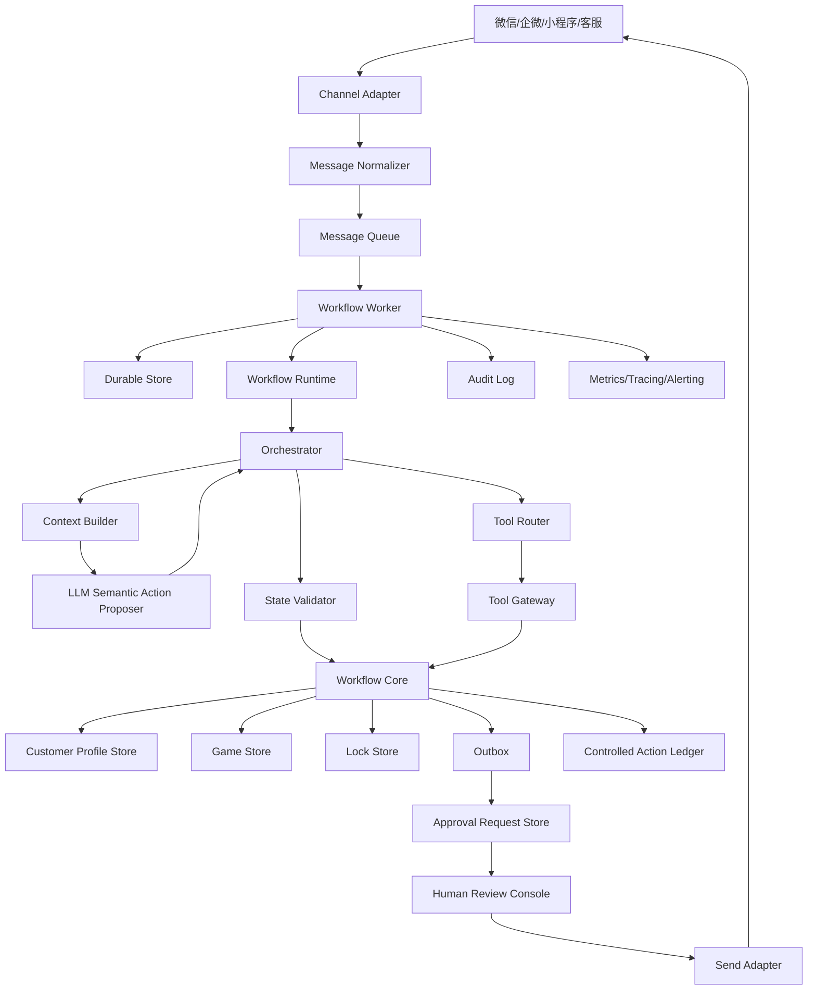

# 生产上线架构

本文档描述 Mahjong Ops Workflow 面向真实商业化部署时的推荐架构。

当前系统定位为 **agentic workflow**，不是完全自治 Agent。模型负责结合上下文理解用户含义、提出下一步动作和回复草稿；业务状态推进、客户锁、outbox、发送审核、幂等和审计必须由后端控制。

## 设计原则

### 1. 业务状态确定性

LLM 可以参与理解，但不能直接修改业务状态。

所有关键动作必须由确定性代码执行：

- 建局
- 改局
- 取消局
- 生成邀约
- 客户占位
- 客户锁
- 状态流转

### 2. 消息处理可靠

真实微信、企微、小程序、客服系统都会出现重复投递、乱序、延迟、节点重启等情况。

系统必须支持：

- 幂等
- 保序
- 重试
- 死信
- 审计
- 状态恢复

### 3. 默认人工审核

商业化早期不建议直接自动发送所有私聊。

推荐策略：

- 低风险群发草稿可半自动。
- 私聊邀约先进入人工审核。
- 高置信、低风险、历史验证稳定后逐步开放自动发送。

### 4. 分层可替换

微信通道、数据库、LLM、工具、发送通道都应该可替换，核心业务状态机保持稳定。

### 5. Badcase 修复不堆业务 if-else

真实运营中会不断出现新表达、新口误和新边界样本。修复 badcase 时，后端不能把每个样本都写成一个具体 `if-else`，否则系统会越来越脆，且难以解释。

推荐分工：

- LLM 负责理解上下文、给出语义候选、工具调用建议、回复草稿和简短理由。
- 后端负责状态机合法性校验、工具权限校验、幂等、去重、顺序、并发、高风险动作拦截、置信度阈值、日志、审计、eval。
- LLM 不允许直接改数据库；所有写入必须通过后端受控 API、状态机或 outbox。
- badcase 修复后，先沉淀为 skill、prompt 约束、工具 schema、状态机约束或置信度门禁，再进入 golden/eval 回归。

## 生产拓扑



## 主要模块

### Channel Adapter

负责对接真实消息来源：

- 微信群
- 微信私聊
- 企业微信群
- 企业微信私聊
- 小程序客服
- 网页客服
- 人工导入

职责：

- 拉取或接收原始消息。
- 标准化 sender、channel、message id、时间。
- 获取语音转写、图片 OCR、表情描述。
- 生成统一 `Message`。

不负责：

- 业务决策。
- 客户推荐。
- 状态修改。

### Message Queue

生产环境建议使用队列：

- Kafka
- RabbitMQ
- Redis Stream
- SQS
- 云厂商消息队列

队列消息必须包含：

- `tenant_id`
- `source_message_id`
- `conversation_id`
- `sequence`
- `message`
- `received_at`

### Durable Processor

职责：

- 写入 inbound message。
- 根据 `source_message_id` 幂等。
- 根据 `conversation_id + sequence` 保序。
- claim 当前可处理消息。
- 写入结果。
- 写入审计。
- 创建 outbox。

当前代码用 SQLite 实现本地版本。生产建议替换为 PostgreSQL 或 MySQL。

### Workflow Runtime

职责：

- 输入校验。
- 单轮超时。
- 异常 fail-closed。
- 上下文快照。
- 指标采集。
- 结构化日志。

失败策略：

- 业务异常：转人工。
- LLM 超时：转人工或使用规则结果。
- 工具失败：转人工或降级。
- 无可判断内容：群聊静默。

### Orchestrator

单条消息的决策编排层。

它协调：

- 多模态证据合并。
- 敏感词检测。
- 上下文构建。
- LLM 语义动作提案。
- 可用工具注入。
- 后端状态校验。
- 核心状态机提交。
- outbox 草稿生成。

返回统一 `ReplyDecision`。

### Rule Parser

规则解析是低成本、低风险的结构化解析能力，不再负责覆盖所有自然语言语义。

优点：

- 快。
- 稳。
- 可测试。
- 成本低。
- 对本地行话可控。

适合解析：

- `cq371`
- `川麻216三等一`
- `今晚7点 0.5 三缺一 无烟`
- `0.5 5点开 371`

不适合用规则硬补的内容：

- 候选人一句“打！”到底是不是接受邀约。
- “可以倒是可以，但是我最快要四点半”是接受还是协商。
- 用户在多轮对话里纠正系统理解。
- 新口误、新转写、新地方黑话。

### LLM Semantic Action Proposer

LLM 是语义理解和动作提案层，不是主状态机。

调用时机：

- 用户消息需要结合上下文理解。
- 候选人回复需要判断接受、拒绝、追问或协商。
- 存在新行话、口误、语音转写错误。
- 需要基于当前局、客户画像、原邀约和历史对话给出下一步建议。

LLM 输出：

- 是否麻将相关。
- 意图。
- 置信度。
- 结构化槽位或语义事实。
- `proposed_action`，例如 `create_game`、`search_existing_games`、`ask_clarification`、`mark_candidate_confirmed`、`start_negotiation`。
- 回复草稿。
- 是否转人工。
- 简短解释。

LLM 不允许：

- 直接建局。
- 直接发送消息。
- 直接给客户占位。
- 直接修改客户画像。

当前用户消息主链路已经接入第一版语义动作提案：

```text
用户消息
-> ContextBuilder 组装当前消息、客户画像、短期记忆、局池、房态和 skill
-> LLM 语义解析返回 intent / slots / proposed_action / confidence
-> Orchestrator 结合规则解析结果形成 user_semantic_action
-> State Validator 校验是否明确组局、人数/时间/档位/烟况/时长是否齐全、是否应优先匹配已有局
-> 只有 effective_action=create_game 时才允许创建当前局
-> create_game 写入 controlled_actions 和状态机
```

这意味着“用户问有没有局”和“用户明确让老板帮忙组局”会被拆开处理：前者优先查当前局池，后者才可能创建新局；即使 LLM 错把咨询现有局理解成建局，后端也会因为 `not_explicit_grouping_request` 或缺关键字段而降级为搜索/追问。

当前候选人回复链路已经按这个方向实现：

```text
候选人回复
-> ContextBuilder 组装原邀约、当前局、已确认人数、候选人画像、最近对话
-> LLM 返回 semantic_type / proposed_action / confidence / reply_text / reasoning_summary
-> State Validator 校验白名单动作、置信度、局是否已满、局是否归档、是否与原局条件冲突
-> Workflow Core record_feedback 落库
-> Outbox / followup 生成待审批老板回复
-> Approval Request Store 生成独立审批请求
```

如果 LLM 超时、预算拒绝或返回非法 JSON，系统会 fail-closed：使用安全降级分类器或转待确认，不直接提交高风险状态。

主流程工具调用也已经接入受控动作协议：

```text
用户消息
-> Orchestrator 组装当前目标和可用工具
-> LLM Tool Planner 提出 search_current_open_games / search_candidate_customers / send_message
-> State Validator 按阶段、权限、缺字段、高风险策略校验动作
-> Tool Gateway 只执行通过校验的动作
-> action_validation / tool_request / tool_response 全链路写日志
```

当前接口会返回 `agent_actions`，用于展示每轮动作轨迹：模型或后端策略提出了什么、后端允许了什么、拒绝了什么、是否需要审批、幂等键是什么。

### Context Builder

`ContextBuilder` 是 LLM 调用前的生产级上下文处理器。

职责：

- 按 `conversation_id`、`customer_id`、`game_id` 隔离上下文。
- 组装当前消息、短期会话摘要、客户画像摘要、开放局快照、房态快照和玩法词典。
- 对手机号、微信号、长数字和资金相关内容脱敏。
- 使用稳定引用替代原始用户 ID、局 ID、房间 ID。
- 根据预算裁剪旧消息、旧局和低优先级 RAG 片段。
- 记录 `context_digest`、上下文 schema 版本、builder 版本、脱敏计数和来源信息。
- 给 LLM 明确本轮 `tool_policy` 和 `allowed_tools`。

生产要求：

- 每次 LLM 调用的上下文都要能按 `trace_id + context_digest` 回放。
- 上下文快照必须是脱敏后的，不把无关隐私传给模型。
- 工具列表由后端 ToolRouter 按当前状态注入，不允许把所有工具一次性暴露给模型。
- 模型返回的 trace、idempotency key、引用 ID 只能作为回显，不作为后端写入依据。

### Tool Registry

当前代码已经实现第一版工具注册中心，版本为 `tool_registry.v1`。

工具注册中心负责：

- 定义工具名、描述、风险等级、是否有副作用。
- 定义每个工具的参数 schema。
- 定义不同阶段可以暴露给 LLM 的工具清单。
- 定义高风险工具的允许执行模式，例如 `send_message` 在主流程只能 `create_pending_outbox`，在协商 followup 阶段只能 `create_pending_followup`。
- 将本轮可用工具写入 LLM 工具规划上下文，而不是把所有工具一次性暴露给模型。

当前已注册工具：

- `search_current_open_games`：只读，搜索当前未结束、未满、可拼或可加入的局。
- `search_candidate_customers`：只读，基于局条件和客户画像搜索候选人。
- `send_message`：高风险，有副作用；当前只允许创建待审批 outbox/followup，禁止真实直发。

阶段裁剪：

- `before_open_game_search`：只暴露 `search_current_open_games`。
- `after_open_game_search`：暴露 `search_candidate_customers` 和 `send_message/create_pending_outbox`。
- `after_candidate_search`：只暴露 `send_message/create_pending_outbox`。
- `organizer_followup_draft`：只暴露 `send_message/create_pending_followup`。

参数校验：

- LLM 传入未注册参数时，Tool Gateway 会剔除并写入 `action_validation` notes。
- LLM 请求直接发送时，Tool Gateway 会降级为当前阶段允许的待审批执行模式。
- LLM 请求当前阶段不可用工具时，后端拒绝执行并记录拒绝原因。
- Tool Gateway 执行前必须拿到通过校验的 `controlled_agent.v1` 动作；没有通过校验的工具不会被调用。
- 只读工具也会写入 `controlled_actions`，因此可以回放“模型/降级策略提议了什么、后端允许了什么、实际读到了什么结果”。
- 副作用工具会额外经过 `runtime_policy.v1`，只读模式、禁写、禁审批，或生产策略要求 LLM/人工提案但当前动作来自后端兜底时，会在动作校验阶段被拒绝。
- 当 LLM 已配置但工具规划失败、超时、预算拒绝或返回空计划时，系统会 fail-closed：只保留 fallback 中的只读工具，过滤 `send_message` 等副作用工具。

推荐工具类型：

- 本店玩法词典查询。
- 客户画像查询。
- 当前待组局队列查询。
- 历史聊天摘要查询。
- 外部网页搜索。
- 营销素材库查询。
- 优惠活动查询。

工具权限建议：

- 默认只读。
- 写操作必须通过核心状态机。
- 发送类动作必须走 outbox。

### Workflow Core

核心业务状态机。

职责：

- 保存局。
- 推荐客户。
- 生成邀约。
- 接受邀约。
- 拒绝邀约。
- 设置局状态。
- 推进生命周期。
- 维护客户锁。
- 计算疲劳度。

当前代码已经落地第一版显式状态机，版本为 `state_machine.v1`。

它控制三类核心实体：

- 局：`待确认`、`待补充`、`待组局`、`邀约中`、`待补充时间`、`待补充人数`、`已成局`、`已取消`、`已归档`。
- 候选人邀约 outbox：`待审批`、`已审批`、`已发送`、`已确认`、`已到店`、`拒绝`、`未回复`、`别再打扰`、`局取消`。
- 发起人 followup：`待审批`、`已审批`、`审批拒绝`、`已发送`、`已归档`。

状态机要解决的问题不是“理解用户说了什么”，而是“理解结果能不能安全落库”：

- 终态局不能被重新打开，例如 `已取消` 不能再改回 `待组局`。
- 已确认的候选人不能倒退成未回复或拒绝，除非走明确的取消/异常流程。
- 自动成局、局取消、清空看板、审批通过/拒绝都必须经过迁移表。
- 每次状态推进都会返回或记录 `from_status`、`to_status`、`event` 和 `state_machine_version`，方便回放。

这层要尽量少写业务猜测，不把 badcase 修成一堆自然语言 `if-else`。badcase 应优先沉淀到 prompt、skill、工具 schema、eval/golden data 或置信度门禁；状态机只守住合法边界。

状态迁移账本：

- 当前本地实现使用 SQLite `state_transition_events` 表保存状态迁移事实，版本为 `state_transition_events.v1`。
- 局、outbox、followup 的创建、审批、候选人反馈、清空看板、超时归档、自动成局都会写入迁移事件。
- 每条事件保留 `entity_type`、`entity_id`、`from_status`、`to_status`、`event`、`reason`、`trace_id/action_id` 和 metadata。
- 查询 `/api/state-transitions` 可以看到最近迁移；查询 `/api/state-transitions?entity_type=game&entity_id=xxx` 可以回放某个局的状态历史。
- 它和 `trace_events` 的区别是：`trace_events` 回放一条请求链路，`state_transition_events` 回放一个业务实体生命周期。
- 对功能上线前已经存在的局、outbox、followup，系统启动时会补一条 `migration_backfill` 初始状态事件，避免老数据完全没有生命周期起点。

### State Validator

后端状态校验层。

它不负责猜用户语义，只负责判断 LLM 提案能不能落地：

- `proposed_action` 是否在白名单内。
- 置信度是否达到状态提交阈值。
- 当前候选人是否属于该局 outbox。
- 当前局是否已满或已归档。
- 候选人是否已经确认过，重复确认是否幂等。
- 候选人提出的新时间/新时长是否和原局冲突。
- 高风险动作是否必须进入人工审核。

校验通过后，后端才调用状态机写数据库；校验不通过时，只能追问、待确认或转人工。

当前实现的动作协议为 `controlled_agent.v1`。它同时覆盖工具动作和关键工作流写入动作。

每个动作提案包含：

- `action_id`：后端根据 `trace_id + stage + tool_name + arguments` 生成的稳定动作 ID。
- `idempotency_key`：用于防止同一轮同一动作重复执行。
- `stage`：当前阶段，例如 `before_open_game_search`、`after_open_game_search`、`after_candidate_search`、`create_game`、`manual_create_game`。
- `tool_name`：模型想调用的工具，或后端要执行的受控工作流动作，例如 `record_candidate_feedback`、`create_game`、`archive_current_games`。
- `arguments`：模型给出的参数。
- `proposed_by`：`llm` 或后端降级策略。
- `risk_level`：低风险只读或高风险写入。
- `approval_required`：是否必须进入人工审批。
- `validation`：后端校验结果。

动作账本：

- 当前本地实现使用 SQLite `controlled_actions` 表保存受控动作。
- 状态包括 `executing`、`executed`、`rejected`、`failed`。
- 允许执行的工具动作和写动作必须先写入账本并 claim 为 `executing`，执行完成后更新为 `executed`。
- 如果同一个 `idempotency_key` 已经 `executed`，后端直接返回上次结果并标记 `deduplicated=true`，不会重复落库。
- `search_current_open_games`、`search_candidate_customers`、`send_message`、自动建局、手动建局、手动反馈、候选人反馈、客户画像更新、清空看板、待审批 outbox 创建和待审批 followup 创建已接入这个执行门禁。
- 幂等参数必须来自请求本身，不能包含执行后会变化的状态快照；例如清空看板的幂等键只使用清空请求和原因，实际清掉的局 ID 记录在执行结果里。

审批请求账本：

- 当前本地实现使用 SQLite `approval_requests` 表保存人审请求。
- `approval_requests` 和 outbox/followup 是一对一关系；outbox/followup 保存“要发什么”，approval 保存“谁在什么时候是否批准，以及最终文案是什么”。
- 状态使用机器态 `pending`、`approved`、`rejected`，界面展示为 `待审批`、`已审批`、`审批拒绝`。
- 审批通过只把草稿变成“可发送”，不代表已经真实发送；真实发送仍需要发送适配器执行并写回发送状态。
- 审批拒绝会保留拒绝原因、审批人、审批时间和原始草稿，方便复盘话术质量。
- 审批动作本身也走 `controlled_actions`，因此重复点击审批按钮不会重复修改状态或触发发送。

发送执行账本：

- 当前本地实现使用 SQLite `message_delivery_attempts` 表保存发送执行记录。
- `/api/send-outbox` 是审批后发送的唯一受控入口；`/api/feedback` 不能绕过它直接把 outbox 标成已发送。
- 只有审批状态为 `approved`，且 outbox 状态为 `已审批/已复制/已发送` 时，发送网关才允许执行。
- 发送幂等键由 `outbox_id + channel + message_text hash` 生成，不依赖 traceId；重复点击、网络重试或换 trace 重放都不会重复发送。
- 当前试用台的 channel 是 `manual`，表示老板已经复制或手动发送；未来接微信、小红书、抖音时，同一张表可以记录真实通道回执。
- 发送成功会把 outbox 推进到 `已发送`，并写入 `state_transition_events`，因此“审批通过”和“实际发送”两件事能分开审计。

运行时安全策略：

- 当前本地实现使用 SQLite `runtime_policies` 表保存当前安全策略，版本为 `runtime_policy.v1`。
- `/api/runtime-policy` 可以查询和更新策略；策略更新本身会写入 `controlled_actions`。
- `read_only_mode=true` 时，除策略更新外，所有副作用动作都会被后端拒绝；只读搜索工具仍可执行并留痕。
- `delivery_enabled=false` 时，审批通过的草稿也不能执行 `/api/send-outbox`。
- `state_writes_enabled=false` 时，建局、清空看板、人工反馈、画像更新、审批、发送等状态写入都会被拒绝。
- `approval_enabled=false` 时，老板也不能继续审批草稿；适合出现话术或推荐异常时暂停外发前置流程。
- `eval_writes_enabled=false` 时，禁止继续写入评测/样本数据。
- `llm_required_for_side_effect_tools=true` 时，`send_message` 这类副作用工具必须来自 LLM 或人工明确提案；后端兜底策略只允许继续执行只读搜索，不能创建待审批 outbox/followup。
- `llm_required_for_state_writes=true` 时，自动建局、候选人反馈、画像更新、清空看板等业务状态写入必须来自 LLM 或人工明确提案；后端规则只能作为降级解释和审计证据，不能直接提交状态变化。
- `MAHJONG_CONTROLLED_AGENT_MODE=production` 会把默认策略切到生产受控模式，并默认开启 `llm_required_for_side_effect_tools` 和 `llm_required_for_state_writes`。
- 策略门禁在后端动作校验层执行，不依赖 LLM 是否遵守提示词。

Trace 回放账本：

- 当前本地实现使用 SQLite `trace_events` 表保存事件流，版本为 `trace_events.v1`。
- 所有 HTTP 输入/输出、LLM 请求/响应、工具请求/响应、动作校验都会带 `trace_id` 写入。
- 查询 `/api/traces` 可以看到最近 trace 摘要；查询 `/api/traces?trace_id=xxx` 可以回放某条链路。
- 事件中保留 `direction`、`event`、`stage`、`payload` 和原日志短文本，便于定位“模型看到了什么、工具返回了什么、后端为什么拦截”。
- 写 trace 表失败不阻断主流程，避免观测系统故障导致组局流程不可用；生产环境可替换为消息队列或 OpenTelemetry collector。

工具校验规则：

- 工具必须在当前阶段的可用工具白名单内。
- 搜索候选人、创建消息草稿必须有明确的组局对象。
- 关键槽位缺失时，拒绝搜索候选人和创建外发草稿。
- `send_message` 属于高风险动作，当前只能降级为 `create_pending_outbox` 或 `create_pending_followup`，禁止真实直发；草稿创建本身也必须经过动作账本。
- 没有候选人搜索结果时，拒绝创建待审批消息。
- LLM 请求直接发送时，后端会记录降级原因，不会真实发送。

候选人回复链路的受控动作：

- `record_candidate_feedback`：候选人回复被 LLM 理解后，后端将其归一化为 `accepted`、`declined`、`candidate_negotiation` 等安全反馈类型，再写入状态。
- `send_message / create_pending_followup`：候选人提出改时间、改时长等协商条件时，只创建给发起人的待审批 followup，不直接发送，也不直接修改局条件。
- 两类动作都会进入 `agent_actions`，并写入 `action_validation` 审计日志。

消息草稿链路的受控动作：

- `send_message / create_pending_outbox`：主流程找到候选人后，只创建候选人邀约草稿，不真实发送；重复请求会复用上一次 outbox 结果。
- `send_message / create_pending_followup`：候选人提出协商条件时，只创建给发起人的待审批 followup；重复请求不会重复生成 followup。
- 这两类草稿创建都会写入 `controlled_actions`，执行结果中保留 outbox/followup ID，便于回放和审计。

工作流写入链路的受控动作：

- `create_game`：用户明确要组局且关键信息足够时，后端创建当前局看板记录；这是内部状态写入，不会自动外发。
- `manual_create_game` / `create_game`：老板从页面手动创建电话或线下来的局，按人工审批动作记录。
- `manual_feedback` / `record_manual_feedback`：老板手动标记已发送、已确认、拒绝、未回复等反馈，记录为人工审批写入。
- `profile_update` / `upsert_customer_profile`：老板维护客户画像时写入审计，避免推荐依据不可追溯。
- `clear_board` / `archive_current_games`：老板清空当前局看板时批量归档未结束局，风险等级为 high，必须在审计日志中保留归档原因和局 ID。

### Lock Store

生产环境必须有客户锁。

推荐表：

```sql
CREATE TABLE customer_game_locks (
  tenant_id TEXT NOT NULL,
  customer_id TEXT NOT NULL,
  game_id TEXT NOT NULL,
  lock_status TEXT NOT NULL,
  expires_at TIMESTAMP,
  created_at TIMESTAMP NOT NULL,
  updated_at TIMESTAMP NOT NULL,
  PRIMARY KEY (tenant_id, customer_id)
);
```

同一个 `tenant_id + customer_id` 同时只能有一个 active lock。

### Outbox

所有对外发送先进入 outbox。

包括：

- 群发组局草稿。
- 私聊邀约草稿。
- 满员通知。
- 候补通知。
- 改时间通知。

outbox 需要：

- 幂等键。
- 目标类型。
- 目标 id。
- 消息正文。
- 审核状态。
- 发送状态。
- 错误信息。

outbox 不负责记录完整审批历史。生产上建议拆成两层：

- `outbox`：待发送消息草稿、目标用户、渠道、发送状态、发送结果。
- `approval_requests`：审批状态、审批人、审批时间、最终文案、审批理由、关联动作 ID。

这样可以避免把“已审批”和“已发送”混成一个状态，也便于后续增加多级审批、抽检和自动发送白名单。

### Human Review Console

商业化产品需要一个审核台。

审核台展示：

- 当前消息。
- Agent 判断。
- 结构化局信息。
- 推荐候选人。
- 群发草稿。
- 私聊草稿。
- 风险提示。
- LLM 解释。
- 审计链路。

操作：

- 批准发送。
- 修改草稿。
- 拒绝发送。
- 转人工处理。
- 更新客户画像。
- 更新玩法词典。

## 数据存储建议

### PostgreSQL / MySQL

用于：

- 租户
- 客户画像
- 局
- 邀约
- 客户锁
- 消息
- outbox
- 审计
- 玩法词典

### Redis

用于：

- 短期缓存
- 限流
- 分布式锁辅助
- 热点上下文

### 对象存储

用于：

- 图片
- 语音
- OCR 原文
- ASR 原文
- 长审计附件

### 向量库

可选，用于：

- 历史聊天语义检索
- 客户偏好摘要
- 玩法文档检索
- 营销素材检索

## 多租户设计

商业化 SaaS 必须把 `tenant_id` 作为一等字段。

所有核心数据都应包含：

- `tenant_id`
- `created_at`
- `updated_at`

包括：

- customer
- game
- invitation
- lock
- message
- outbox
- audit
- rule dictionary

## 可观测性

生产指标：

- 消息总数
- 处理成功率
- 平均耗时
- P95/P99 耗时
- 超时率
- 异常率
- 转人工率
- 静默率
- 建局数
- 成功组局数
- 邀约接受率
- LLM 调用数
- LLM 成本
- LLM 失败率
- outbox 待审核数
- outbox 发送失败数

审计必须能回答：

- 这条回复为什么这么说？
- 这个客户为什么被推荐？
- 为什么没有推荐某个客户？
- 这个客户为什么被锁定？
- 哪次 LLM 参与了判断？
- 哪个用户批准了发送？

## 测试分层

普通单元测试不调用真实模型，保证开发阶段稳定、低成本、可离线运行：

- `python -m pytest -q`
- `PYTHONPATH=src python scripts/run_tests.py`
- `PYTHONPATH=src python scripts/run_scenario_eval.py`
- `PYTHONPATH=src python scripts/run_controlled_agent_acceptance.py`

集成测试阶段需要显式调用 DeepSeek，验证当前模型、endpoint、JSON 输出、预算门禁和语义解析契约仍然可用：

- `MAHJONG_RUN_DEEPSEEK_INTEGRATION=1 python -m pytest -q -m integration`
- `PYTHONPATH=src python scripts/run_deepseek_integration_test.py`
- `PYTHONPATH=src python scripts/run_tests.py --with-deepseek`
- `PYTHONPATH=src python scripts/run_controlled_agent_acceptance.py --with-deepseek`

`run_controlled_agent_acceptance.py` 是当前本地生产验收门禁。默认模式只跑离线检查，不调用真实模型；带 `--with-deepseek` 时必须真的调用 DeepSeek，缺少 API key 或 provider 被错误替换都应失败，不能假通过。

DeepSeek 集成测试必须满足：

- 强制 `provider=deepseek`，默认 `model=deepseek-v4-flash`。
- API key 只能来自环境变量，不能写入仓库。
- pytest 集成测试必须显式设置 `MAHJONG_RUN_DEEPSEEK_INTEGRATION=1`，普通离线 pytest 只会跳过真实模型调用。
- 日志必须脱敏，不能输出 API key。
- 集成测试只做语义 smoke test，不写业务数据库、不创建 outbox、不发送消息。
- 集成测试必须拿到 provider 返回的 token usage，否则不能证明真实模型响应成功。
- 如果未配置 DeepSeek key，集成测试阶段应失败或显式跳过；不能偷偷改用其他 provider。

## 安全和合规

系统应默认拦截或转人工：

- 资金结算
- 抽水
- 赌资
- 上分下分
- 借码
- 放贷
- 代收代付
- 其他高风险内容

LLM 提示词和工具层也必须包含同样约束。

## 生产验收门槛

当前项目要按“受控 Agent core engine”验收，至少需要同时满足这些门槛：

- `controlled_agent.v1`、`tool_registry.v1`、`state_machine.v1`、`runtime_policy.v1` 版本常量存在并有契约测试保护。
- 所有自动工具调用必须先生成动作提案，再经过后端动作校验和 `controlled_actions` 账本 claim，不能绕过 Tool Gateway。
- `send_message` 只能创建待审批 outbox/followup，不能真实直发；真实发送必须走 `/api/send-outbox` 和 `message_delivery_attempts`。
- 自动建局、候选人反馈、人工反馈、画像更新、审批、发送、清空看板等状态写入必须受 `runtime_policy.v1` 约束；只读模式或禁写模式下不能落库；生产受控模式下，非 LLM/人工提案不能直接触发业务状态写入。
- LLM 可提出 `proposed_action`，但后端必须根据置信度、状态机、缺失字段、局是否已满、候选人是否属于该局等条件决定 `effective_action`。
- 普通 pytest 必须离线、低成本、可重复；真实 DeepSeek 集成必须显式开启，并且没有 API key 时不能假通过。
- 日志、trace、tool audit、LLM audit、state transition、approval、delivery 均可按 `trace_id` 或实体 ID 回放。

## 部署阶段

### 阶段 1：人工审核增强

- 接入真实消息。
- Agent 生成草稿。
- 人工确认发送。
- 收集真实样本。

### 阶段 2：低风险自动化

- 高置信组局自动入队。
- 低风险群发可自动发送。
- 私聊仍需审核。
- 建立玩法词典后台。

### 阶段 3：半自动运营

- 常见组局自动邀约。
- 客户报名自动占位。
- 冲突和敏感场景转人工。
- 引入 LLM 工具调用。

### 阶段 4：多店 SaaS

- 多租户。
- 权限系统。
- 运营看板。
- 客户分层。
- 营销自动化。
- 成本和效果分析。

## 当前代码和生产架构的关系

当前仓库已经实现：

- 核心领域模型。
- 规则解析。
- 候选人回复的 LLM 语义动作提案。
- 候选人动作的后端状态校验。
- 主流程工具调用的 `controlled_agent.v1` 动作校验。
- 候选人状态写入 `record_candidate_feedback` 的受控动作审计。
- 候选人协商 followup 的受控待审批消息审计。
- 自动建局、手动建局、手动反馈、客户画像更新、清空看板的受控动作审计和持久化幂等执行门禁。
- 待审批 outbox/followup 草稿创建的受控动作审计和持久化幂等执行门禁。
- `controlled_actions` 动作账本，记录动作状态、执行结果和重复请求去重。
- `approval_requests` 审批请求账本，记录 outbox/followup 草稿的人审状态、最终文案、审批原因和关联动作。
- `/api/approval-decision` 审批接口，通过受控动作账本落库；审批通过不触发真实发送。
- `/api/send-outbox` 发送执行接口，通过受控动作账本和 `message_delivery_attempts` 落库；重复提交不会重复发送。
- `/api/runtime-policy` 运行时策略接口，可切换只读、禁发、禁审批等紧急控制模式。
- `runtime_policy.v1` 已覆盖候选人反馈写入；只读模式下候选人确认、拒绝、协商不会落库。
- `state_machine.v1` 显式状态机，保护局、outbox、followup 的合法状态迁移，阻止终态重开和状态倒退。
- `state_transition_events.v1` 状态迁移账本，支持按实体查看局、邀约和 followup 的状态推进历史。
- `trace_events.v1` Trace 回放账本，支持按 `trace_id` 查看输入、输出、LLM、工具和状态校验事件。
- `agent_actions` 决策轨迹返回。
- 高风险 `send_message` 强制待审批，禁止直接发送。
- 客户推荐。
- 客户锁。
- 生命周期。
- outbox 草稿。
- 本地持久化。
- LLM 接入点。
- 运行时保护。
- 审计事件。

当前仓库尚未实现：

- 真实微信 adapter。
- 生产数据库 schema。
- 管理后台。
- 分布式锁。
- 队列 worker 部署。
- 工具注册中心的后台配置化管理。
- 多租户维度的 LLM 成本报表。

这意味着当前版本适合作为生产系统的 core engine，而不是完整 SaaS 产品的全部形态。
