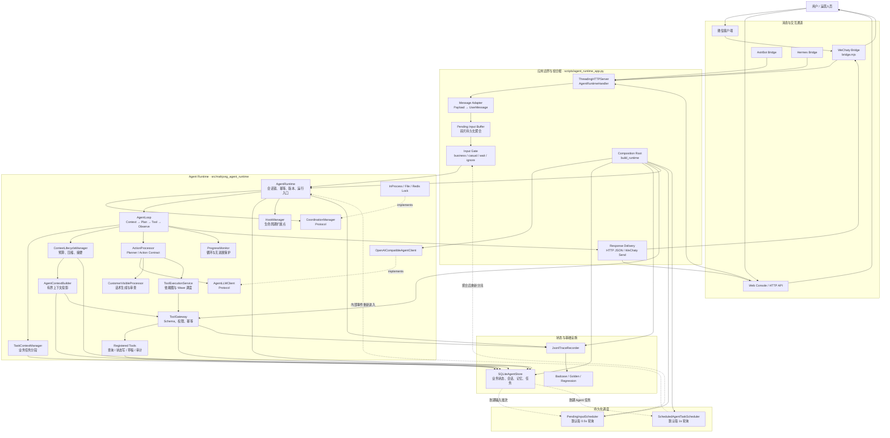
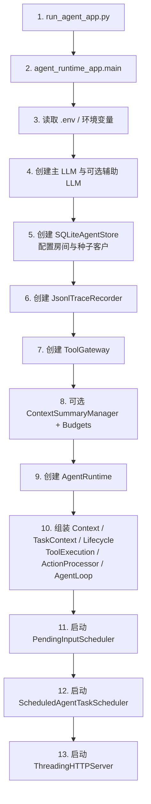
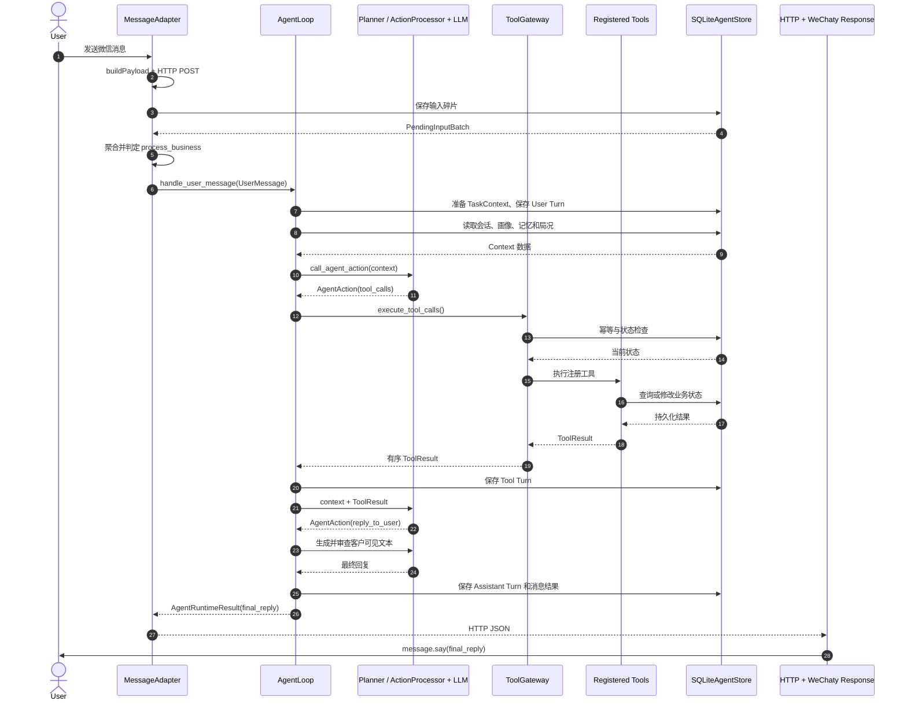
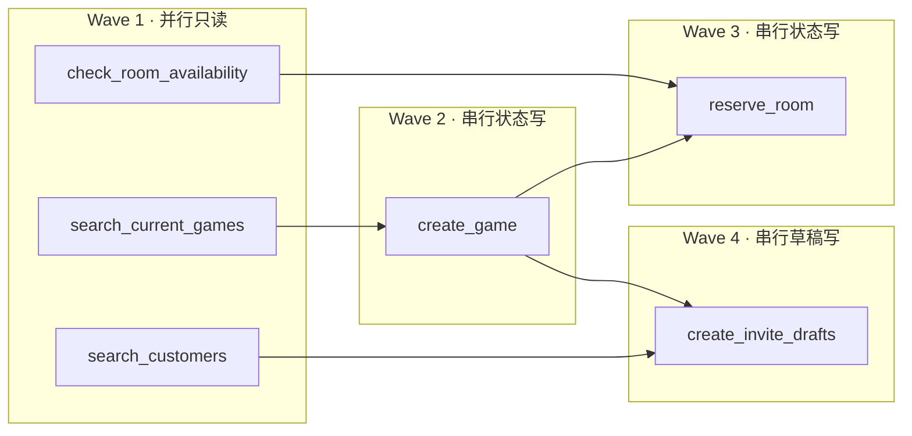

# Mahjong Agent Core 完整架构说明

> 分析范围：当前仓库中的生产 Runtime、微信/HTTP 通道适配器、领域数据对象、SQLite 持久化、工具执行和调度基础设施。本文不展开具体函数实现，也不把测试、评测脚本或纯中间变量视为核心架构组件。

## 1. 架构摘要

该项目是一个“单主 Agent + 可信工具执行边界”的麻将馆私域运营系统。主模型负责理解用户目标和规划下一步；后端负责输入聚合、上下文治理、工具合同、权限、幂等、状态机、持久化、并发、调度和客户可见文本审查。

- 主启动文件：`scripts/run_agent_app.py`
- 应用组合根：`scripts/agent_runtime_app.py`
- 主运行时入口：`AgentRuntime`
- 主循环：`AgentLoop`
- Planner：`ActionProcessor + AgentLLMClient`
- 工具执行边界：`ToolExecutionService + ToolGateway`
- 生产存储：`SQLiteAgentStore`
- 微信适配器：WeChaty Bridge；另有 AstrBot、Hermes Bridge
- 调度方式：两个后台线程定时轮询 SQLite
- 工具并发方式：`ThreadPoolExecutor`，仅限已注册为并行安全的只读工具
- 数据建模：标准库 `@dataclass`；无 SQLAlchemy、Peewee、Pydantic

## 2. 完整架构图

图中实线箭头表示调用或依赖方向；虚线表示接口实现、回调或持久化唤醒关系。



## 3. 启动入口、初始化顺序与组件依赖

### 3.1 Main Entry Point

主启动链为：

```text
scripts/run_agent_app.py
  → 导入 scripts/agent_runtime_app.py
  → main()
  → get_runtime()
  → build_runtime()
  → 启动两个 Scheduler
  → ThreadingHTTPServer.serve_forever()
```

### 3.2 初始化顺序



### 3.3 核心模块和依赖方向

| 模块 | 主要实现 | 依赖对象 | 核心职责 |
|---|---|---|---|
| Message Adapter | `bridge.mjs`、`AgentRuntimeHandler`、应用路由函数 | Runtime、Input Buffer | 将通道消息转换为统一 `UserMessage` |
| Input Boundary | Pending Input Buffer、Input Gate | SQLite、LLM Client | 聚合碎片并决定业务、闲聊、等待或忽略 |
| Runtime Facade | `AgentRuntime` | Coordination、AgentLoop、Store、Hooks | 会话串行、消息幂等、版本控制和结果持久化 |
| Agent Loop | `AgentLoop` | TaskContext、Lifecycle、Planner、Progress | 驱动主模型与工具之间的目标循环 |
| Context Layer | `AgentContextBuilder`、`ContextLifecycleManager` | Store、ToolGateway、Summary | 构造有界上下文并管理预算和摘要 |
| Planner | `ActionProcessor`、`AgentLLMClient` | LLM、ToolExecution、Visible Processor | 产生并处理结构化 `AgentAction` |
| Tool Gateway | `ToolExecutionService`、`ToolGateway` | Tool Definitions、Store | 依赖图调度、Schema、权限、幂等和可信执行 |
| Storage Layer | `SQLiteAgentStore` | SQLite | 保存领域状态、会话、记忆、草稿和定时任务 |
| Scheduling | 两个 Scheduler | Store、应用回调、Runtime | 到期轮询、原子领取、重试及内部唤醒 |
| Response | Visible Processor、HTTP/WeChaty Delivery | LLM、Store、Channel | 生成、审查、保存并投递客户可见文本 |

依赖箭头统一解释为 `A → B = A 持有、调用或依赖 B`。主方向是：

```text
Channel → Message Boundary → AgentRuntime → AgentLoop
AgentLoop → Context / Planner / Progress
Planner → LLM / ToolExecution / Visible Processor
ToolExecution → ToolGateway → Tools → Storage
Scheduler → AgentRuntime
AgentLoop → Response → Channel
```

### 3.4 IoC 与依赖注入

项目没有使用外部 DI 容器，采用显式构造器注入和回调式 IoC。

| 位置 | IoC / DI 形式 | 说明 |
|---|---|---|
| `scripts/agent_runtime_app.py` | Composition Root | 创建 LLM、Store、Trace、Gateway、Summary，再注入 `AgentRuntime` |
| `AgentRuntime.__post_init__` | 内部构造器注入 | 将已创建依赖继续注入 Context、Lifecycle、Processor 和 Loop |
| `AgentLLMClient` | `Protocol` | 生产实现为 `OpenAICompatibleAgentClient`，测试可替换为静态 Client |
| `CoordinationManager` | `Protocol` | 可选择进程内锁、文件锁或 Redis 锁 |
| `HookManager` | 回调式 IoC | Runtime 在生命周期事件发生时反向调用注册 Handler |
| Scheduler `handler` | 回调式 IoC | Scheduler 只负责到期和领取，业务解释由应用层回调完成 |
| `ToolGateway.tools` | 注册式 IoC | Runtime 依赖 Tool Definition/Handler 注册表，而不是硬编码调用具体工具 |

存储层通过 `stores/base.py` 中的 `AgentStore Protocol` 约束 Runtime 所需能力，可注入 `InMemoryAgentStore` 或 `SQLiteAgentStore`。Protocol 在类型层定义端口，具体后端仍以组合后的 mixin 实现该结构化接口。

## 4. 核心数据对象与持久化模型

项目没有 SQLAlchemy、Peewee 或 Pydantic 模型。核心数据契约集中在 `src/mahjong_agent_runtime/models.py`，均为标准库 `@dataclass`。SQLite DDL 位于 `stores/sqlite/migration.py`，多数表采用“关键索引列 + 完整对象 JSON payload”；局参与者是独立关系表，不再嵌入局 payload。

| 对象名 | 文件位置 | 核心字段（5 个） | 核心职责 |
|---|---|---|---|
| `UserMessage` | `models.py` | `message_id`, `conversation_id`, `sender_id`, `text`, `metadata` | 通道、Runtime 与 Agent Loop 之间的统一消息契约 |
| `QuotedMessageRef` | `models.py` | `message_id`, `sender_id`, `text`, `business_ref_type`, `business_ref_id` | 携带被引用消息及业务定位信息 |
| `MessageReference` | `models.py` | `message_id`, `conversation_id`, `business_ref_type`, `business_ref_id`, `metadata` | 持久化消息与业务实体的可追溯关联 |
| `PendingInputBatch` | `models.py` | `batch_id`, `conversation_id`, `sender_id`, `fragments`, `version` | 保存碎片输入及其静默截止和并发版本 |
| `ScheduledAgentTask` | `models.py` | `task_id`, `task_type`, `aggregate_id`, `due_at`, `status` | 表示可领取、可重试的未来 Agent 工作 |
| `ConversationTurn` | `models.py` | `role`, `content`, `trace_id`, `sender_id`, `occurred_at` | 保存用户、助手和工具会话历史 |
| `ConversationCheckpoint` | `models.py` | `conversation_id`, `task_context_id`, `summary`, `facts`, `open_questions` | 保存长对话压缩后的事实和待办 |
| `ConversationTaskContext` | `models.py` | `task_context_id`, `conversation_id`, `customer_id`, `status`, `previous_task_context_id` | 在稳定会话中隔离独立业务任务 |
| `CustomerProfile` | `models.py` | `customer_id`, `display_name`, `preferred_games`, `preferred_stakes`, `smoke_preference` | 保存客户身份与稳定匹配画像 |
| `CustomerRelationship` | `models.py` | `customer_a_id`, `customer_b_id`, `played_together_count`, `avoid_playing`, `updated_at` | 表示客户之间的同桌和回避关系 |
| `TaskMemory` | `models.py` | `memory_id`, `conversation_id`, `customer_id`, `field`, `value` | 保存当前任务有效的临时约束 |
| `PendingMemoryCandidate` | `models.py` | `candidate_id`, `customer_id`, `field`, `value`, `status` | 保存待审核的长期记忆候选 |
| `Game` | `models.py` | `game_id`, `conversation_id`, `organizer_id`, `requirement`, `status` | 组局领域聚合根 |
| `GameParticipant` | `models.py` | `customer_id`, `status`, `joined_at`, `seat_count`, `party_id`, `known_member_ids` | 表示客户在某局中的参与和占座状态 |
| `Party` | `models.py` | `party_id`, `contact_id`, `seat_count`, `known_member_ids`, `status` | 表示联系人带领的同行小组 |
| `InviteDraft` | `models.py` | `draft_id`, `game_id`, `customer_id`, `message_text`, `status` | 保存特定局的待审核邀约 |
| `OutboundMessageDraft` | `models.py` | `draft_id`, `conversation_id`, `recipient_id`, `channel`, `status` | 保存通道无关的待审核外发消息 |
| `RoomReservation` | `models.py` | `reservation_id`, `room_id`, `game_id`, `start_at`, `end_at` | 表示房间在时间窗口中的占用 |
| `StateTransition` | `models.py` | `entity_type`, `entity_id`, `from_status`, `to_status`, `trace_id` | 统一记录领域状态变化 |
| `ToolCall` | `models.py` | `name`, `arguments`, `call_id`, `depends_on`, `idempotency_key` | Planner 与 Tool Gateway 之间的调用契约 |
| `ToolResult` | `models.py` | `name`, `called`, `allowed`, `result`, `state_transitions` | 将可信工具结果反馈给 Agent Loop |
| `AgentAction` | `models.py` | `goal`, `objective_status`, `objective_state`, `tool_calls`, `reply_to_user` | 表示 Planner 一次结构化决策 |
| `AgentRuntimeResult` | `models.py` | `trace_id`, `conversation_id`, `final_reply`, `actions`, `tool_results` | 表示一轮 Runtime 的完整输出 |

`GameParticipant` 使用 `runtime_game_participants` 独立联结表持久化，`runtime_games.payload` 不再保存 `participants`、`parties` 及座位统计等派生字段。`Party` 由参与者的 `party_id`、`seat_count` 和同行人信息在读取时重建，不是第二份业务真相。`AgentAction`、`ToolCall`、`ToolResult` 通常嵌入消息结果、会话或 Trace。

### 4.1 ER 图

下面的 `FK` 多数仍表示代码层逻辑外键。`runtime_game_participants.game_id` 是已落地的 SQLite 外键，指向 `runtime_games.game_id` 并支持级联删除；其他关系仍主要由应用层维护。

```mermaid
erDiagram
    CUSTOMER {
        string customer_id PK
        json payload
        datetime updated_at
    }
    CUSTOMER_RELATIONSHIP {
        string pair_key PK
        string customer_a_id FK
        string customer_b_id FK
        json payload
    }
    CONVERSATION_VERSION {
        string conversation_id PK
        int version
        datetime updated_at
    }
    CONVERSATION_TURN {
        int id PK
        string conversation_id FK
        string trace_id
        string role
        json payload
    }
    CONVERSATION_CHECKPOINT {
        string conversation_id PK
        string task_context_id FK
        json payload
    }
    TASK_CONTEXT {
        string task_context_id PK
        string conversation_id FK
        string customer_id FK
        string previous_task_context_id FK
        string status
    }
    GAME {
        string game_id PK
        string conversation_id FK
        string organizer_id FK
        string status
        json payload
    }
    GAME_PARTICIPANT {
        string game_id PK, FK
        string customer_id PK
        string party_id
        string status
        int seat_count
        datetime joined_at
    }
    PARTY {
        string party_id
        string contact_id FK
        int seat_count
        string status
        string storage "JSON in GAME.payload"
    }
    INVITE_DRAFT {
        string draft_id PK
        string game_id FK
        string customer_id FK
        string status
        json payload
    }
    OUTBOUND_DRAFT {
        string draft_id PK
        string conversation_id FK
        string recipient_id FK
        string channel
        string status
    }
    ROOM {
        string room_id PK
        datetime updated_at
    }
    ROOM_RESERVATION {
        string reservation_id PK
        string room_id FK
        string game_id FK
        string conversation_id FK
        datetime start_at
    }
    TASK_MEMORY {
        string memory_id PK
        string conversation_id FK
        string customer_id FK
        string target_customer_id FK
        string status
    }
    PENDING_MEMORY_CANDIDATE {
        string candidate_id PK
        string conversation_id FK
        string customer_id FK
        string target_customer_id FK
        string status
    }
    PENDING_INPUT_BATCH {
        string batch_key PK
        string batch_id UK
        string conversation_id FK
        string sender_id FK
        int version
    }
    SCHEDULED_AGENT_TASK {
        string task_id PK
        string aggregate_id FK
        string conversation_id FK
        string idempotency_key UK
        string status
    }
    MESSAGE_REFERENCE {
        int id PK
        string message_id
        string conversation_id FK
        string business_ref_type
        string business_ref_id FK
    }
    STATE_TRANSITION {
        int id PK
        string trace_id
        string entity_type
        string entity_id FK
        json payload
    }

    CUSTOMER ||--o{ CUSTOMER_RELATIONSHIP : customer_a
    CUSTOMER ||--o{ CUSTOMER_RELATIONSHIP : customer_b
    CUSTOMER ||--o{ TASK_CONTEXT : owns
    CUSTOMER ||--o{ GAME : organizes
    CUSTOMER ||--o{ INVITE_DRAFT : receives
    CUSTOMER ||--o{ TASK_MEMORY : owns
    CUSTOMER ||--o{ PENDING_MEMORY_CANDIDATE : owns
    CONVERSATION_VERSION ||--o{ CONVERSATION_TURN : contains
    CONVERSATION_VERSION ||--o| CONVERSATION_CHECKPOINT : summarizes
    CONVERSATION_VERSION ||--o{ TASK_CONTEXT : segments
    CONVERSATION_VERSION ||--o{ GAME : originates
    CONVERSATION_VERSION ||--o{ OUTBOUND_DRAFT : produces
    CONVERSATION_VERSION ||--o{ PENDING_INPUT_BATCH : buffers
    CONVERSATION_VERSION ||--o{ SCHEDULED_AGENT_TASK : schedules
    CONVERSATION_VERSION ||--o{ MESSAGE_REFERENCE : indexes
    TASK_CONTEXT ||--o| CONVERSATION_CHECKPOINT : scopes
    TASK_CONTEXT ||--o{ TASK_MEMORY : scopes
    GAME ||--o{ GAME_PARTICIPANT : contains
    GAME ||--o{ PARTY : derives
    CUSTOMER ||--o{ GAME_PARTICIPANT : participates
    CUSTOMER ||--o{ PARTY : contacts
    GAME ||--o{ INVITE_DRAFT : has
    GAME ||--o{ ROOM_RESERVATION : reserves
    GAME ||--o{ SCHEDULED_AGENT_TASK : wakes
    ROOM ||--o{ ROOM_RESERVATION : has
```



关系要点：

- `Customer ↔ Customer` 通过 `CustomerRelationship` 形成自关联 N:N。
- `Customer ↔ Game` 在领域上是 N:N，通过 `runtime_game_participants` 联结；`(game_id, customer_id)` 为复合主键，`status` 表示该客户在该局内的状态，`joined_at` 记录首次入局时间。
- `Game → InviteDraft`、`Room → RoomReservation`、`Conversation → TaskContext` 均为 1:N。
- `StateTransition`、`MessageReference` 和 `ScheduledAgentTask` 使用“类型 + ID”的多态逻辑关联。

## 5. 微信消息到 Agent 回复的 Main Happy Path

默认前提：WeChaty 输入聚合开启，Input Gate 判定为业务消息，Planner 至少调用一次工具，随后生成最终回复。忽略异常、人工接管和观测代码。

| 顺序 | 关键步骤 | 文件名 | 核心函数名 |
|---:|---|---|---|
| 1 | WeChaty 接收用户消息事件 | `bridge.mjs` | `bot.on('message', ...)` |
| 2 | 提取文本、发送者、群聊和消息 ID，构造 Payload | `bridge.mjs` | `buildPayload()` |
| 3 | POST 到 `/api/channels/wechaty/raw` | `bridge.mjs` | `postJsonWithRetry()` → `postJson()` |
| 4 | HTTP Adapter 读取请求并进入微信路由 | `agent_runtime_app.py` | `AgentRuntimeHandler.do_POST()` |
| 5 | 将 Payload 转为统一 `UserMessage` | `agent_runtime_app.py` | `route_wechaty_raw_to_agent()` → `build_wechaty_user_message()` |
| 6 | 持久化消息碎片并形成 `PendingInputBatch` | `agent_runtime_app.py` | `route_user_message_with_aggregation()` → `buffer_input_fragment()` |
| 7 | 聚合批次，Input Gate 判定为 `process_business` | `agent_runtime_app.py`、`input_aggregation.py` | `dispatch_pending_input_batch()` → `aggregate_pending_input_batch()` → `run_wechaty_input_gate()` |
| 8 | Runtime 获取会话锁、推进版本并进入主循环 | `runtime.py` | `AgentRuntime.handle_user_message()` |
| 9 | 准备 Task Context、保存用户 Turn | `services/loop_service.py` | `AgentLoop.run()` |
| 10 | 从 Storage 投影画像、局况、记忆、历史和工具 Schema | `services/context_service.py`、`domains/context_builders/` | `build_and_trace_context()` → `AgentContextBuilder.build()` |
| 11 | Planner 调用主 LLM 并解析 `AgentAction` | `services/action_service.py` | `ActionProcessor.call_agent_action()` |
| 12 | 工具动作经 Tool Execution、Gateway 和注册工具读写 SQLite | `services/tool_service.py`、`domains/tools/` | `process_tool_action()` → `execute_tool_calls()` → `ToolGateway.execute()` |
| 13 | `ToolResult` 返回 Loop，Planner 基于真实结果再次规划 | `services/loop_step_service.py`、`action_service.py` | `AgentLoopStepService.run_step()` → `call_agent_action()` |
| 14 | 最终回复经过生成/审查并作为 Assistant Turn 保存 | `services/visible_action_service.py` | `process_reply_action()` → `append_pending_assistant_turn()` |
| 15 | HTTP 返回 `final_reply`，WeChaty 将其发送给用户 | `agent_runtime_app.py`、`bridge.mjs` | `do_POST()` → `maybeAutoSendReply()` |

### 5.1 Main Happy Path 时序图



Planner 不直接调用业务函数；它只产生 `ToolCall`。可信执行路径始终是：

```text
Planner → ToolExecutionService → ToolGateway → Registered Tool → SQLiteAgentStore
```

## 6. 异步、线程池与调度器

### 6.1 并发机制总览

| 并发点 | 实现 | 并发范围 |
|---|---|---|
| HTTP 请求 | `ThreadingHTTPServer` | 不同请求可在独立线程处理 |
| 只读工具 Wave | `ThreadPoolExecutor + as_completed` | 同一 AgentAction 内依赖已满足的并行安全只读调用 |
| 输入调度 | daemon `threading.Thread` | 轮询已到静默截止时间的输入批次 |
| 未来任务调度 | daemon `threading.Thread` | 轮询到期的持久化 Agent 任务 |
| LLM Provider | `BoundedSemaphore` | 限制进程内同时访问模型的请求数量 |
| 同会话协调 | InProcess/File/Redis Lock | 同一会话串行，不同会话可并行 |
| SQLite | `RLock` + 事务 | 保护共享连接和原子业务写入 |

Python 主 Runtime 没有使用 `asyncio.gather()` 或 `asyncio.create_task()`，也没有进程池。AstrBot Adapter 使用 `asyncio.to_thread()` 把同步 HTTP 调用移出事件循环。WeChaty Bridge 使用 JavaScript `async/await`，但核心单消息链路主要顺序等待；Web 控制台有与业务无关的 `Promise.all()` 并行刷新。

### 6.2 Scheduler 触发方式

| Scheduler | 默认周期 | 触发条件 | 回调与结果 |
|---|---:|---|---|
| `PendingInputScheduler` | 0.5 秒 | `quiet_deadline` 已到的 pending 输入批次 | 调用 `handle_due_pending_input_batch()`，重新聚合和分流，必要时投递延迟回复 |
| `ScheduledAgentTaskScheduler` | 1 秒 | `due_at` 已到且可 claim 的持久化任务 | 调用 `handle_due_scheduled_agent_task()`，构造内部事件并通过 `handle_system_event()` 重入 Agent Loop |

二者都是“SQLite 持久化状态 + 后台线程定时轮询”，不是基于 asyncio 事件循环或消息队列。未来任务具有原子 claim、lease、完成状态和失败重试。

## 7. 工具执行模式与 Wave

### 7.1 并行只读工具

只有以下工具同时声明 `execution_mode=read_only` 和 `parallel_safe=true`：

| 工具 | 模式 | 并行安全 |
|---|---|---:|
| `check_room_availability` | `read_only` | 是 |
| `search_current_games` | `read_only` | 是 |
| `search_customers` | `read_only` | 是 |

### 7.2 串行写工具

| 工具 | 模式 | 调度方式 |
|---|---|---|
| `reserve_room` | `state_write` | 串行 |
| `create_game` | `state_write` | 串行 |
| `update_game_requirement` | `state_write` | 串行 |
| `record_candidate_reply` | `state_write` | 串行 |
| `update_game_status` | `state_write` | 串行 |
| `record_user_memory` | `state_write` | 串行 |
| `update_context_checkpoint` | `state_write` | 串行 |
| `create_invite_drafts` | `draft_write` | 串行 |
| `create_outbound_message_drafts` | `draft_write` | 串行 |
| `record_badcase` | `audit_write` | 串行 |

### 7.3 Wave 生成规则

只有当一次 `AgentAction` 中每个 ToolCall 都包含唯一 `call_id` 和显式 `depends_on` 时，才启用依赖图调度；否则按模型声明顺序全部串行。

1. 找出依赖均已成功完成的 ready 调用。
2. 从 ready 集合筛选并行安全只读调用。
3. 若至少有两个，则合并为一个 `parallel_read` Wave。
4. 否则只执行 ready 集合中的第一个调用，形成单调用串行 Wave。
5. 完成后更新依赖状态并生成下一 Wave。
6. 最终 ToolResult 恢复为 Planner 原始声明顺序，不按线程完成顺序回传。

默认线程池上限为 4，由 `MAHJONG_AGENT_MAX_PARALLEL_READ_TOOLS` 控制。

### 7.4 所有不同工具组合的并发 Wave

| Wave | 工具调用 | 条件 |
|---|---|---|
| Read Wave A | `check_room_availability` + `search_current_games` | 两者依赖均已满足 |
| Read Wave B | `check_room_availability` + `search_customers` | 两者依赖均已满足 |
| Read Wave C | `search_current_games` + `search_customers` | 两者依赖均已满足 |
| Read Wave D | 三个只读工具全部执行 | 三者依赖均已满足 |
| Dynamic Read Wave | 同一只读工具的多个不同参数调用，或上述工具的多实例混合 | 每个调用有独立 `call_id` 且依赖已满足 |

### 7.5 串行 Wave

| Wave 类型 | 可包含工具 | 每次实际执行数 |
|---|---|---:|
| Single Read | 任意一个只读工具 | 1 |
| State Write | 任意 `state_write` 工具 | 1 |
| Draft Write | 任意 `draft_write` 工具 | 1 |
| Audit Write | `record_badcase` | 1 |
| Legacy Sequential | 缺少完整依赖图元数据的任意工具序列 | 按声明顺序逐个执行 |

典型 Wave 如下：



即使两个写调用同时 ready，也不会在同一个线程池中并行；每个写调用各占一个串行 Wave。

## 8. 关键设计判断与边界

1. **单主 Agent，而非多 Agent。** Input Gate、摘要、话术生成和审查可能调用模型，但不拥有独立业务目标或长期状态。
2. **模型规划，后端执行。** 模型不能直接修改数据库，只能提出结构化 ToolCall。
3. **业务事实以 Store 为准。** 对话摘要和模型文字不能替代局、成员、房间、邀约和任务状态。
4. **同会话串行，不同会话可并行。** 会话锁防止同一客户消息相互覆盖，HTTP 层仍支持不同会话并发。
5. **只读可并行，写入强制串行。** 并行资格来自后端 Tool Definition，模型不能通过参数自行声明。
6. **调度任务持久化。** 进程重启不会丢任务，但准时执行仍要求至少一个服务实例处于运行状态。
7. **SQLite 关系主要由应用维护。** `runtime_game_participants.game_id` 已有真实 Foreign Key 和级联删除；其他图中 FK 仍主要是逻辑关联。
8. **Storage 通过 Protocol 解耦。** Runtime 面向 `AgentStore Protocol`，内存与 SQLite 后端分别位于 `stores/memory` 和 `stores/sqlite`；协议只描述能力，不承载业务规则。

## 9. 关键代码索引

| 关注点 | 文件 |
|---|---|
| 主启动 | `scripts/run_agent_app.py` |
| 应用组合根、HTTP 和通道路由 | `scripts/agent_runtime_app.py` |
| Runtime Facade | `src/mahjong_agent_runtime/runtime.py` |
| 主循环 | `src/mahjong_agent_runtime/services/loop_service.py` |
| 单步执行 | `src/mahjong_agent_runtime/services/loop_step_service.py` |
| Planner 动作处理 | `src/mahjong_agent_runtime/services/action_service.py` |
| 工具执行与调度 | `src/mahjong_agent_runtime/services/tool_service.py`、`tool_scheduler.py` |
| Tool Gateway 与注册工具 | `src/mahjong_agent_runtime/domains/tools/` |
| 上下文构建 | `src/mahjong_agent_runtime/domains/context_builders/` |
| 上下文生命周期 | `src/mahjong_agent_runtime/services/context_service.py` |
| Task Context | `src/mahjong_agent_runtime/task_context.py` |
| 核心数据类 | `src/mahjong_agent_runtime/models.py` |
| Store 协议 | `src/mahjong_agent_runtime/stores/base.py` |
| SQLite 聚合与 DDL | `src/mahjong_agent_runtime/stores/sqlite/store.py`、`migration.py` |
| Game/Participant 持久化 | `src/mahjong_agent_runtime/stores/sqlite/game_persistence.py` |
| 输入聚合调度 | `src/mahjong_agent_runtime/input_aggregation.py` |
| 持久化任务调度 | `src/mahjong_agent_runtime/scheduled_tasks.py` |
| LLM 接口与适配器 | `src/mahjong_agent_runtime/llm.py` |
| 协调接口与实现 | `src/mahjong_agent_runtime/coordination.py` |
| 客户可见模型处理 | `src/mahjong_agent_runtime/visibility.py` |
| 审查合同 | `src/mahjong_agent_runtime/customer_visible_review.py` |
| WeChaty Bridge | `integrations/wechaty/mahjong-wechaty-bridge/src/bridge.mjs` |
