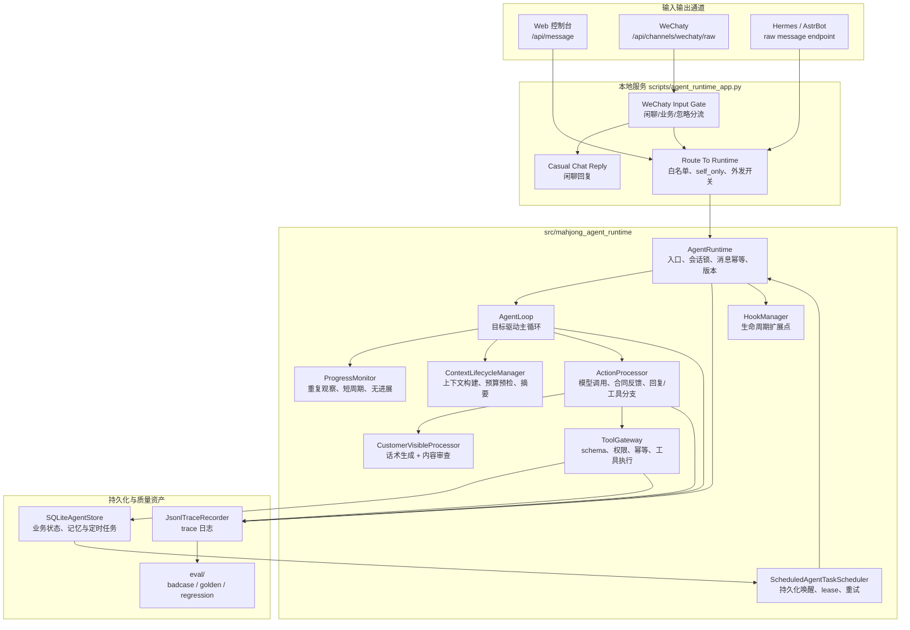
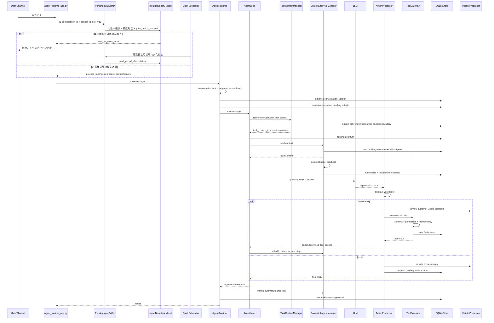
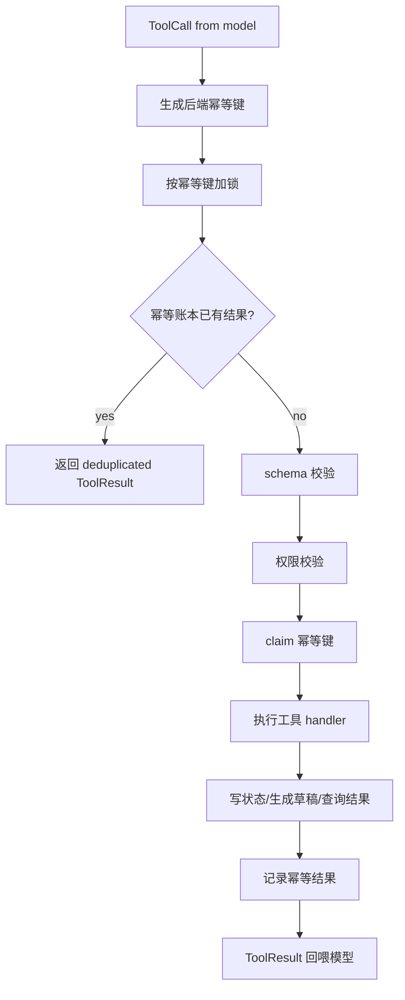

# Mahjong Agent Runtime 架构解析

这份文档解释当前 `mahjong_agent_runtime` 的真实代码结构、主链路、上下文构建、工具调用、记忆、状态、审查、可观测和数据存储。目标是让开发者能沿着一条用户消息，从输入一直追到模型、工具、数据库和最终回复。

## 1. 架构目标

系统要解决的是麻将馆/棋牌室私域运营里的组局撮合问题。用户可能在微信私聊、群聊或本地控制台里发消息：

- “今晚 7 点 0.5 无烟 371”
- “现在有人打吗”
- “帮我组一个吧”
- “我不和 C 打”
- “5 小时不行”
- “张哥是谁”

这些消息不是固定表单，真实运营里还会穿插闲聊、表情、引用回复、补充条件和改口。因此系统采用目标驱动 Agent Runtime：

- 模型决定下一步做什么：查局、建局、找人、记录反馈、追问、回复或转人工。
- 后端只做生产边界：合同、权限、schema、幂等、状态机、并发、预算、审计。
- 工具结果回喂模型：模型不能凭空说“有局/问过/已确认”，必须基于真实工具结果继续判断。
- 客户可见文本单独处理：主模型负责业务决策，话术生成器负责自然表达，审查器负责泄露和未发生动作兜底。

## 2. 总体组件图



## 3. 入口与主文件

| 文件 | 作用 |
| --- | --- |
| `scripts/run_agent_app.py` | 本地服务启动入口 |
| `scripts/agent_runtime_app.py` | Web 控制台、HTTP API、WeChaty/Hermes/AstrBot 原始消息入口 |
| `src/mahjong_agent_runtime/runtime.py` | `AgentRuntime`，负责入口、锁、幂等、版本、结果持久化 |
| `src/mahjong_agent_runtime/services/loop_service.py` | `AgentLoop`，主 Agent loop |
| `src/mahjong_agent_runtime/services/loop_step_service.py` | 单步上下文、模型和动作处理 |
| `src/mahjong_agent_runtime/progress.py` | `ProgressMonitor`，通用死循环和无进展检测 |
| `src/mahjong_agent_runtime/services/context_service.py` | 上下文生命周期，含预算预检和摘要重建 |
| `src/mahjong_agent_runtime/domains/context_builders/` | `AgentContextBuilder` 及分职责上下文投影 |
| `src/mahjong_agent_runtime/services/action_service.py` | `ActionProcessor` |
| `src/mahjong_agent_runtime/services/tool_service.py` | `ToolExecutionService` |
| `src/mahjong_agent_runtime/domains/tools/` | `ToolGateway`、工具定义、schema 与 handler |
| `src/mahjong_agent_runtime/stores/sqlite/` | SQLite 聚合、DDL、查询和事务写入 |
| `src/mahjong_agent_runtime/task_context.py` | 在稳定会话路由内切分独立业务任务 |
| `src/mahjong_agent_runtime/summary.py` | 上下文摘要 checkpoint |
| `src/mahjong_agent_runtime/scheduled_tasks.py` | 持久化定时任务的领取、重试和内部事件唤醒 |
| `src/mahjong_agent_runtime/visibility.py` | 客户可见模型处理器 |
| `src/mahjong_agent_runtime/customer_visible_review.py` | 客户可见审查合同 |
| `src/mahjong_agent_runtime/copywriting.py` | 客户可见话术生成 |
| `src/mahjong_agent_runtime/prompts/` | 主模型、摘要、审查、话术、微信分流提示词 |

## 4. 一条消息的完整链路



## 5. AgentRuntime 的职责

`AgentRuntime` 故意保持薄：

- 生成或接收 traceId。
- 按 `conversation_id` 加锁，保证同一会话串行处理。
- 根据 `conversation_id + sender_id + message_id` 做消息幂等。
- 每条新用户消息推进 `conversation_version`。
- 新消息进来时，把旧版本未发送的回复、邀约草稿、外发草稿标记为 `superseded`。
- 调用 `AgentLoop.run`。
- 一轮结束后触发摘要检查。
- 记录 message result，支持重复消息直接返回同一结果。

它不写麻将语义，不直接决定“要不要组局”，也不直接操作业务工具。

### 5.1 输入边界层

输入边界层位于通道适配器和 `AgentRuntime` 之间，解决用户把一句话拆成多条发送的问题。它不是主 Agent 的业务规划步骤，也不是后端关键词分类器。

- 聚合范围：`conversation_id + sender_id`，同一群里不同用户不会串片段。
- 模型输入：当前批次全部原始片段、发送者画像、最近对话、通道信息、`quiet_period_elapsed`。
- 模型动作：`process_business`、`process_casual`、`wait_for_more_input`、`ignore`。
- 超时规则：未超时允许等待；超时后模型必须在业务、闲聊、忽略中选择，不能无限等待。
- 持久化：批次和静默截止时间存入 SQLite，进程重启后调度器仍可继续处理。
- 并发控制：调度器通过 `batch_id + version + pending status` 做 CAS 领取，只有一个节点能处理指定版本。
- 旧结果失效：处理过程中收到新片段，批次版本递增并回到 pending；旧版本不能写状态、创建草稿或产生最终外发。

例如连续收到“老板 / 帮我组个局 / 0.5，无烟，人齐开”，前两条可以被模型判断为等待补充；第三条到达后，主 Agent 只收到一次包含三条原文的聚合消息。

### 5.2 未来预约如何准时启动

用户预约未来固定时间时，主 Agent 当轮就创建 `Game`。后端从 `planned_start_at` 派生 `recruitment_opens_at=planned_start_at-2h`，同时在 `runtime_scheduled_agent_tasks` 写入确定性任务。局马上可见、可排序和参与群局列表聚合，但在窗口打开前，`create_invite_drafts` 会统一拒绝主动私聊邀约。

调度器轮询到期任务，并通过 SQLite `BEGIN IMMEDIATE` 原子领取 lease。领取成功后发出 `game_recruitment_window_opened` 内部事件，经 `AgentRuntime.handle_system_event` 重新进入同一主 Agent；这不是写死“找八个人”的定时回调，模型会读取唤醒时最新局况，再决定是否查候选人、生成邀约、停止或重规划。内部事件不推进客户消息版本，也不会把内部摘要发送给客户。

任务持久化只解决“重启不丢”，准时执行仍依赖至少一个调度器实例处于运行状态。本地 Mac 长时间休眠时不会执行轮询；恢复或重启后，过期未完成任务会立即进入原子领取。需要严格准点时，应部署常驻进程或接入外部调度基础设施。

任务状态为 `pending/running/retry_wait/completed/failed/cancelled`。进程重启后任务仍在 SQLite；领取节点宕机后 lease 可过期重领；失败任务按上限和退避时间重试；局已满、取消或结束时任务同步收口。多节点共享同一数据库时只有一个节点能领取同一任务，避免重复邀约。

## 6. 主 Agent Loop

当前主 loop 位于 `services/loop_service.py`，单步实现位于 `services/loop_step_service.py`，核心结构是：

```text
resolve or rotate task_context_id
append user turn with task_context_id
for step in 1..max_steps:
    built = build context
    built = summarize and rebuild if needed
    action = call llm
    if contract error:
        append contract error as tool result
        continue
    if action has tool_calls:
        execute tools
        append tool results
        check material progress
        if stalled first time: append agent_progress_guard and replan
        if stalled again: abort and needs_human
        continue
    else:
        process final reply
        stop
if max_steps exceeded:
    needs_human
```

这正是你前面理解的 `buildContext -> call_llm -> if tool_use: execute -> append_tool_results`，只是生产系统里把预算、合同、审查、过期 run、trace 和 hooks 放到了组件里。

### 6.1 会话路由与业务任务分层

`conversation_id` 是微信私聊、群聊或 Web 会话的稳定路由标识，不会因为用户上午各打一场就改变。`task_context_id` 是一次有边界的组局任务：

- 关联的局已 `finished/cancelled` 且用户没有其他活跃局时，下一条消息创建新任务。
- 没有活跃局且连续 4 小时无消息时，下一条消息创建新任务。
- 只要还有活跃局，即使超过 4 小时也不会误切断当前任务。
- 旧 turn、checkpoint、任务记忆和草稿保留在存储中供审计，但 `AgentContextBuilder` 只投影当前 `task_context_id` 的内容。
- 长期客户画像和已审核关系约束可以跨任务保留，“这一局不和 C 打”等临时任务记忆会随旧任务归档。

因此，A 上午打完后下午再约一场，微信路由仍是同一个 `conversation_id`，但模型看到的是新 `task_context_id` 下的下午原始消息，不会继承上午的任务对话。

主 loop 本身不处理业务 if-else。复杂度来自几个独立组件：

- `ContextLifecycleManager`：上下文构建和压缩。
- `ActionProcessor`：模型输出合同、工具/回复分支。
- `ToolExecutionService`：工具执行前后的状态一致性与过期 run 拦截。
- `CustomerVisibleProcessor`：客户可见文本话术生成和审查。
- `ToolGateway`：工具层生产边界。

### 6.1 死循环与无进展检测

`max_steps` 只能限制最坏成本，不能说明 Agent 为什么没有完成目标。因此主循环在每次非终态工具步骤后调用 `ProgressMonitor`，对执行轨迹做语义无关的运行时检查。

检测输入不是模型的自然语言推理，而是稳定化后的执行事实：

```text
observation = hash(
  tool_name
  + validated_arguments
  + stable_tool_result
)
```

稳定化会移除 `trace_id`、幂等键、耗时和时间戳等执行噪声。工具参数属于指纹的一部分，所以“用不同条件查询但都为空”是两次有效观察；只有同一参数得到同一稳定结果才是重复。

系统认可两类实质进展：

- **信息进展**：第一次看到某个“调用参数 + 工具结果”组合。
- **状态进展**：工具产生非去重重放的状态迁移，例如真正创建局或更新候选人状态。

检测三类停滞：

- **重复观察**：同一动作和结果达到阈值。
- **短周期**：尾部出现 `A -> B -> A -> B`、`A -> B -> C -> A -> B -> C` 等多步骤重复周期；`A -> A` 由重复观察阈值单独控制。
- **连续无进展**：连续步骤既没有新观察，也没有状态迁移。

处理分两级：

1. 首次命中生成虚拟 `ToolResult(name=agent_progress_guard)`，写入 trace 和会话工具轮次，并在下一轮通过 `previous_tool_results` 回喂主模型。模型必须换工具、换参数、进入合法终态或转人工。
2. 已经重规划仍再次命中时，本轮中止并转人工，避免继续耗费 token、重复读工具或产生副作用。

真实状态迁移后会重置检测 epoch，避免把状态变化前后的同一查询误判为循环。最终仍保留 `max_steps` 作为硬兜底。

默认配置：

```text
MAHJONG_AGENT_REPEATED_OBSERVATION_LIMIT=2
MAHJONG_AGENT_NO_PROGRESS_LIMIT=2
MAHJONG_AGENT_MAX_PROGRESS_REPLANS=1
MAHJONG_AGENT_MAX_CYCLE_PERIOD=3
MAHJONG_AGENT_MAX_STEPS=8
```

## 7. 模型输出合同

主模型必须输出 JSON object。核心字段：

```json
{
  "goal": "当前目标",
  "objective_status": "needs_tool | waiting_user | completed | needs_human | unknown",
  "reasoning_summary": "简短判断依据",
  "objective_state": {},
  "objective_plan": [],
  "plan_revision_reason": "",
  "reply_to_user": "",
  "tool_calls": [],
  "needs_human": false,
  "stop_reason": {
    "can_stop": false,
    "why": "",
    "pending_work": [],
    "depends_on_tool_results": false
  },
  "badcase": null
}
```

关键不变量：

- `objective_status=needs_tool` 必须有 `tool_calls`，并且 `reply_to_user` 必须为空。
- `waiting_user/completed/needs_human/unknown` 不能包含工具调用，且必须有客户回复。
- `needs_human=true` 时，`objective_status` 必须是 `needs_human`。
- `badcase` 字段必须是 `null`，记录 badcase 必须调用 `record_badcase` 工具。
- 合同不合法时，后端不会执行工具，而是把错误包装成工具结果回喂模型修正。

合同校验只检查结构和安全不变量，不写“通宵/人齐开/0。5”这类业务规则。

## 8. 上下文构建

`AgentContextBuilder.build` 会把本轮模型需要的信息打包成一个 JSON payload，并与系统提示词一起发给模型。

```mermaid
flowchart TB
  current["current_message<br/>当前消息和安全元数据"]
  quote["quoted_message_context<br/>引用消息业务锚点"]
  recent["recent_conversation<br/>预算内最近对话"]
  checkpoint["conversation_checkpoint<br/>摘要后的长期上下文"]
  profile["sender_profile<br/>客户画像"]
  rel["sender_relationships<br/>关系画像"]
  task["task_memories<br/>当前任务约束"]
  pending["pending_memory_candidates<br/>待审长期画像候选"]
  games["active_games<br/>当前局池"]
  visible["active_game_visible_summaries<br/>客户可见局况摘要"]
  drafts["outbound_message_drafts<br/>外发草稿"]
  tools["available_tools<br/>工具 schema"]
  results["previous_tool_results<br/>上一轮工具结果"]
  contracts["planning_contract / output_contract"]
  payload["LLM Payload"]

  current --> payload
  quote --> payload
  recent --> payload
  checkpoint --> payload
  profile --> payload
  rel --> payload
  task --> payload
  pending --> payload
  games --> payload
  visible --> payload
  drafts --> payload
  tools --> payload
  results --> payload
  contracts --> payload
```



### 最近对话窗口

`ContextPackingPolicy` 默认最多考虑最近 `60` 轮，最近对话预算约 `4000` tokens。它会从最新消息往前装，超过预算的旧 turn 被省略。

如果已有 checkpoint，则 checkpoint 更新时间之前的 turn 会被认为已经被摘要覆盖，不再重复放进 `recent_conversation`。

### 为什么要有 checkpoint

多轮会话可能很长，不能把所有历史都塞进上下文。checkpoint 用来保存跨窗口仍然重要的事实，例如：

- 当前目标。
- 组局条件。
- 当前局 ID。
- 用户补充的约束。
- 候选人反馈。
- 还没确认的问题。

如果 checkpoint 和当前消息、工具结果冲突，以当前消息和工具结果为准。

## 9. 上下文摘要什么时候触发

摘要由 `ContextSummaryManager` 负责，默认策略：

| 参数 | 默认值 | 含义 |
| --- | --- | --- |
| `min_turns_before_summary` | 12 | 至少 12 轮后才做常规摘要 |
| `min_turns_since_last_summary` | 6 | 距离上次摘要至少 6 轮 |
| `max_recent_tokens_before_summary` | 3000 | 最近对话粗估超过 3000 tokens |
| `max_turns_considered` | 80 | 摘要最多考虑最近 80 轮 |
| `max_summary_input_tokens` | 6000 | 摘要模型输入上限 |
| `max_summary_chars` | 800 | checkpoint 摘要文本上限 |
| `min_confidence` | 0.6 | 摘要置信度保存阈值 |

另外还有调用前预防性摘要：

- 主模型调用前会估算当前 prompt tokens。
- 如果超过 `MAHJONG_AGENT_MAX_TOKENS_PER_CALL * MAHJONG_CONTEXT_SUMMARY_PREEMPTIVE_RATIO`，默认是 `24_000 * 0.85`，会先尝试生成 checkpoint。
- checkpoint 保存成功后重新 build context，再调用主模型。

token 估算函数在 `token_estimation.py`：

```text
CJK ~= 1 token / char
ASCII words ~= 1 token / 4 chars
punctuation ~= 1 token / 2 chars
```

这是保守的工程保护，不是精确 tokenizer。它的作用是提前发现上下文膨胀，并避免旧的“四字符一 token”在中文场景严重低估。

工具原始结果会完整持久化用于审计，但进入模型前会转成有界决策投影。同一 trace 内的工具 turn 若已通过 `previous_tool_results` 回馈，不再同时放入 `recent_conversation`，避免同一结果重复占用窗口。

## 10. 记忆系统

当前有三层记忆：

### 10.1 最近对话

存储在 `runtime_conversation_turns`。用于短期多轮理解，例如用户连续说：

```text
老板
今天下午
有没有打麻将的
0.5 或 1 都行
烟也都可
```

这些 turn 会被打包进 `recent_conversation`，直到超过窗口预算或被 checkpoint 覆盖。

### 10.2 当前任务记忆

存储在 `runtime_task_memories`。由 `record_user_memory.task_memories` 写入，用于本次任务立即生效的约束。

例子：

- “我不和 C 打”
- “这次只能无烟”
- “我最多打四小时”
- “张哥和我这边两个人”

这类信息不能只靠最近对话，因为后续搜索现有局、搜索候选人、生成邀约都需要结构化约束。

### 10.3 待确认长期画像候选

存储在 `runtime_pending_memory_candidates`。由 `record_user_memory.pending_long_term_memories` 写入。

例子：

- “我以后都不和 C 打”
- “我一般只打无烟”
- “我 95% 都是一个人”

它不会直接改客户画像，默认进入待审核队列。这样避免模型把一次偶发表达误写成长期画像。

## 11. 工具系统

工具注册在 `domains/tools/registry.py` 的 `default_tool_definitions`，Gateway 位于 `domains/tools/gateway.py`。

| 工具 | 风险 | 权限类型 | 说明 |
| --- | --- | --- | --- |
| `search_current_games` | low | read_only | 查询当前局池 |
| `check_room_availability` | low | read_only | 查询指定时间段房间库存 |
| `reserve_room` | medium | state_write | 预留可用房间，使用独立幂等键 |
| `search_customers` | low | read_only | 搜索候选客户 |
| `create_game` | medium | state_write | 创建待组局记录 |
| `create_invite_drafts` | medium | draft_write | 创建候选人邀约草稿 |
| `create_outbound_message_drafts` | medium | draft_write | 创建通道无关外发草稿 |
| `record_candidate_reply` | medium | state_write | 记录候选人反馈 |
| `update_game_requirement` | medium | state_write | 更新尚未成局且已协商确认的局条件 |
| `update_game_status` | medium | state_write | 更新局状态 |
| `record_badcase` | low | audit_write | 记录 badcase/eval 样本 |
| `record_user_memory` | medium | state_write | 记录当前任务记忆和待审长期画像候选 |
| `update_context_checkpoint` | medium | state_write | 更新会话 checkpoint |

### 工具调用流程



工具幂等键优先使用：

```text
conversation:{conversation_id}:sender:{sender_id}:message:{source_message_id}:tool:{tool_name}:args:{sha256(canonical_args)}
```

这意味着同一条用户消息触发同一个工具、同一组参数时，重复执行会命中幂等账本，不会重复创建局或草稿。

### 工具依赖图与并行调度

`ToolCall` 可选声明：

```json
{
  "name": "search_current_games",
  "call_id": "games",
  "depends_on": [],
  "arguments": {"requirement": {}},
  "reason": "查询可加入的局"
}
```

一旦某个调用使用依赖元数据，本步所有调用都必须提供唯一 `call_id`。独立调用建议显式提供 `depends_on: []`；模型省略或返回 `null` 时，合同层会做领域无关的归一化，视为空依赖。`action_contract.py` 仍会拒绝缺失/重复 `call_id`、未知依赖、自依赖和环。

`ToolExecutionService` 按依赖就绪的波次调度：

1. 同波中只有后端 `ToolDefinition.parallel_safe=true` 且 `execution_mode=read_only` 的调用可进入线程池。
2. 写工具无论模型如何声明都单个串行；权威并行属性来自工具注册表，不来自 LLM。
3. 前置结果失败，不执行后续依赖工具，而是构造可审计失败结果回喂主模型。
4. 并行任务可以任意顺序完成，但 `previous_tool_results` 始终按原始调用顺序组装。
5. 没有完整元数据的旧输出保持串行，确保存量 fixture 和模型响应兼容。

trace 中增加 `tool_batch_started` / `tool_batch_completed`，其中记录波次、执行方式、`call_id`、工具名和耗时。并发度由 `MAHJONG_AGENT_MAX_PARALLEL_READ_TOOLS` 控制，默认 `4`。

## 12. 状态模型

### 12.1 局状态

`GameStatus`：

- `forming`：待组局。
- `inviting`：邀约中。
- `ready`：已成局。
- `cancelled`：已取消。
- `finished`：已结束。

允许迁移由 `ALLOWED_GAME_TRANSITIONS` 控制。非法迁移会被后端拒绝。

### 12.2 邀约状态

`InviteStatus`：

- `pending_approval`
- `sent`
- `confirmed`
- `declined`
- `negotiating`
- `no_reply`
- `superseded`

### 12.3 外发草稿状态

`OutboundDraftStatus`：

- `pending_approval`
- `sent`
- `cancelled`
- `superseded`

### 12.4 人数座位模型

真实麻将组局里，一个微信联系人不一定等于一个座位。例如：

- “我这边两个人”
- “272”
- “带一个朋友”

因此系统区分：

- `contact_id`：微信联系人。
- `seat_count`：这个联系人代表几个座位。
- `known_member_ids`：已知成员。
- `anonymous_seat_count`：同行但暂时不知道姓名的人。

`Game.seat_summary()` 会计算总座位、已占座位、剩余座位，模型回答“加上你还差几人”时应优先使用工具返回的 `join_projection`。

### 12.5 多候选局共享参与者

当 A、B、C 对时间和时长不能形成一个共同方案，但 B 明确表示多个方案都可以时，系统不会用一个折中条件覆盖所有人，而是允许建立多个独立 `Game` 聚合。每个局独立保存 requirement、参与者、缺口和生命周期；B 可以临时存在于任意数量的 `forming/inviting` 局中。

这里没有额外引入“全局唯一当前局”字段。承诺语义由局状态和参与状态共同决定：

- 待组局中的 `joined/confirmed` 是临时占位。
- 已成局中的 `joined/confirmed` 是最终时间承诺。
- 被其他冲突局抢先成局释放的参与记录保留为 `superseded`，不计座位，但保留审计证据。

`record_candidate_reply` 补齐最后座位时会调用跨局承诺解析器。解析器按实际开始/结束区间判断冲突；未定时间的方案使用“创建时间至最晚开局时间，再加预计时长”的保守窗口。胜出局进入 `ready` 后，后端在同一个写事务中将共享客户从所有冲突的待组局释放、把相关开放邀约改为 `superseded`，并重算失败局人数。

内存实现依靠进程内可重入锁；SQLite 实现使用 `BEGIN IMMEDIATE` 在读取可变不变量前取得写保留锁。因此两个节点同时把不同候选局补满时，后提交者会读到前一个事务的 `ready` 结果，最终只能有一个冲突局获得该客户。非重叠时间窗口允许分别成局。

候选搜索同样遵守这套语义：出现在待组局只会产生轻度排序惩罚，不会绝对排除；已经承诺到时间冲突的 `ready` 局才会被硬性过滤。这避免了“一个人被临时候选一次后，其他合理方案永远搜不到”的问题。

## 13. 客户可见文本处理

客户可见文本分两类：

- 当前回复：`reply_to_user`。
- 工具参数里的外发文本：邀约草稿、通道外发草稿的 `message_text`。

处理顺序：

```text
主模型生成业务动作
  -> 话术生成器做语义保真改写
  -> 内容审查器检查泄露、编造、内部状态
  -> 通过后才写入 pending assistant turn 或工具草稿
```

话术生成器只做表达改写，不做业务判断，不读取局池、画像或工具结果。它的唯一事实来源是输入文本本身，避免“改话术”变成“补事实”。

内容审查器只审查客户可见文本，例如：

- 是否暴露 AI、模型、系统、工具、traceId、审批、草稿。
- 是否暴露候选人名单、私有备注、画像标签。
- 是否说了工具没有发生的动作，例如“已经问了 8 个人”。
- 是否把内部枚举直接发给客户，例如 `asap_when_full`。

审查不负责麻将语义决策。语义和工具选择仍由主 Agent 完成。

## 14. 微信通道

微信通道当前通过 WeChaty 做灰度测试。

入口：

```text
POST /api/channels/wechaty/raw
```

通道层会做：

- 记录原始 WeChaty payload 到 `logs/wechaty_weixin_raw.jsonl`。
- 提取 sender、conversation、room、message_id、text、self_message、message_type。
- 白名单路由。
- `self_only` 测试范围控制。
- Input Gate 判断消息是业务消息、闲聊还是忽略。
- 闲聊走轻量闲聊回复，不进入主组局 Agent。
- 业务消息转成 `UserMessage` 进入 `AgentRuntime`。
- 外发由独立开关和 WeChaty outbound bridge 控制，不等同于模型自动发消息。

当前阶段的设计重点是验证主流程和话术质量。真正扩大到老板微信生产使用前，需要继续做更严格的白名单、频控、人工审批和风控。

## 15. 并发、乱序和过期输出

### 同一会话串行

`AgentRuntime` 通过 `CoordinationManager` 按 `conversation_id` 串行。内存存储使用进程内锁；SQLite 默认使用本机文件锁，可覆盖同一 Mac 上多进程；配置 `MAHJONG_REDIS_URL` 后可切换为 Redis 协调锁。

会话版本号和关键写入在 SQLite 中使用 `BEGIN IMMEDIATE` 原子更新，不依赖先读后写的进程内假设。

### 消息幂等

消息幂等键：

```text
conversation:{conversation_id}:sender:{sender_id}:message:{message_id}
```

同一条消息重复进来时，直接返回缓存的 `AgentRuntimeResult`。

### 会话版本

每条新用户消息都会推进 `conversation_version`。如果上一轮还在生成草稿或待发送回复，新消息会把旧 pending 输出标记为 `superseded`。

这解决了一个真实问题：用户先说“今天下午有人吗”，系统还没回复，他又补充“0.5 或 1 都行，烟也都可”。旧回复不能再按缺信息去追问，必须基于新条件重新判断。

### stale run

如果旧 run 试图继续写状态或生成草稿，后端会拒绝，并把 `stale_run` 结果回喂模型。模型必须停止旧动作，等待新一轮上下文。

碎片化输入还增加了一层批次版本校验。即使旧主流程已经开始执行，只要同一发送者又补充了新片段，`services/tool_service.py` 和 `visible_action_service.py` 会在写工具和最终回复前检查 `input_batch_id + input_batch_version`。不匹配时旧流程只能结束，不能把过时回复发给客户。

## 16. 数据库设计

当前默认使用 SQLite，适合单店、本地 MacBook、几百客户规模试运行。

| 表 | 作用 |
| --- | --- |
| `runtime_customers` | 客户画像 |
| `runtime_customer_relationships` | 客户之间是否打过、是否不愿同桌 |
| `runtime_games` | 局、状态、条件、参与方、开始/结束/过期时间 |
| `runtime_rooms` | 房间库存和可用状态 |
| `runtime_room_reservations` | 房间预留、关联局、占用区间和释放状态 |
| `runtime_invite_drafts` | 候选人邀约草稿 |
| `runtime_outbound_message_drafts` | 通道无关外发草稿 |
| `runtime_state_transitions` | 状态变更审计 |
| `runtime_conversation_turns` | 用户、助手、工具多轮对话 |
| `runtime_conversation_checkpoints` | 上下文摘要 checkpoint |
| `runtime_conversation_versions` | 会话版本 |
| `runtime_idempotency_ledger` | 工具幂等账本 |
| `runtime_message_results` | 入站消息幂等结果 |
| `runtime_message_references` | 引用消息到业务对象的映射 |
| `runtime_task_memories` | 当前任务短期记忆 |
| `runtime_pending_memory_candidates` | 待确认长期画像候选 |
| `runtime_pending_input_batches` | 碎片化输入批次、静默截止时间、处理状态、决策和版本 |
| `runtime_badcases` | badcase/eval 样本 |

大部分业务对象以 JSON payload 存储，外层保留常用索引字段。这种设计方便本地快速迭代，也方便后续迁移到更规范的关系模型。

## 17. Trace 和可观测

每轮关键事件都会写 trace：

- `user_input`
- `context_packed`
- `context_built`
- `llm_prompt`
- `llm_response`
- `agent_action`
- `tool_gateway_received`
- `tool_schema_checked`
- `tool_permission_checked`
- `tool_result`
- `agent_progress_checked`
- `agent_loop_detected`
- `agent_replan_requested`
- `agent_loop_aborted`
- `customer_visible_content_review_*`
- `state_transition`
- `final_output`
- `context_summary_*`

trace 文件默认：

```text
logs/agent_runtime_trace.log
```

格式：

```text
traceId-time(yyyy-mm-dd hh:mm:ss)-loglevel: content
```

这让每一次错误都可以回放：当用户说“为什么又转人工”，可以拿 traceId 查到当时给模型的 prompt、模型原始输出、合同错误、工具结果、审查结果和最终回复。

## 18. Hook 机制

`HookManager` 是生命周期扩展点。它允许在不改主 loop 的情况下订阅关键事件，例如：

- `message_received`
- `before_agent_loop`
- `after_context_built`
- `before_llm_call`
- `after_llm_response`
- `after_action_proposed`
- `before_tool_execute`
- `after_tool_execute`
- `before_reply_send`
- `after_agent_loop`
- `after_turn_finished`

通俗理解：hook 就是在主流程的关键节点上预留“挂钩”。主流程照常跑，额外的监控、埋点、调试、实验逻辑可以挂上去。

当前项目里 hook 主要用于测试和架构扩展，证明主链路可以被观测和增强，而不需要把主 loop 写得越来越臃肿。

## 19. 为什么主 loop 需要组件化

如果把所有逻辑都写在 `AgentRuntime.handle_user_message` 里，代码会变成：

- 上下文怎么打包。
- 摘要什么时候生成。
- 模型输出怎么解析。
- 工具前怎么审查。
- 工具怎么幂等。
- 回复怎么审查。
- stale run 怎么拦截。
- trace 怎么打。
- hook 怎么发。

这些关注点混在一起，后面每修一个问题都会像补丁。当前拆分后的边界是：

- `AgentLoop` 只编排。
- `ContextLifecycleManager` 管上下文生命周期。
- `ActionProcessor` 管模型 action 的处理。
- `ToolExecutionService` 管工具执行周边的生产约束。
- `ToolGateway` 管工具合同和执行。
- `CustomerVisibleProcessor` 管客户可见内容。

这样主 loop 能保持“像 Agent loop”，组件能独立测试和替换。

## 20. 当前不是流式响应

当前系统不是流式响应。主模型、话术生成、审查、工具调用都在一次 HTTP 处理里完成，最后返回 `AgentRuntimeResult`。

后续如果要做流式，可以拆成：

- 用户可见的即时占位回复，例如“我看下”。
- 后台异步任务继续查局、找候选人。
- 事件流或 WebSocket 推送状态。
- 外发任务队列负责真正发微信。

但当前阶段优先保证主流程正确、可审计、可回归。

## 21. 质量闭环

质量资产目录：

```text
eval/
  badcases/badcases.jsonl
  regression/agent_runtime_regression.jsonl
  golden/real_owner_chat_golden.jsonl
  golden/real_owner_chat_transcript_20260704.md
  few_shot_examples.jsonl
```

闭环原则：

1. 发现问题，先记录 badcase。
2. 判断是提示词、上下文、工具合同、话术生成、审查还是状态模型问题。
3. 修复后补 regression 或 golden。
4. 每次改动跑 eval，避免旧问题复发。

## 22. 开发时最容易混淆的边界

### 主 Agent 和话术生成器

主 Agent 做业务决策；话术生成器只改表达。话术生成器不能新增事实，也不能根据画像重新判断业务。

### 审查器和 guard

审查器不是业务 guard。它只审客户可见文本是否泄露、编造、客服腔严重或暴露内部实现。业务决策仍由主 Agent 负责。

### 短期记忆和长期画像

`task_memories` 当前任务立即生效；`pending_memory_candidates` 等待确认后才可能成为长期画像。

### 联系人和座位

一个微信联系人可以代表多个座位。不能用联系人数量直接当人数。

### 创建局和发送消息

`create_game` 只是记录需求；`create_invite_drafts` 只是创建待审批草稿；都不代表已经发给候选人。

### 现有局查询和新建局

用户只是问有没有局时，先查现有局；没有匹配时问要不要组。用户明确要组时，如果条件足够，就应该建局和找候选人，不要停在“我帮你留意”。

## 23. 运行命令速查

启动服务：

```bash
python scripts/run_agent_app.py
```

测试：

```bash
PYTHONPATH=src python -m pytest -q
```

评估：

```bash
PYTHONPATH=src python scripts/run_evals.py
```

查看日志：

```bash
tail -f logs/agent_runtime_trace.log
```

查看 WeChaty 原始消息：

```bash
tail -f logs/wechaty_weixin_raw.jsonl
```

查看服务：

```bash
curl http://127.0.0.1:8790/api/runtime
```
